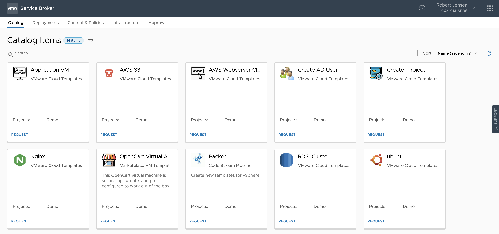
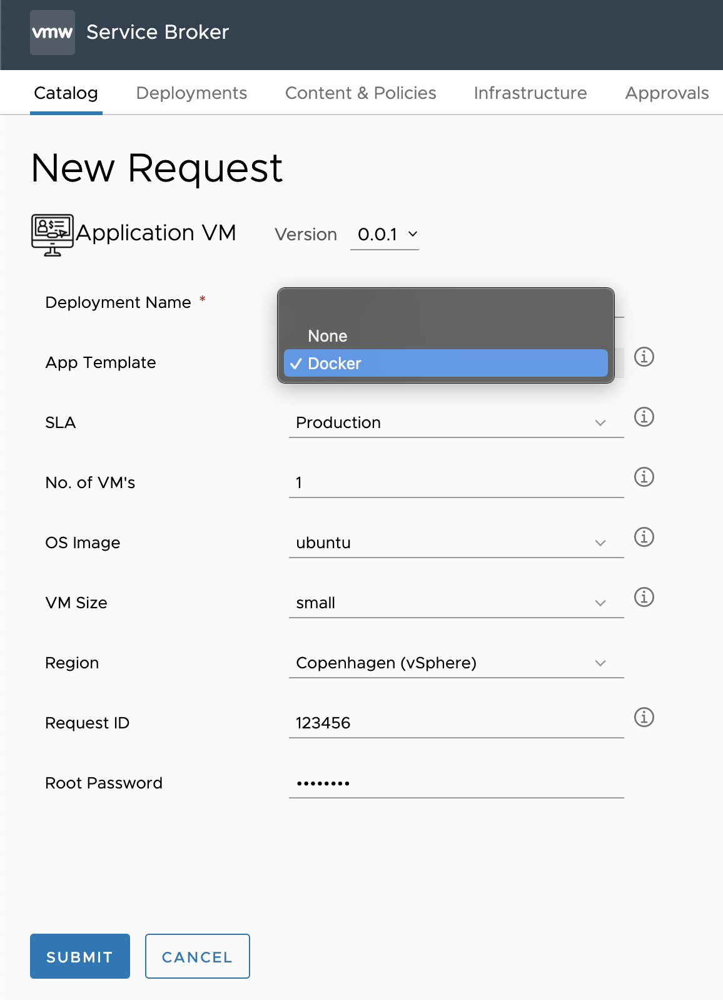
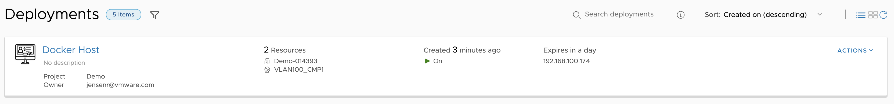
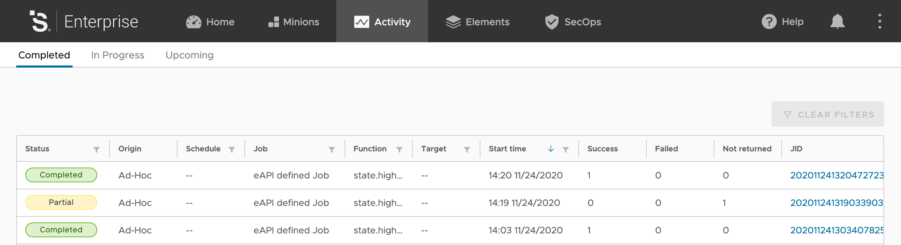
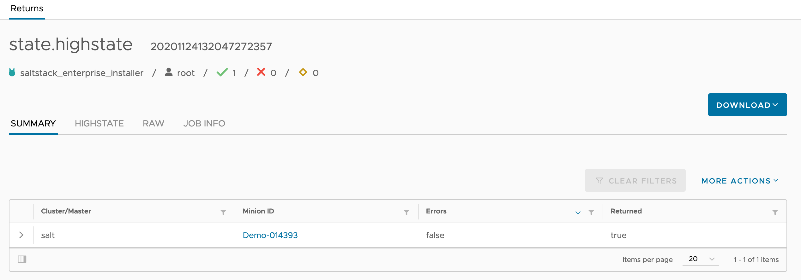
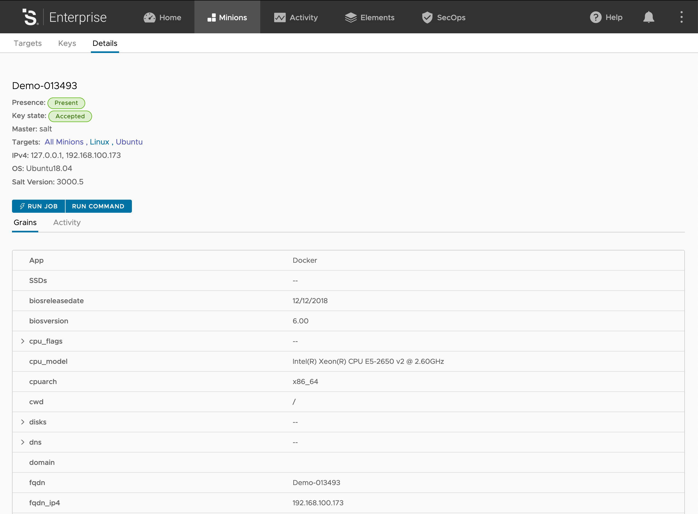
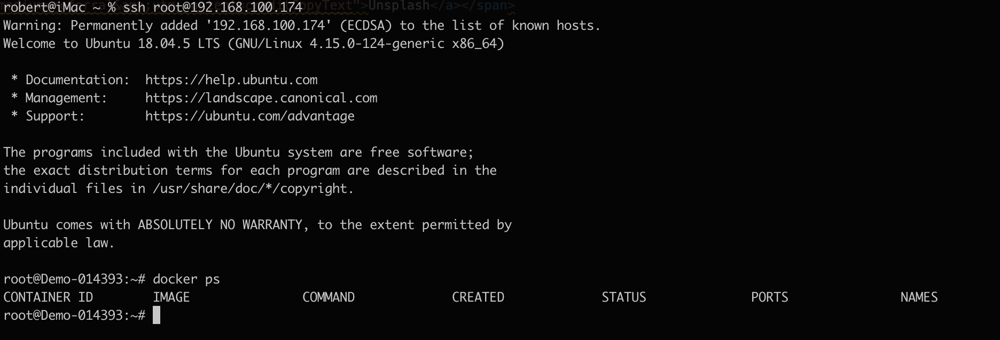
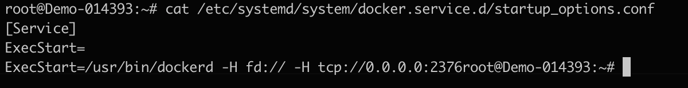

Here is a short post, around my first integration between [SaltStack](https://www.saltstack.com) and [vRealize Automation](https://www.vmware.com/products/vrealize-automation.html).

Expect this to be updated, as I get more experience in SaltStack. 

Note [VMware](https://www.vmware.com) (The company I work for), bought SaltStack, so I don't know, what the future plans look like, and if this is the correct way going forward, to do this kind of integration.

In this post I will show you, how I have setup custom application deployment (Docker in this case) on VM's, along with making sure configurations stays compliant, even after deployment.

 
First we select the "Application VM", that I have created, from the catalog


The special thing about this VM, is that it's possible to select "App Template" and select the application from there.
The reason i have called it template, is that it not only about the app, but just as much all the configuration around it, like correct mounts, permissions etc.

Right now it's only possible to select None or Docker, but more will come.

What happens then, is that depending on what we select, it will update the grains file in /etc/salt/grains with app:appname. Spoiler: This is what Salt will pick up on, and apply the configuration accordingly.


After the VRA VM deployment is finished, the salt-minion contacts the salt master.

In /etc/salt/master.d/reactor.con I have configured 2 states, that get's triggered when the minion contacts the master for the first time. 

salt/auth : auto accepts the certificate (probably not best practice for production env)

salt/minion/*/start : runs a highstate job, against the minion, everytinme a Minion starts, so in this case, as soon as the key is accepted.

I have included the reactor.conf file below.

````
reactor:
  - 'salt/auth':
    - /srv/reactor/auth/auth.sls            

  - 'salt/minion/*/start':                  
     - /srv/reactor/highstate/init.sls
````


On the Salt Master, we can see the job has been run (the top one)


And looking at the details of the job, we can see it was run with success on the VM we just deployed.


And clicking the VM, we can see the different grains applyed to the VM. Note the top one "App" "Docker". This is the one we applied, in the request form, that we selected earlier.


Logging in, i'm not asked for password, since my public key, is in autorized_keys. This is one of the jobs, that the minion has had applied to it.
Running 
````
docker ps
````
Shows that docker is installed, and working.

But it does not stop there. 
As part of my docker installation, I open up the docker api, so that other systems on my network, can communicate with it (probably not best practice either - but hey, it's a demo env)
I do that, by creating a file in /etc/systemd/system/docker.service.d/startup_options.conf
that contains 
```
[Service]
ExecStart=
ExecStart=/usr/bin/dockerd -H fd:// -H tcp://0.0.0.0:2376
```


As you can see, the file is updated on my VM.
But better yet. The original file, is currently on my Salt master, and if I change the original file, on the master, this one will be updated automaticly, along with all other minions, that has the same job.

So what happens when the "highstate" job get triggers by the reactor.conf, as I menitoned yearlier.

It looks in /srv/salt/top.sls to see what jobs to run.

```
base:
  '*':
    - presence
    - ssh
    - loginsight

  'App:Docker':
    - match: grain
    - docker

  'test:container':
    - match: grain
    - docker
```
The top.sls file, is simply a filter, that decides what jobs to run, based on different things on the minion. This can be hostname, grains, os or something else. You can do some pretty advanced things, that is out of scope for this post. 

I have mine setup as below.

'*' means all minions, and it runs base jobs, like enabling Presence on the minion. Setting the correct SSH keys, and SSH configuration, and installing and configuring the LogInsight agent.

'App:Docker' matches all Grains with the folling key and value, and applys the job Docker.

'test:container' is for testing jobs in my container. See this [post](https://www.robert-jensen.dk/posts/2020-docker-for-almost-everything/) for more info, on how i setup this litte test minion :-)

The above means that my VM, get all the jobs in * but also the jobs in App:Docker.
- presence
- ssh
- loginsight
- docker

All jobs are placed in /srv/salt/jobname/ with a init.sls file in each, to be run as the first job, so all I need to reference, is the folder.
The folder can also contain files, like the startup_options.conf for docker, or LogInsight agents files, that get transfered, from the master, to the minion, as part of the job.

The docker job I run, contains the following :

```
docker_install_app:
  pkg.installed:
    - names:
      - docker.io
      - docker-compose
  file.managed:
    - source: salt://docker/startup_options.conf
    - name: /etc/systemd/system/docker.service.d/startup_options.conf
    - makedirs: True
docker:
  service.running:
    - enable: True
    - reload: True

/etc/fstab:
  file.append:
    - text: |
        nfs.cmplab.dk:/mnt/Data /mnt/Data nfs defaults 0 0
  cmd.run:
    - names:
      - mkdir /mnt/Data
      - mount -a
```
Note this job is pretty basic, but it does the following.

- Installs the app
- copied the startup_options.conf file
- makes sure the service is running at startup, and restarts it, to read the startup_options.conf file.
- edits fstab, to mount my NFS share, that i use for some of my containers.
- created the local mount folder and mounts the shares, selected in fstab.

 I will probably update it later, to include different commands and settings, for different OS, and also some error handling. But for now, it's working, with the configs I need. 

I have also setup a schelduled job, that runs HighState every hour.
This means, that if I change a configurations that is managed here, it wil automaticly be overwritten, when that jobs runs (or at reboot with the reactor state)
I could also do that, a lot faster, and probably more efficient with beacons, but that is for another post :-) 

This is really nice, if you want all your VM's to stay compliant, but also something to be aware off, you you do changes, that is then reverted back every hour :-) 


Thats all I had for now. I hope that gave some idea, on how it's possible to use SaltStack with VRA, and to start to use some configuration managemt, with the VM's you have already running.

I have included the blueprint i use below, if you want to try it yourselv. 
The only important things, is creating of the grains file (and the input variable there), and the installation of saltstack.

### The blueprint I used.
```
name: Application VM
version: 0.0.1
inputs:
  rootpassword:
    type: string
    description: Root Password
    default: VMware1!
    title: Root Password
    encrypted: true
  novm:
    type: integer
    description: Number of VM's 1-10
    default: 1
    title: No. of VM's
    maximum: 10
  image:
    type: string
    enum:
      - ubuntu
    description: Image
    default: ubuntu
    title: OS Image
  sla:
    type: string
    description: Service Level Agreement
    default: 'network:production'
    title: SLA
    oneOf:
      - title: Production
        const: 'network:production'
      - title: Test
        const: 'network:test'
  flavor:
    type: string
    enum:
      - small
      - medium
      - large
    description: Size of VM's
    default: small
    title: VM Size
  region:
    type: string
    description: Region
    default: 'region:copenhagen'
    title: Region
    oneOf:
      - title: Copenhagen (vSphere)
        const: 'region:copenhagen'
  App:
    type: string
    oneOf:
      - title: None
        const: none
      - title: Docker
        const: Docker
    title: App Template
    description: Which app template do you want to use ?
    default: none
  requestid:
    type: string
    description: Request ID for approval
    default: 123456
    title: Request ID
  notify:
    type: boolean
    description: Notify when deployment is finished
    default: true
    title: Notify
  update:
    type: boolean
    description: Update all packages on VM
    default: true
    title: Update
  active_directory:
    type: boolean
    description: Create Active Directory computer account during. deployment
    default: true
    title: Active Directory
  dns:
    type: boolean
    description: Create DNS record during. deployment
    default: true
    title: DNS
  ipam:
    type: boolean
    description: Create IPAM record during. deployment
    default: true
    title: IPAM
resources:
  VM:
    type: Cloud.Machine
    properties:
      #---Custom VM Properties---
      projectname: '${env.projectName}'
      deploymentname: '${env.deploymentName}'
      blueprintname: '${env.blueprintName}'
      blueprintversion: '${env.blueprintVersion}'
      timesaved: '30'
      type: vm
      #---Custom VM Properties---
      notify: '${input.notify}'
      name: '${self.resourceName}'
      image: '${input.image}'
      flavor: '${input.flavor}'
      count: '${input.novm}'
      constraints:
        - tag: '${input.region}'
      tags:
        - key: name
          value: linux
        - key: requestid
          value: '${input.requestid}'
      cloudConfigSettings: null
      #Making sure that cloudconfig is finished, before continue
      #        phoneHomeShouldWait: true
      #        phoneHomeTimeoutSeconds: 600
      #        phoneHomeFailOnTimeout: true
      cloudConfig: |
        #cloudconfig
        package_update: '${input.update}'
        package_upgrade: '${input.update}'
        package:
         - wget
         - git
        hostname: '${self.resourceName}'
        write_files:
        - content: |
            project: '${env.projectName}'
            App: '${input.App}'
          path: /etc/salt/grains
        runcmd:
        #Change Root password and restart ssh service
         - echo root:'${input.rootpassword}'|sudo chpasswd
         - sed -i 's/#PasswordAuthentication no/PasswordAuthentication yes/g'  /etc/ssh/sshd_config
         - sed -i 's/#PermitRootLogin prohibit-password/PermitRootLogin yes/g'  /etc/ssh/sshd_config
         - systemctl restart sshd
        #Install Saltstack
         - curl -L https://bootstrap.saltstack.com -o install_salt.sh
         - sh install_salt.sh
         - sed -i 's/ubuntu.cmplab.dk/'${self.resourceName}'.cmplab.dk/g' /etc/salt/minion_id
         - reboot
      networks:
        - network: '${resource.Network.id}'
  Network:
    type: Cloud.Network
    properties:
      networkType: existing
      constraints:
        - tag: '${input.sla}'

```

<span>Photo by <a href="https://unsplash.com/@hishahadat?utm_source=unsplash&amp;utm_medium=referral&amp;utm_content=creditCopyText">Shahadat Rahman</a> on <a href="https://unsplash.com/s/photos/application?utm_source=unsplash&amp;utm_medium=referral&amp;utm_content=creditCopyText">Unsplash</a></span>