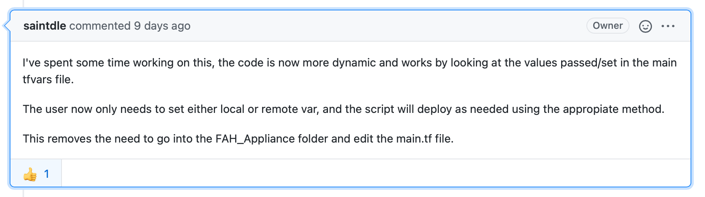
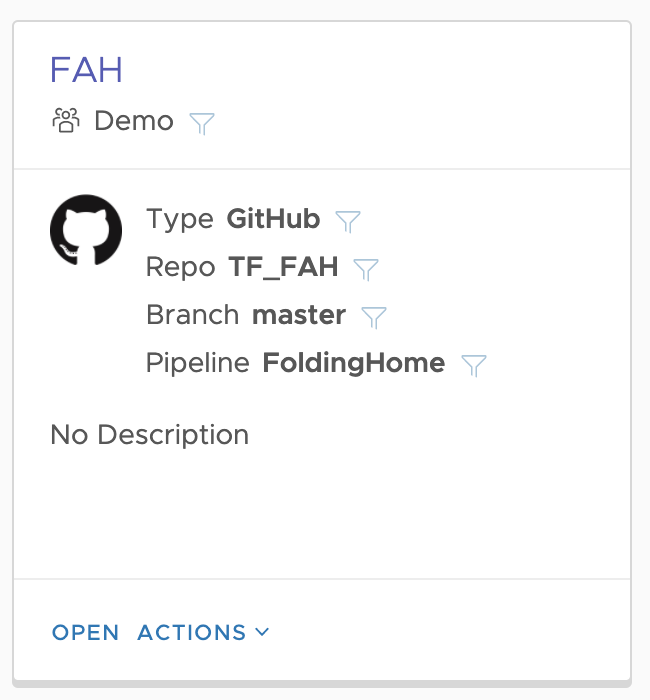
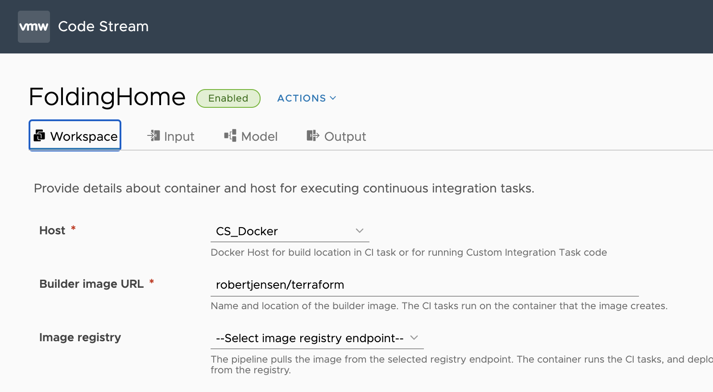
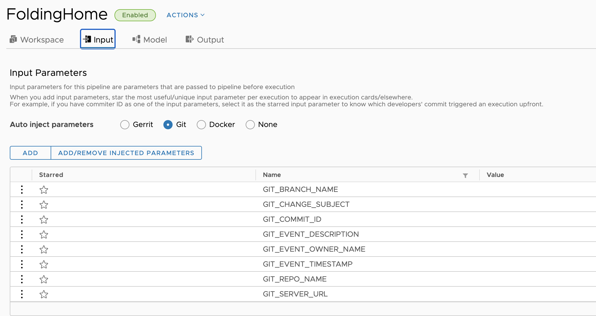
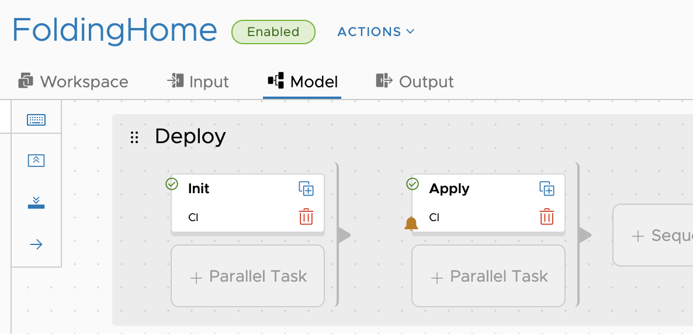
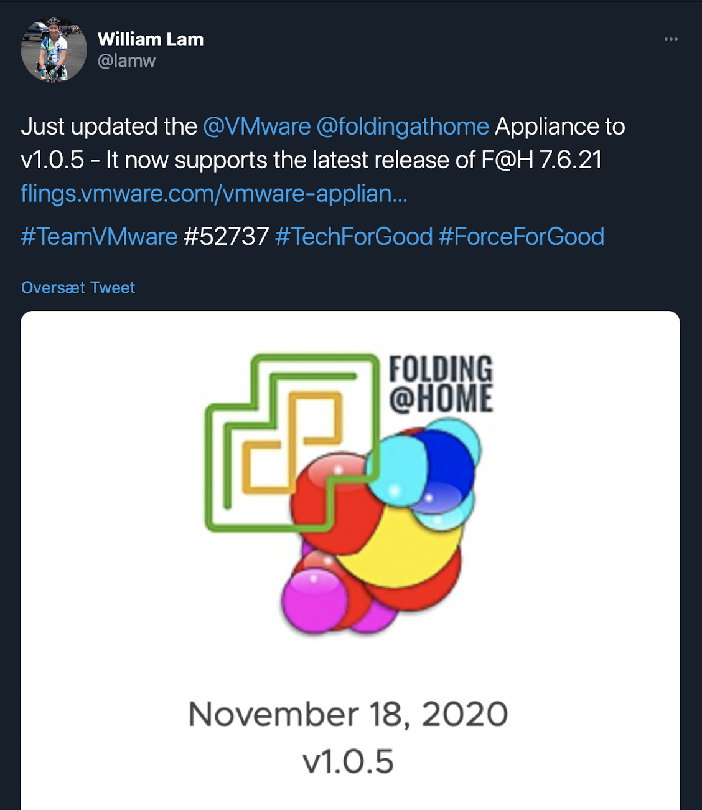
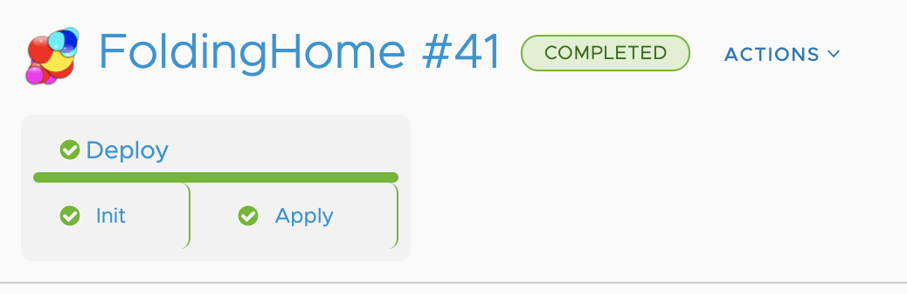
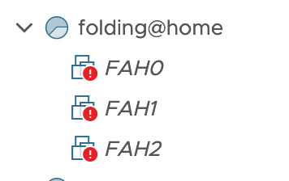

I am always looking for new ways to do demo's, and to showcase the solutions the company I work for have. 
One usecase, that I really wanted to show, was infrastructure as code (IAC), using a combination of both VMware and opensource tools.
But not just as a deploy and destroy, but also as a way to maintain state in something that keeps running, and do the changes, from a source repository, like Github.

The solution came to me, when I stumpled upon a [Github repo](https://github.com/saintdle/Terraform), that takes the fantastic project [Foldinghome](https://foldingathome.org) combined with the OVF appliance from [VMware Flings](https://flings.vmware.com/vmware-appliance-for-folding-home) and deploys it on vSphere using [Terraform](https://www.terraform.io).

My idea was to combine it with [VMware Code Stream](https://cloud.vmware.com/code-stream), to automate the deployment.

The result is what you read here :-) 

The first thing i did, was to fork the project, and change the code, so it would pull directly from a URL. I actuallily think it was inspired from a post from [William Lam](https://twitter.com/lamw), where he described how to do just that (i can't find the post now - sorry). 

In the intial version, the OVF was pulled from the local git repo folder, and since I run everything in Code Stream, using a container, having it local did not make sense for me. 
I created a [issue](https://github.com/saintdle/Terraform/pull/1#issuecomment-723975191)

And [Dean](https://twitter.com/saintdle) responded quickly, and have since implementet a really nice solution, in his repo, that can do both local and remote. So check out his [Github repo](https://github.com/saintdle/Terraform) if you want to play with this yourself.

I ended up creating my own private Github repo, with the code, to keep the demo usecase, seperate from all other stuff. 

I then created a simple pipeline, that gets triggered by changes to that GitHub repo using the Code Stream integration

The Pipeline start's by deploying my [Terraform container](https://hub.docker.com/r/robertjensen/terraform)

Pulls my git repo into that container.

Does an Terraform init and the a terraform apply -auto-approve, with a notification, in case anything goes wrong.

The result is that when I see a Tweet like this.

It takes me 1 minutes, to change the url, and commit and push to my repo.

2 minutes later, the pipeline is complete.

and my vSphere enviroment is updated, with 3 new Folding@home appliances, running with the correct specs, with my FAH user profile, on my vSphere enviroment.

I don't know if that qualifyes as IAC, but for me, it's a really nice demo, and it makes it so easy, to keep my deployment updated, and running with the specs i want.

A side note. When I need ressources, in my enviroment, I just change the number of VM's, and commit. And 2 minuts later, it happens. 

Hope you found this usefull :-) 

Photo credit
Photo by <a href="https://unsplash.com/@swimstaralex?utm_source=unsplash&amp;utm_medium=referral&amp;utm_content=creditCopyText">Alexander Sinn</a> on <a href="https://unsplash.com/s/photos/code?utm_source=unsplash&amp;utm_medium=referral&amp;utm_content=creditCopyText">Unsplash</a>
