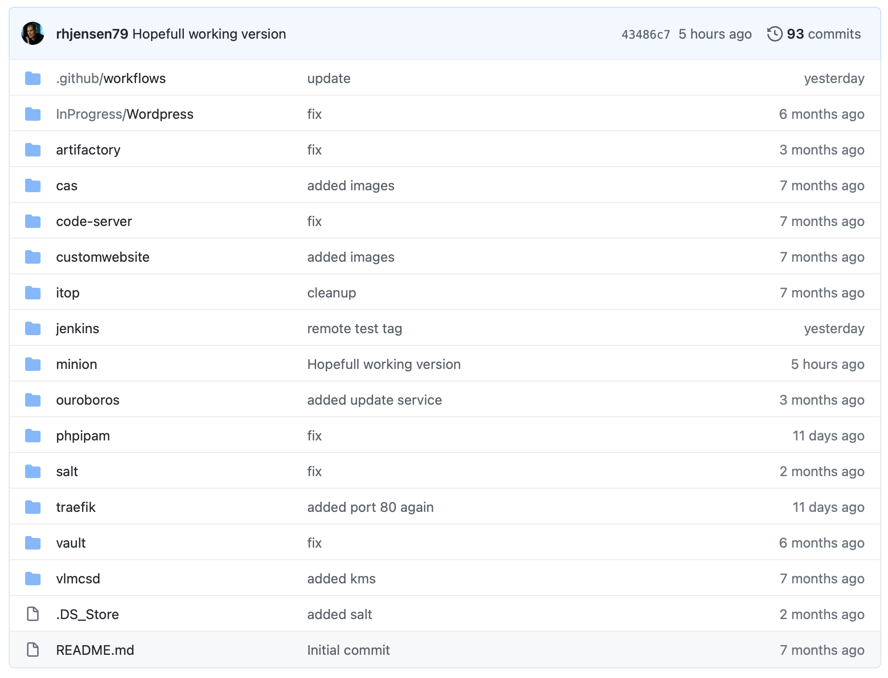
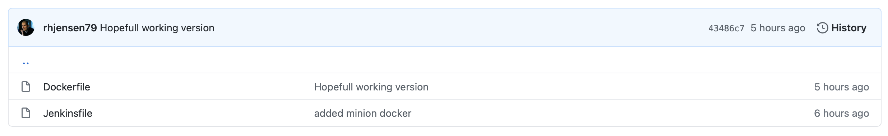
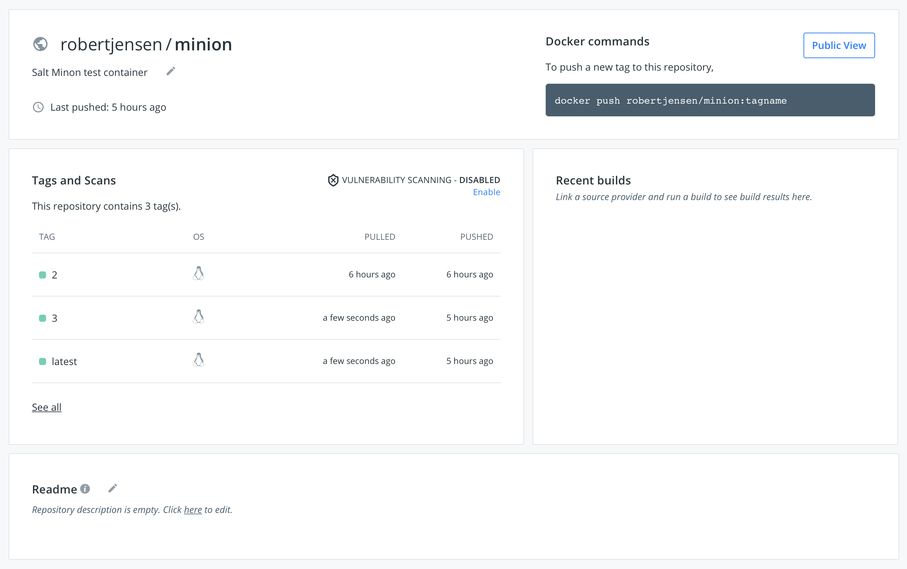
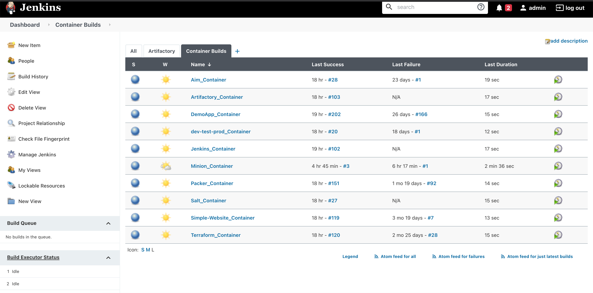
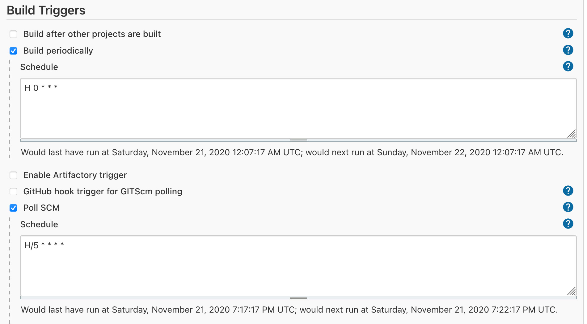
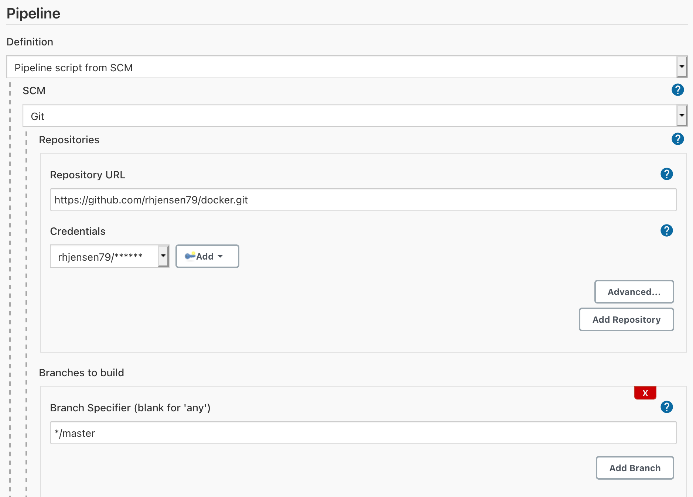
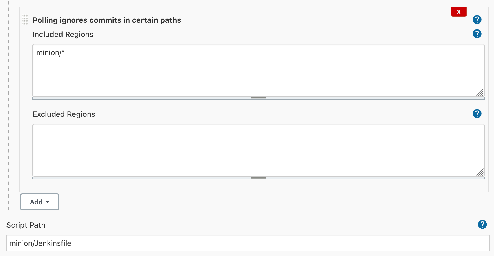
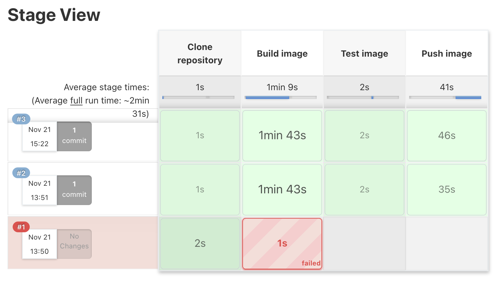
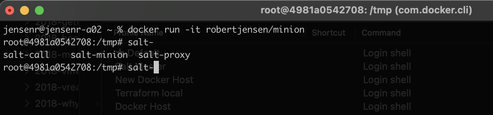

I'm no expert in containers, but I do talk to a lot of admins in my job, that has not taken the time, to look at containers yet, and therefore haven't found, if they can be a usefull tool, for them.

I think it has a lot to do, with containers, being something developers use, and all the talk around Kubernetes (K8S). And that's just a long way away, from the tasks many sysadmins do in their job. My personal take, is that there is a lot to learn, from the way developers do things, but that is another post :-) 

So I thought that I would share, the way I use containers, and the reason behind it., with the hope of sombody finding it usefull enough, for them to start exploring it. 

## The reason behind

I have a demo enviroment for work, that I use all the time. 
But being in a company, where everything change so fast, means that having a static enviroment, is not possible. And I always need to change stuff, to make new things work, and then ending up breaking stuff.
Combine that with, me not having the newest and most stable hardware (i'm not complaning, but it is getting old), means that backup is pretty important. But when I say backup, I don't mean application data. I mean configurations, since the they are most of the time, more important than the actual app data, in my demo enviroment. 

Also talking to more and more people in the DevOps space mens I needed to get a lot more hands on, to feel it on my own body.

This lead me to implementing a Gitops aproact to everything in my enviroment. 
So I have all configurations stored in Github, and I have all persistant data, stored on a NFS server (FreeNAS), that is taking backup to the cloud, every night. 

This approact, allows me to move and reconfigure my enviroment with ease. I have already tried to move it to another location, and it works really well, restoring, and redeploying all from the configurations.

The above, fit's really well with containers, since I can have the container config in GitHub, and the persistant data, on the NFS share, and not be depended on the underlying infrastructure, in case it blows up.

## How do I do it

The way what works for me, is the following.
Note there are many ways to do this, so find the one that fits you.

I always create the dockerfiles etc, in a repo in Github.
I then create a docker hub repository, for the container.

And in the end, I create a [Jenkins](https://www.jenkins.io) job, that pulls the repo, builds the container, and pushes it to Docker Hub, when I make changes, and on a scheldule, to keep the container updated.

This menas, that it's easy to pull my container, from everywhere, and it is always updated.
I can also use, something like watchtower, on my docker host's to automaticly update the running containers, when it is updated in docker hub. 

## Example

Playing around with [SaltStack](https://www.saltstack.com), I needed to be able to test new Minion easily, to deploy job's to it. 

After first deploying new VM's (using VRA) and then pulling the official Ubuntu docker image down, a couple of times, and installing SaltStack, and doing configurations manualily, I desided to build my own test container, with everything installed and the correct config.

So let me run you thru, what I did.


The private repo, i'm using, for all my docker images, has a folder, for each container. 

I created one for this usecase, called minion.


Besides the Dockerfile, it also contains a jenkinsfile, that tells Jenkins, how to buid, and where to put it after.

### The dockerfile looks like this

```
#Dockerfile used for salt minion test
FROM ubuntu:latest
WORKDIR /tmp
#Update imnage and install essesntial apps
RUN apt-get update && apt-get install -y \
    curl \
    nano && \
#Install salt minion
    curl -L https://bootstrap.saltstack.com -o install_salt.sh && \
    sh install_salt.sh &&\
#Update to correct salt master ip
    sed -i 's/#master: salt/master: 192.168.100.12/g' /etc/salt/minion

CMD ["/bin/bash"]
```

It's pretty simple. 
From : Mens which container, to build this from. In my case, the latest ubuntu.

Workdir : The working directory

Run : The commands to run. Note I run as much as possible, as a one liner, to keep the size of the container to minimum.

CMD : the command to run in the end, in this case just a bash terminal.

### The jenkinsfile look like this

```
node {
    def app

    stage('Clone repository') {
        /* Let's make sure we have the repository cloned to our workspace */

        checkout scm
    }

    stage('Build image') {
        /* This builds the actual image; synonymous to
         * docker build on the command line */
        dir("${env.WORKSPACE}/minion"){
           app = docker.build("robertjensen/minion")}     
    }

    stage('Test image') {
        /* Ideally, we would run a test framework against our image.
         * For this example, we're using a Volkswagen-type approach ;-) */

        app.inside {
            sh 'echo "Tests passed"'
        }
    }

    stage('Push image') {
        /* Finally, we'll push the image with two tags:
         * First, the incremental build number from Jenkins
         * Second, the 'latest' tag.
         * Pushing multiple tags is cheap, as all the layers are reused. */
        docker.withRegistry('https://registry.hub.docker.com', 'docker-hub-credentials') {
            app.push("${env.BUILD_NUMBER}")
            app.push("latest")
        }
    }
}
```

The jenkinsfile contains, all the info Jenkins need to build and push the image.
I have my crenditials stored in Jenkins, for both github, and docker hub, which this jenkinsfile uses. 

Note that there is no crenditials stored in Github. This is important, and somthing I had to learn the hard way. 



I also created a clean Docker hub repo, to store my container. 
Note on this picture, I have already a couple of versions of my container build and uploaded.



The part, that makes it all work, is in this case Jenkins.
Note Jenkins is also running as a container, and is actualily building it's own container, on a scheldule. Thats kinda cool imho :-) 



My Jenkins config, is setup so that it builds every 24 hours, and it looks for changes in github, every 5 minute.
Since my Jenkins install is not public facing, i'm not able to trigger a run, when i push changes to Github. Here I have to wait, at least 5 minutes, wich is no problems at all, in my setup.


I also tell jenkins where my Guthub repo is located, and provide it with crenditials and branch.


I tell it where to look for changes. Remember, I have multiple docker configurations, in the same repo. So i only want to build, when sometihng happens to the Minons folder.
And I tell it, where the jenkinsfile is located.



The builds, can be seen in each stage, like this. 
My first one failed, due to a configuration error. I fixed it, and it now build and uploads the container, in around 2 minutes. 

And that is all it takes, to buils a container, and make it public avaliable, and updated.

It might sound like a lot, when you look at it, but most of this, is somthing you do once, and the you can just copy the folder, jenkins job etc. to create a new job. So the "hard" work, is creating the dockerfile, with the configuration, and in this case, it was just putting the commands, I did manualily, into a dockerfile.


The end result, as you can see above, is that I can run
```
docker run -it robertjensen/minion
```

and now have a container, containing a SaltStack Minion, ready to test, in seconds. And when i'm done with it, I can just exit, and run it again, and get a new one.

Was this a static application, then I would use docker-compose, to have it running in a more static way, with the right ports open, and with the correct folders, mounted to my NFS share.

I will share more around this, in a later post.
but for now, I hope this gave some insigt, in a simple usecase, for containers, and how to have it automaticly updated.

If you want to try for yourself, then all docker, jenkinsfiles from this example, is in the post.
The only thing missing, is the Jenkins server. The container i'm using, is [here](https://hub.docker.com/r/robertjensen/jenkins) but it's quite easy to install, and there is many other versions on docker hub, that could be worth to take a look at as well.

If you have comments, then fell free to reach out on Twitter etc. 

<span>Photo by <a href="https://unsplash.com/@t_lipke?utm_source=unsplash&amp;utm_medium=referral&amp;utm_content=creditCopyText">Thomas Lipke</a> on <a href="https://unsplash.com/s/photos/whale?utm_source=unsplash&amp;utm_medium=referral&amp;utm_content=creditCopyText">Unsplash</a></span>