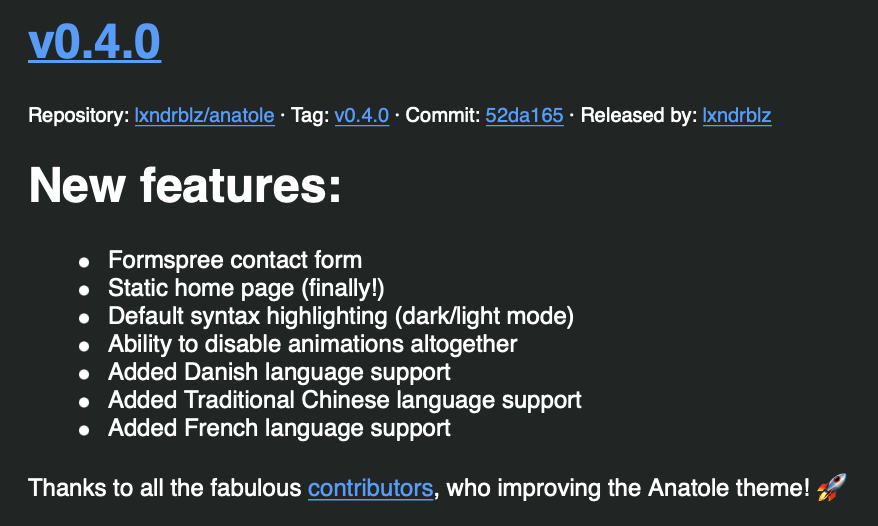

One thing, I have been wanting to do, ever since I started learning Python, and started using Github, was to give back, the the projects, that I use. 
I remember reading, how to get started doing this, but I see myself as a beginner, when it comes to coding, and find myself thinking, "why would anybody want something, that I have done."

The article I read, was about helping with improving code. Improving graphics. Improving documentation etc. But imho it's not that easy, to just jump in, and start participating.

But it finalily happend for me, and not in the way I would have thought. 

Since I moved away from blogger, an into Hugo, I have been using the [anatole](https://github.com/lxndrblz/anatole) theme. And I have been watching the Git repo, for changes etc.

I really like this repo, but my skills in web programming, is close to non existing, so i'm just a normal user here. 
But then I noticed, that the theme had localications, in different languages, and I took a look at the files. 
It was really simple to add new ones, and there were no Danish file. So I guss you can figure out the rest :-) 

I forked the repo, and added a Danish file, with the translations. Then I  created an issue, to put in back into the master branch (I hope I explanined it correctly here :-)  )

It quickly got accepted and merged, and the other day, I got an update from the repo, saying that version 4 was released, and thank you, to all the contributors. 
In the release notes my contribution was mentioned (Danish language) and there I was/am, among a lot of other people, on the contribution [page](https://github.com/lxndrblz/anatole/graphs/contributors).

So the point of this post, is to show, that we all can do this, and giving something back, does not have to be that hard (depending on how much you can/want to do)

So I hope, that more of you out there, want to do the same. 
It's not the last time for me (I have done it 2 more times, since :-)  ).
When you know how it works, it's quite easy, to help fix small issues, that you come across.

And if you are using the code/product/solution yourself, then you are helping your self, and maybe others.

If you don't know how to do this, and want to, then hit me on Twitter, and I will be happy, to setup a test git repo, so you can try it out, without breaking anything :-) 

Photo by <a href="https://unsplash.com/@goshua13?utm_source=unsplash&amp;utm_medium=referral&amp;utm_content=creditCopyText">Joshua Aragon</a> on <a href="https://unsplash.com/s/photos/code?utm_source=unsplash&amp;utm_medium=referral&amp;utm_content=creditCopyText">Unsplash</a>