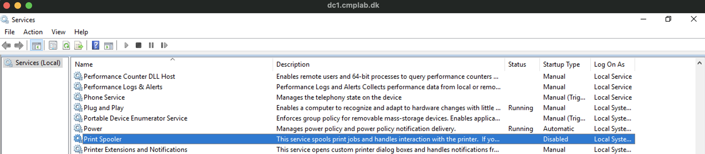

A new exploit, allowing remote code execution on Windows servers using the Print spoller service, has been released as [CVE-2021-1675](https://cve.mitre.org/cgi-bin/cvename.cgi?name=CVE-2021-1675).

I thought this was a good oppertunity, to do a post, around how to disable all your Print Spoooler services, on all your Windows machines, using [SaltStack](https://saltproject.io).

Note there is a fix, and you shuld apply this, and anways keep your systems patched (SaltStack can also help here, but thats another story). So this is not a solution to the above problem, but rather a way to show, how to manage configurations, on multiple systems quickly, when there is a need to do so.

The way I use SaltStack, in my enviroment, is by using something called HighState.

Highstate is a way, to define filters, jobs and configurations, to all my minions (Minion = SaltStack Agent), that get's applyed at a certain interval (every hour for me), and at first connect, to my Salt Master.

So it's a way to make sure, that all my Minions, have the configuration, that I want them to.
If the states/configurations are changed later, Highstate will make sure, my Minions return to my configured state, when next Highstate is run.

It works extremely well.

So what I did was to add a simple job, to my Highstate config, that disabled Print Spoller on all windows.
I have no print servers in my enviroment, but if I had, then I would have made an exception, to exclude those.

In my top.sls file, which defines which jobs to run, I added the folder "print" to my base jobs.

```
base:
  '*':
    - presence
    - ssh
    - loginsight
    - user_mgmt
    - rdp
    - patch
    - print
```

The I created a folder, with the name "print" and created an init.sls file in this

```

disable_print_service:
  service.dead:
    - name: Spooler
    - enable: false

```

The job is quite simple.
Since my base job run's on all minions (due to the ´*´) I added a filter, inside the sls file, so it only targets the Minions with the "grain" OS_Family with the value Windows.

I labeled the job "disable_print_service" and called the module "service.dead"

Then I gave the name of the service "Spooler" and set "enable" to "false". 
This kills the service, and disables it from running again.

And then I ended my filter.

I then found a Windows machine, loggede on and checked that the Spoler service was running.


I then opened a cmd prompt and ran
```
salt-call state.highstate
```
To trigger a highstate job on this Minion.


It ran, and confirmed that the job had run, and that the service has been disabled.

Checking confirmed this.


Now all I needed to do, was to wait for the next Highstate scheldule to run, or to trigger it manual, and then all Windows Minions, will have the print spooler disabled.

Note that all new Minions, with also have their service disabled, when they connect for the first time.  

If I ever need to start it again, it's just a matter of changing the job, to someting that starts the service again, and enables it.

I hope you found this little teaser of SaltStack usefull, and that it gave you an idea of one of the thigs it can be used for. 


Photo by <a href="https://unsplash.com/@nahelabdlhadi?utm_source=unsplash&utm_medium=referral&utm_content=creditCopyText">Nahel Abdul Hadi</a> on <a href="https://unsplash.com/s/photos/hack?utm_source=unsplash&utm_medium=referral&utm_content=creditCopyText">Unsplash</a>
  