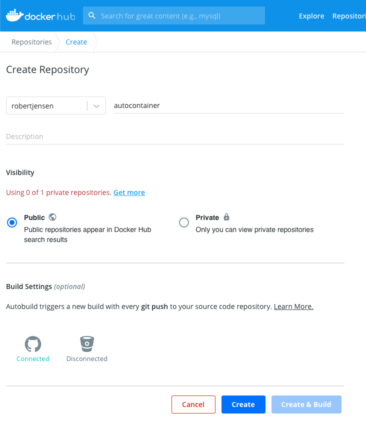
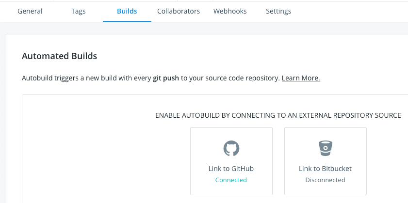
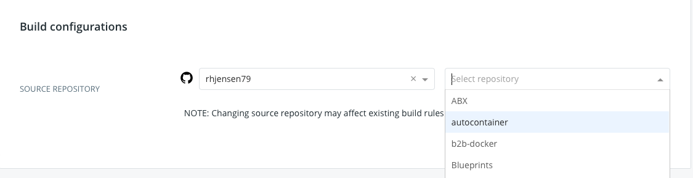
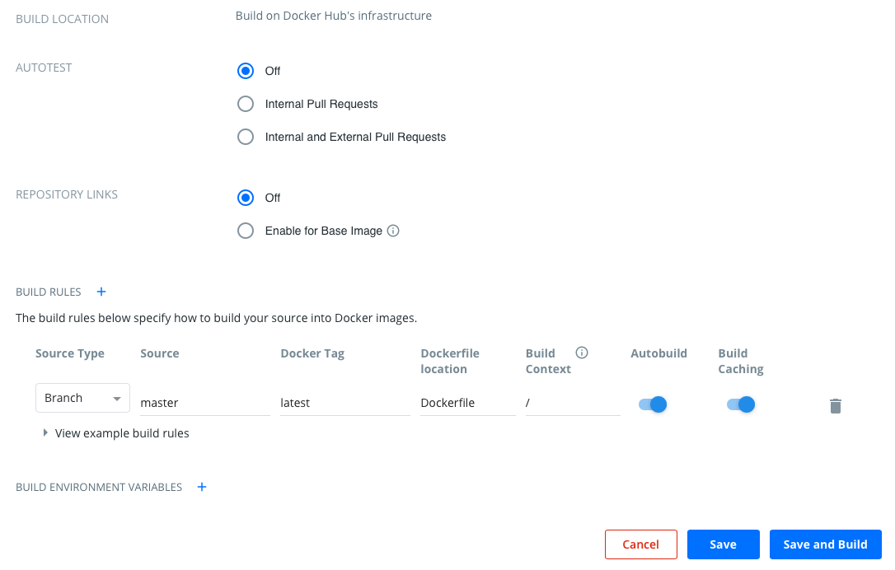
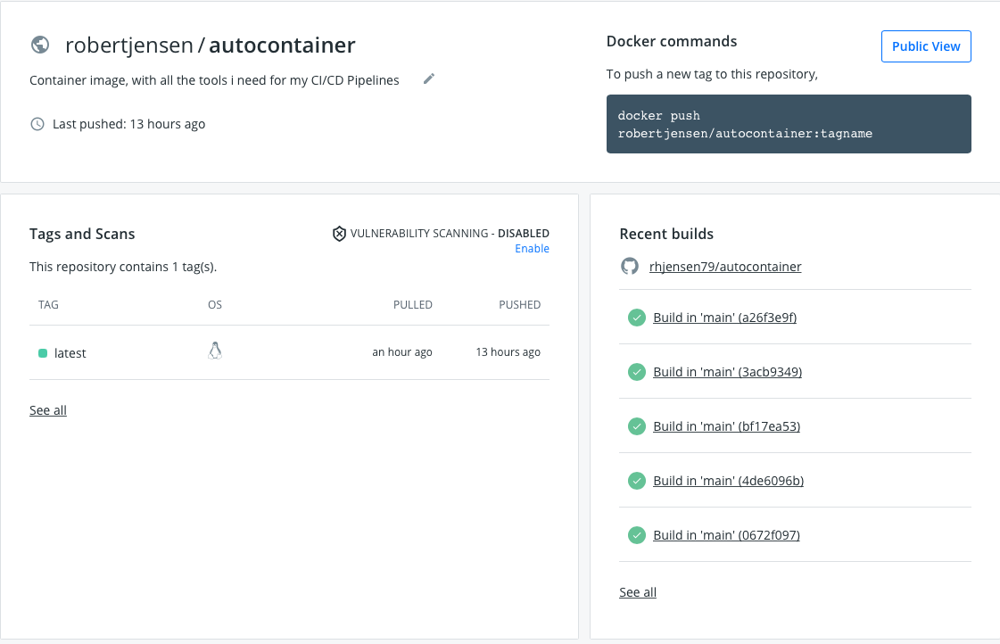

I'm a big fan of using containers, whenever I do any form of automation. For me, it provides a simple way of having a consistant enviroment, where I always know, that the tools I use, are working.
For some time, that way i have been using this, is by creating a docker image, for each git repo. This has also lead me to suddendly having quite a lot of images to maintain.

So I descided that I wanted to consolidate my images, to have less to maintain. 
I will then reference specific versions of my container, to make sure, I don't break anything, when I update the image. 

The image will offcurse be a bit bigger, than using seperate images, but since I only have around 2-3 docker hosts, that run my images, they should be cashed, and be faster to run, and actuallily take up less space. At least that is the idea :-) 

Yesterday Packer 1.7.0 was released, and I thought that was a good excuse, to share how i'm doing this. 
Note i'm no expert, so if you have comments, good ideas etc. then hit me up on Twitter, and let me know. Part of the reason for writing this blog, is for me to learn something new :-) 

If you just want to see my Dockerfile, or use my container, then then links are below :
- Git repo [hjensen79/autocontainer](https://github.com/rhjensen79/autocontainer)
- Docker Hub : [robertjensen/autocontainer](https://hub.docker.com/r/robertjensen/autocontainer)

### Dockerfile

My Dockerfile is based on ubuntu 20.04 and contains the following tools today (it changes all the time). 
- Git
- Curl
- Wget
- Golang
- Python-pip
- Docker.io
- Unzip
- Docker-compose
- Packer
- PAcker Windows update provisioner
- Terraform
- Terraform VRA PRovider

As of today, the Dockerfile looks like below :

```
FROM ubuntu:20.04
LABEL maintainer="Robert Jensen - robert@robert-jensen.dk"
LABEL description="CI/CD Container, containing all buld tools, used in my Buld Pipelines"
WORKDIR /tmp
ENV DEBIAN_FRONTEND="noninteractive" TZ="Europe/Copenhagen"
RUN apt-get update && apt-get install -y \
    git \
    curl \
    wget \ 
    golang \
    python3-pip \
    docker.io \
    unzip &&\ 
    # Install Docker-Compose
    export VER="1.28.2" &&\
    curl -L "https://github.com/docker/compose/releases/download/${VER}/docker-compose-$(uname -s)-$(uname -m)" -o /usr/local/bin/docker-compose &&\
    chmod +x /usr/local/bin/docker-compose &&\
    # Install Packer
    export VER="1.7.0" &&\
    wget https://releases.hashicorp.com/packer/${VER}/packer_${VER}_linux_amd64.zip &&\
    unzip packer_${VER}_linux_amd64.zip &&\
    rm packer_${VER}_linux_amd64.zip &&\
    mv packer /usr/local/bin &&\
    #Install Packer Windows Update provisioner
    export VER="0.10.1" &&\
    wget https://github.com/rgl/packer-provisioner-windows-update/releases/download/v${VER}/packer-provisioner-windows-update_${VER}_linux_amd64.tar.gz &&\
    tar xf packer-provisioner-windows-update_${VER}_linux_amd64.tar.gz &&\
    rm packer-provisioner-windows-update_${VER}_linux_amd64.tar.gz &&\
    chmod +x packer-provisioner-windows-update &&\
    mv packer-provisioner-windows-update /usr/local/bin &&\
    rm LICENSE.txt &&\
    rm README.md &&\
    # Install Terraform
    export VER="0.14.6" &&\
    wget https://releases.hashicorp.com/terraform/${VER}/terraform_${VER}_linux_amd64.zip &&\
    unzip terraform_${VER}_linux_amd64.zip &&\
    rm terraform_${VER}_linux_amd64.zip &&\
    mv terraform /usr/local/bin &&\
    # Install Terraform VRA provider
    export VER="0.1.9" &&\
    wget -q https://github.com/vmware/terraform-provider-vra/releases/download/v${VER}/terraform-provider-vra-linux_amd64-v${VER}.tgz &&\
    tar xvf terraform-provider-vra-linux_amd64-v${VER}.tgz &&\
    rm terraform-provider-vra-linux_amd64-v${VER}.tgz &&\
    mkdir -p ~/.terraform.d/plugins/linux_amd64 &&\
    mv terraform-provider-vra_v${VER} ~/.terraform.d/plugins/
```

The idea of this file, is that all installers (after the atp install), start by defining a env varibale, that is then used to download, unpack, install and cleanup the install, before moving on to the next installation. 

So when Packer got updated yesterday, all i needed to do, was to change the value of VER to 1.7.0, and push the change to my repo. Easy right ? 

Note I could just install latest, but that way i can't controll what version i'm running.  

### Building new image

For this image, I don't need it to be build fast, and i want it to be avaliable, on the internet, for my automation to consume. So I have hooked it up to my Github repository, for auto build to Docker Hub, everytime a change happens. 

The way to do this, is :

From you Docker Hub profile, create a new repository


Link it to your Github or Bitbucket repo


Select your repo from the list


Chose if you want to do Autotest, and if you want your image, to be auto updated, when your from image is updated. Note the last, only works for non official images.

Then select where your Dockerfile is located and branch. 
For me, my Dockerfile is in the root of my master branch, and i want it named latest, so default works for me. 
So I just need to select save and build, and then my auto build is setup :-) 


My Builds


That's all it takes.
Not that Docker hub autobuilds, is not the fastest. So if you need to build your images fast, then you should look into other options. That said, I think it's a really nice service.

Also if you want to learn more abour docker, then I did a presentation, to the latest Automation User Group, around basic docker. You can find the links below.

Back to Basics: Getting started with Docker - Robert Jensen

- Recording : https://www.youtube.com/watch?v=QPLJL1u-Hvs&t=256s
- Git Repo : https://github.com/rhjensen79/b2b-docker  
- Presentation : https://github.com/rhjensen79/b2b-docker/blob/master/presentation.pdf

<span>Photo by <a href="https://unsplash.com/@sxoxm?utm_source=unsplash&amp;utm_medium=referral&amp;utm_content=creditCopyText">Sven Mieke</a> on <a href="https://unsplash.com/s/photos/technical?utm_source=unsplash&amp;utm_medium=referral&amp;utm_content=creditCopyText">Unsplash</a></span>