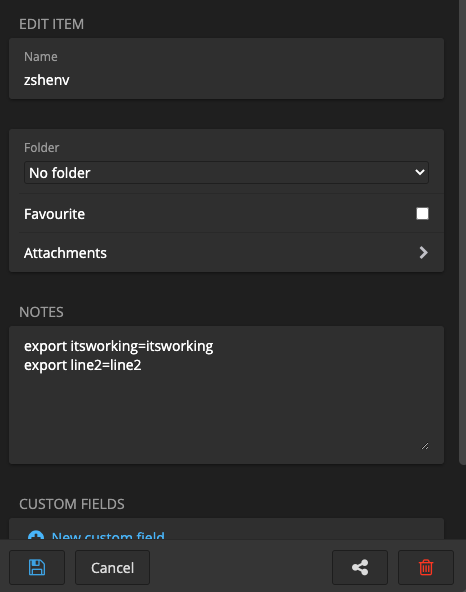
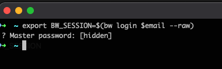
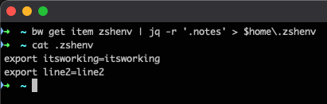

Update : After posting this, I was told that Grand Orchard, had already written a similar post, around how to do the same, using [1Password](https://1password.com).

So if you are a 1Password user, then take a look at his [blog](https://grantorchard.com/securing-environment-variables-with-1password/) 
- - -

I use multiple computers, and sometimes it can be hard, to keep everything in sync. Working documents are easy, but my .env files, has proven to be harder.

I know there are tons of solutions for this, but since i'm a big fan of [Bitwarden](https://bitwarden.com) I thought I might as well, use that to store the data, from my .env files.

### Disclamer - This is probably not best practice, to keep all your secrets in env files etc. So keep that in mind, if you are using this guide.

I will be using Bitwardens GUI to create the data, and the CLI client with jq to gather the data, end update my env file.

The env file i'm using is the .zshenv since my defauls shell is ZSH on my Mac.

To install these, on my Mac, I use [HomeBrew](https://brew.sh) 
If you don't have Homebrew installed, then do this prior to following this guide, or install the needed tools your way.

Open a terminal to install Bitwarden, Bitwarden-cli and jq
```
brew install bitwarden bitwarden-cli jq
```
Login using the GUI, and create a new secure note with the name zshenv


Create the env data, you want to use, in the Notes field.
I have used dummy data, but use whatever you like, in the format below:
```
export key=value
export key=value
```
Save the note, and open a terminal 

Create a variable with your email so you don't have to type it, every time.
```
export email=YourEmailADress
```
Use Bitwarden-cli to get a session key by running
```
export BW_SESSION=$(bw login $email --raw)
```


You will be prompted, for a master password.
We could have kept it in a variable, but I don't want the master key, to all my secrets, in a env variable on my computer.

After this, you should have a env variable, with your session key in it.
you can verify it by typing
```
export
```
and look for a key with the name BW_SESSION

All we have to do now, is to use that Session key, to get the data from the secure note in Bitwarden, and update our .zshenv file with the data.
```
bw get item zshenv | jq -r '.notes' > $home\.zshenv
```


As you can see it's now working.


If you want to create a bash file, that does all of this for you, then create a zshenv.sh file with the content below
```
#!/bin/bash

export email=YourEmailADress
export BW_SESSION=$(bw login $email --raw)
bw get item zshenv | jq -r '.notes' > $home\.zshenv
```
remember to give it the right permissions
```
chmod +s zshenv.sh
```
And now all you need to to, is to run it, to have an updated .zshenv file.

I hope you found this usefull.

Photo by <a href="https://unsplash.com/@gcsgpp?utm_source=unsplash&utm_medium=referral&utm_content=creditCopyText">Gabriel Gusmao</a> on <a href="/s/photos/sync?utm_source=unsplash&utm_medium=referral&utm_content=creditCopyText">Unsplash</a>
  