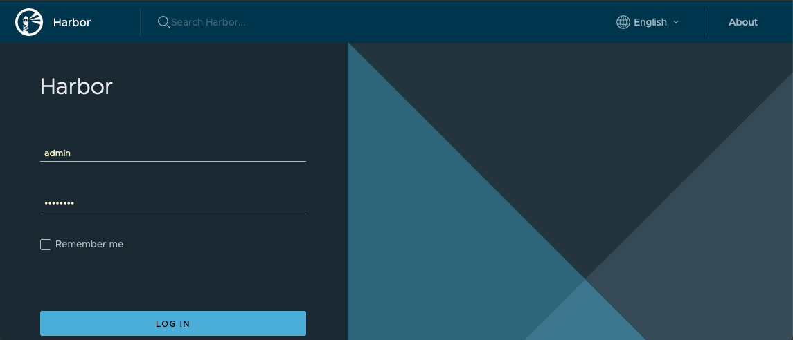

Ever since [Docker](https://www.docker.com) enforced their [rate limit](https://www.docker.com/increase-rate-limits), I have been looking at using some other registry, to put my containers, but also to use as a proxy, so I hit the Docker api a blit less.

Everywhere I look, [Harbor](https://goharbor.io) is mentioned, so that is the one, that I have been looking at.

The problem with Container registrys, is that Docker requires there to be a valid certificate, for them to work.
I could just buy a certificate, and use that, but i'm a big fan of [Let's Encrypt](https://letsencrypt.org) so it was natural for me to look into using that.

To make Let's Encrypt work, I would have to expose Harbor to the internet, and since I only have one public ipadress, and that is used by my Traefik proxy (on the same ports), that wont work. 

Luckely, I can just use Traefik, to generate the certificates, and publish my Harbor container registry, thru Traefik.

This blog is about how to do just that :-) 

### Before you begin, you need

- A working Traefik proxy, with Let's Encrypt enabled
My setup is [described here](https://www.robert-jensen.dk/posts/2021-secure-deployments-with-docker-and-traefik/), and should be quite easy to follow.

- An clean Ubuntu 18.04 VM for running Harbor
(That is what i'm using anyway)
Note the [requirements](https://goharbor.io/docs/2.1.0/install-config/installation-prereqs/)

### Installtion of Harbor

Note: I found a lot of my inspiration, in this [guide](https://thenewstack.io/tutorial-install-the-docker-harbor-registry-server-on-ubuntu-18-04/).

The steps for installing with Traefik is.

Note: I'm running as root, so change accordingly if you are not. 

Install Docker
```
apt-get install docker.io
```
Install Docker-Compose
```
wget https://github.com/docker/compose/releases/download/1.28.4/docker-compose-Linux-x86_64

mv docker-compose-Linux-x86_64 /usr/local/bin/docker-compose

chmod +x /usr/local/bin/docker-compose
```
Install NGINX
```
apt-get install nginx
systemctl start nginx
systemctl enable nginx
```

Download Harbor
I chose to install mine in /srv
```
cd /srv

wget https://github.com/goharbor/harbor/releases/download/v2.0.6/harbor-online-installer-v2.0.6.tgz
tar xvzf harbor-online-installer-v2.0.6.tgz

cd harbor
```
Now copy the template config, and configure it to match your installation.

```
cp harbor.yml.tmpl harbor.yml
nano harbor.yml
```
I have included the top of my config below (Do not replace this file, with you entire file). 

The changes that i have made are the following :

- Hostname
- port
- relativeurls
- external_url

As far as I can read, you don't need hostname, if you have external_url, but I set them both to the anyway, to the external hostname.

I have also # all things related to https, since we are using Traefik for that. 

Remember to change admin and database pass. Look for !!!ChangeMe!!! in my file.


```
# Configuration file of Harbor

# The IP address or hostname to access admin UI and registry service.
# DO NOT use localhost or 127.0.0.1, because Harbor needs to be accessed by external clients.
hostname: registry.cmplab.dk

# http related config
http:
  # port for http, default is 80. If https enabled, this port will redirect to https port
  port: 8080
  relativeurls: true

# https related config
#https:
  # https port for harbor, default is 443
#  port: 443
  # The path of cert and key files for nginx
#  certificate: /your/certificate/path
#  private_key: /your/private/key/path

# # Uncomment following will enable tls communication between all harbor components
# internal_tls:
#   # set enabled to true means internal tls is enabled
#   enabled: true
#   # put your cert and key files on dir
#   dir: /etc/harbor/tls/internal

# Uncomment external_url if you want to enable external proxy
# And when it enabled the hostname will no longer used
external_url: https://registry.cmplab.dk:443

# The initial password of Harbor admin
# It only works in first time to install harbor
# Remember Change the admin password from UI after launching Harbor.
harbor_admin_password: !!!ChangeMe!!!

# Harbor DB configuration
database:
  # The password for the root user of Harbor DB. Change this before any production use.
  password: !!!ChangeMe!!!
  # The maximum number of connections in the idle connection pool. If it <=0, no idle connections are retained.
  max_idle_conns: 50
  # The maximum number of open connections to the database. If it <= 0, then there is no limit on the number of open connections.
  # Note: the default number of connections is 1024 for postgres of harbor.
  max_open_conns: 1000
```

Now you are ready to run the installer with trivy (Security scanner)
```
./install.sh --with-trivy
```
When the installer is done, then run
```
docker-compose down
```

Edit the nginx.conf file, to make Harbor work, behind the Traefik proxy.

```
nano common/config/nginx/nginx.conf
```
Find all lines with 
```
all of proxy_set_header X-Forwarded-Proto $scheme;
```
And put a # in front so they look like this 
```
# all of proxy_set_header X-Forwarded-Proto $scheme;
```
!!! Important: There are multible lines, you need to # out. 
If you get a lot of retry errors later, when you push a container to the registry, then you probably did not set this everywhere in the file. 

When this is done, you can start your Harbor installation again, by running
```
docker-compose up -d
```
### Configuration of Traefik

If you, are not running Traefik, on the same host, as you are running Harbor, then you need to setup a static config in Traefik.

Luckely it's not that hard :-) 

In your traefik.yml file, add the following lines under providers.
```
  file:
    filename: "/etc/traefik/all.yaml"
    watch: true
```
Add a the file all.yaml in the /etc/traefik directory.

This is most likely where you have the traefik.yml file

The content of the file should be the following.
Replace publichostname with the pub hostname of your harbor installation (the same you sat in your harbor.yml file)
and change the url, to be the fqdn of your harbor vm.

Also if your certresolver, is called something different, in your setup, then change that as well.
```
http:
  routers:
    harbor:
      service: harbor
      rule: "Host(`publichostname`)"
      tls:
        certResolver: myresolver

  services:
    harbor:
      loadBalancer:
        servers:
          - url: "http://HarborFQDN:8080"
```
And that is it.

Traefik should now have published your Harbor installation, so it avaliable for you, on https://publicurl.

You can login with admin and the password, you set in your harbor.yml file, and you now have your own container registry.


If you want to test your new installation, then look at the Harbor website. I found this section of value, when I was trubleshooting : [Link](https://goharbor.io/docs/1.10/working-with-projects/working-with-images/pulling-pushing-images/)

Thanks for reading so far. I hope you found it usefull.

If you have any questions, then feel free to reach out on Twitter. 


<span>Photo by <a href="https://unsplash.com/@_everaldo?utm_source=unsplash&amp;utm_medium=referral&amp;utm_content=creditCopyText">Everaldo Coelho</a> on <a href="https://unsplash.com/s/photos/lighthouse?utm_source=unsplash&amp;utm_medium=referral&amp;utm_content=creditCopyText">Unsplash</a></span>
