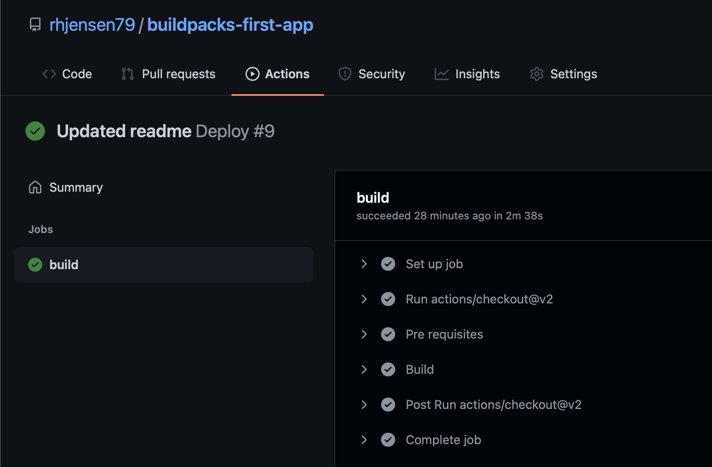
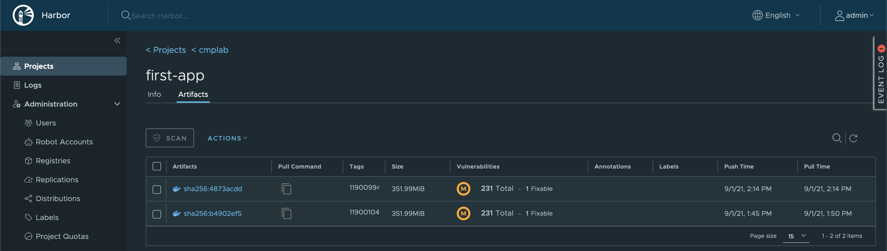
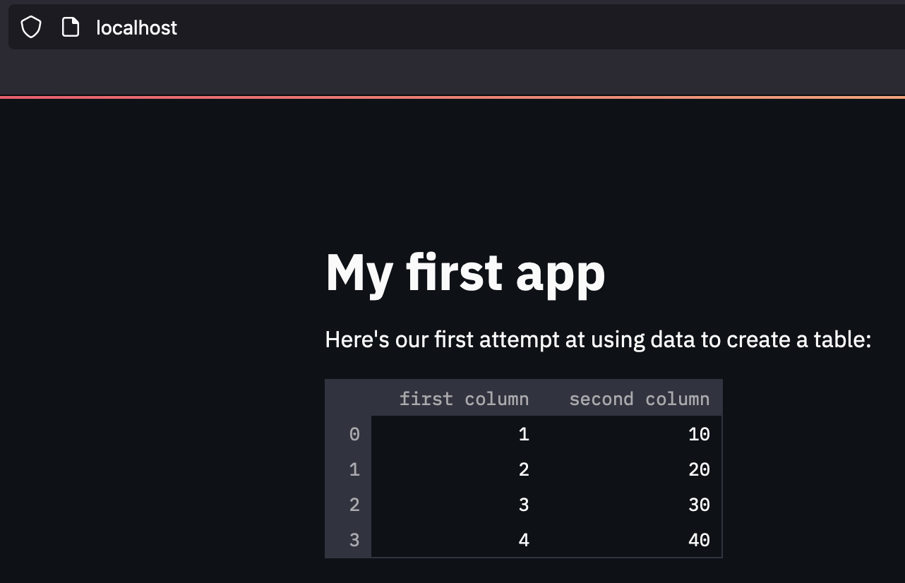

I might be late to the party, but recently I learned about [Buildpacks.io](https://buildpacks.io) and what they can do vs Dockerfiles, and I just had to try it out. 

If you never heard about Buildpacks, then it's a way to package your application into a container, without using Dockerfiles.

The benefits can be 
- More secure images.
- Faster upgrades of your applications
- Easier to maintain images

And many more. 

But it requires your application, to be fit for it.
You can read more about this on [Buildpacks.io](https://buildpacks.io), and it's too big a topic, for me to cover it here.

Instead I will show how I created my first Buildpack app, and how I integrated it with Github Actions, for auto builds, because you have to automate it - Right ? 

The Github Repo with all the code I mention, can be found here : https://github.com/rhjensen79/buildpacks-first-app

Feel free to use it as reference, if you want to try it out yourself.

All you need to create your container, if you are running Python, is the following files :
- app.py
- requirements.txt
- Procfile


app.py consists of a few lines of code, that basicly imports [Streamlit](https://streamlit.io), and creates a Headline and a table.
It's not pretty, but it works for my purpose.
```
import streamlit as st
import pandas as pd

st.title('My first app')

st.write("Here's our first attempt at using data to create a table:")
st.write(pd.DataFrame({
    'first column': [1, 2, 3, 4],
    'second column': [10, 20, 30, 40]
}))
```

requirements.txt tells Buildpacks what to install, for the app to work (Note this is not the full file, listed below)
```
altair==4.1.0
appnope==0.1.2
argon2-cffi==21.1.0
astor==0.8.1
attrs==21.2.0
backcall==0.2.0
...
```

Procfile tells that it's a Web app, and what process to start at runtime. 

In this case, it runs the setup.sh and Streamlit.
```
web: sh setup.sh && streamlit run app.py
```
The purpose of the setup.sh file, is just to setup some Streamlit configurations in the container. So it only specific to my app, and not Buildpacks in general.

Now all there is left, is to build the container. 
I wanted to use [github Actions](https://github.com/features/actions) for this, so I created a .github/workflows/master.yml file containing all the steps. 
```
name: Deploy

# Controls when the workflow will run
on:
  # Triggers the workflow on push or pull request events but only for the master branch
  push:
    branches: [ master ]
  pull_request:
    branches: [ master ]

  # Allows you to run this workflow manually from the Actions tab
  workflow_dispatch:

# A workflow run is made up of one or more jobs that can run sequentially or in parallel
jobs:
  # This workflow contains a single job called "build"
  build:
    # The type of runner that the job will run on
    runs-on: ubuntu-latest

    # Steps represent a sequence of tasks that will be executed as part of the job
    steps:
      # Checks-out your repository under $GITHUB_WORKSPACE, so your job can access it
      - uses: actions/checkout@v2

      # Runs a set of commands using the runners shell
      - name: Pre requisites
        run: |
          echo add buildpack repo and install
          sudo add-apt-repository ppa:cncf-buildpacks/pack-cli
          sudo apt-get update
          sudo apt-get install pack-cli -y
          echo set pack builder
          pack config default-builder heroku/buildpacks:20
          echo Docker Registry login
          docker login -u ${{ secrets.DOCKER_HUB_USER }} -p ${{ secrets.DOCKER_HUB_PASSWORD }} ${{ secrets.REGISTRY }}

      # Runs a set of commands using the runners shell
      - name: Build
        run: |
          echo Build container
          pack build ${{ secrets.REGISTRY }}/cmplab/first-app:${{ github.run_id }}
          echo Push container to registry
          docker push ${{ secrets.REGISTRY }}/cmplab/first-app:${{ github.run_id }}
```

It requires 3 secrets in your repo :
- DOCKER_HUB_USER
- DOCKER_HUB_PASSWORD
- REGISTRY

to be able to login and push your container after build.
But once you get this, then it auto builds, on every push.

In my setup, it takes less than 3 minutes, to execute.

The echo part of the script, should explain what every part of the job does, so I won't cover it in details here. 

The versioning is based on the run_id variable. There might be better ways of doing this, but it works fine in my usecase.

After it's build, and pushed, my [Harbor](https://goharbor.io) registry, does security scans on it. So this is something to consider, for extra security.



To test the image, simply run 
```
docker run -p 80:80 registry.cmplab.dk:443/cmplab/first-app@sha256:4873acdd3b3c00f7735eead784f9b531f1501d990e38abf53e389bc0ca0cf9c5
```
And open http://localhost:80 to see the app


Note that the version, needs to be correct, as well as your registry url, for this to work. The above example, only works for the specific version, that might not be available, when you read this.

This concludes my quick getting started guide. Thanks for reading this far. 


Photo by <a href="https://unsplash.com/@kellysikkema?utm_source=unsplash&utm_medium=referral&utm_content=creditCopyText">Kelly Sikkema</a> on <a href="https://unsplash.com/s/photos/build?utm_source=unsplash&utm_medium=referral&utm_content=creditCopyText">Unsplash</a>
  