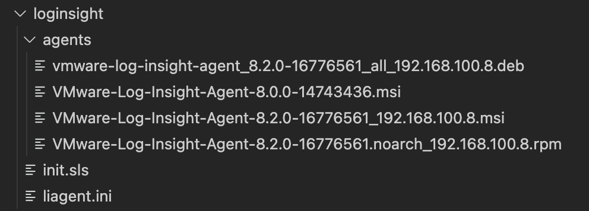

For a POC i'm preparing for, I had the chance to look at bit more at [SaltStack](https://www.vmware.com/products/vrealize-automation/saltstack-config.html).

I like the product, and what it can do, but I really need a usecase, to do anything usefull with it. It's the same with many other products, but with SaltStack, i'm just feeling it more. So it was nice to have a goal this time :-) 

I wanted to share what I have done, for inspiration, for people just starting out with SaltStack or Salt.
This usecase, is eash to replicate, and use for other deployments/configurations etc. 

The usecase is to deploy [LogInsight](https://www.vmware.com/products/vrealize-log-insight.html) agent's on all my VM's. This being both Windows and Linux in one single job. 

The reason this was a bit special, is that LogInsight itself, can manage the agent and configuration after deployment. So what I needed to do, wat to deploy the correct agent, and configurations file, and then let LogInsigt take over.
In a normal deployment, I would let SaltStack, manage the configuration files, since this is one of the key benefits of the product imho. 


### The Code

If you just wanna see the code, then here it is. 
Below this I will try to break it down, and explain what it's doing.

```



loginsight_agent_install:
  file.managed:
    
    - source: salt://loginsight/agents/vmware-log-insight-agent_8.2.0-16776561_all_192.168.100.8.deb
    - name: /tmp/liagent-current.deb
    - skip_verify: True
    
    - source: salt://loginsight/agents/VMware-Log-Insight-Agent-8.2.0-16776561.noarch_192.168.100.8.rpm
    - name: /tmp/liagent-current.rpm
    - skip_verify: True
    
    - source: salt://loginsight/agents/VMware-Log-Insight-Agent-8.2.0-16776561_192.168.100.8.msi
    - name: 'c:\windows\temp\liagent-current.msi'
    - skip_verify: True
    

  cmd.run:
    - names:
      
      - dpkg -i /tmp/liagent-current.deb
      
      - rpm -q VMware-Log-Insight-Agent || rpm -i /tmp/liagent-current.rpm
      
      - 'c:\windows\temp\liagent-current.msi /quiet'
      

loginsight_agent_configure:
  file.managed:
    
    - source: salt://loginsight/liagent.ini
    - name: 'c:\ProgramData\VMware\Log Insight Agent\liagent.ini'
    
    - source: salt://loginsight/liagent.ini
    - name: /etc/liagent.ini
      

set_loginsight:
  grains.present:
    - name: loginsight_installed
    - value: True
    - require:
      - loginsight_agent_configure



loginsight_allready_configured:
  test.configurable_test_state:
    - name: loginsight_installed
    - changes: False
    - result: True
    - comment: Loginsight allready installed



loginsight_agent_start_service:
  service.running:
    - names:
      
      - LogInsightAgentService
      
      - liagentd
      
```

I use my code as a HighState. So it's part of my base in my top SLS file.
```
base:
  '*':
    - presence
    - ssh
    - loginsight
    - user_mgmt
    - patch
```

The directory structure of my loginsight folder is 


So I keep alle the binaries in the agents folder, and the liagent.ini file and the init.sls file, in the root.

### Breakdown

```


```
To begin with, I create a [grain](https://docs.saltproject.io/en/latest/topics/grains/index.html) "loginsight_installed" and set it to false.
It then checks if it's false, and only runs the rest of the job, if it's false.
This ensures that the install part of the job, is only run once.

```
loginsight_agent_install:
  file.managed:
    
    - source: salt://loginsight/agents/vmware-log-insight-agent_8.2.0-16776561_all_192.168.100.8.deb
    - name: /tmp/liagent-current.deb
    - skip_verify: True
    
    - source: salt://loginsight/agents/VMware-Log-Insight-Agent-8.2.0-16776561.noarch_192.168.100.8.rpm
    - name: /tmp/liagent-current.rpm
    - skip_verify: True
    
    - source: salt://loginsight/agents/VMware-Log-Insight-Agent-8.2.0-16776561_192.168.100.8.msi
    - name: 'c:\windows\temp\liagent-current.msi'
    - skip_verify: True
    
````

Then I copy the correct binary to the on the minon, and rename it.

```
  cmd.run:
    - names:
      
      - dpkg -i /tmp/liagent-current.deb
      
      - rpm -q VMware-Log-Insight-Agent || rpm -i /tmp/liagent-current.rpm
      
      - 'c:\windows\temp\liagent-current.msi /quiet'
      
```
I then install the binary on the minon, using the OS specific installer.
Debian = dpkg
Redhat/Photon = rpm
Wndows = msi

```
loginsight_agent_configure:
  file.managed:
    
    - source: salt://loginsight/liagent.ini
    - name: 'c:\ProgramData\VMware\Log Insight Agent\liagent.ini'
    
    - source: salt://loginsight/liagent.ini
    - name: /etc/liagent.ini
      

set_loginsight:
  grains.present:
    - name: loginsight_installed
    - value: True
    - require:
      - loginsight_agent_configure
```
Then I copy the liagent.ini file to the correct OS path, and set the grain to True, to keep the install part of the job from running again.
The config file, contains the settings needed for the Agent to do the initial connection to the LogInsight server.

```


loginsight_allready_configured:
  test.configurable_test_state:
    - name: loginsight_installed
    - changes: False
    - result: True
    - comment: Loginsight allready installed


```
If the grain was True, then I log that it's already installed, and skip the previsus steps. 
And then I end the initial If run.

```
loginsight_agent_start_service:
  service.running:
    - names:
      
      - LogInsightAgentService
      
      - liagentd
      
```
And finalily in the end, I make sure the service is running. 
Since the [highstate](https://docs.saltproject.io/en/latest/ref/states/highstate.html) job, is being run at a scheldule in my system, this also ensures, that if the services stops, it get's started again.

So to sum up. This is an example, of a job, that can run on multiple OS, and which checks/updates a grain.
I hope you found it usefull. Let me know on Twitter, if you can use it, and if you have done any jobs yourself, that could be usefull to share :-) 


Photo by <a href="https://unsplash.com/@brett_jordan?utm_source=unsplash&utm_medium=referral&utm_content=creditCopyText">Brett Jordan</a> on <a href="https://unsplash.com/s/photos/order?utm_source=unsplash&utm_medium=referral&utm_content=creditCopyText">Unsplash</a>
  
