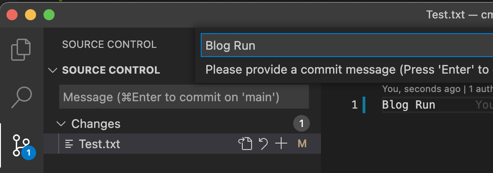
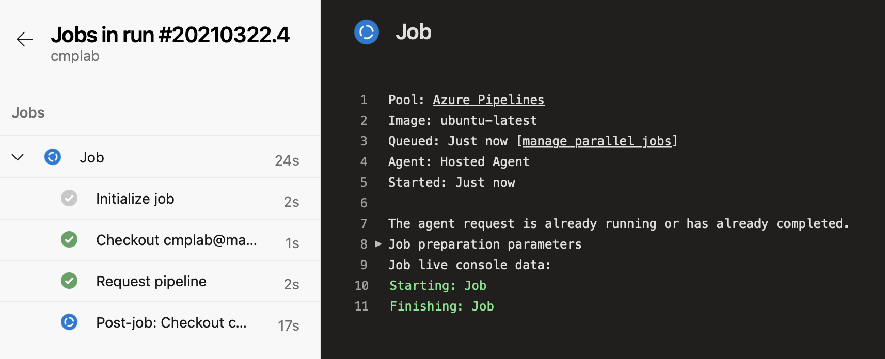
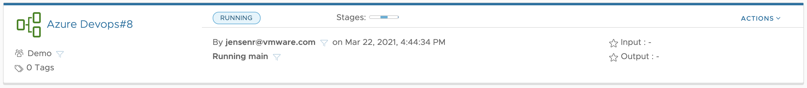

For a customer case, I had to show integration between [Azure Devops](https://azure.microsoft.com/da-dk/services/devops/), and [VMware CodeStream](https://cloud.vmware.com/vrealize-automation-cloud).

Since the Git endpoint in Code Stream, does not work with [Azure DevOps Git repository](https://azure.microsoft.com/en-us/services/devops/repos/), I had to find another way of doing the integration.

The solution was quite simple. Trigger the pipeline, using a pipeline run by Azure Devops.

Note most of the code snippets, i'm using, I got from [Grant Orchard blog](https://grantorchard.com/tango/cloud-assembly-api-getting-started/). 

Before you begin, you need to have an API token, that can trigger the pipeline, and a Pipeline to run.

I'm no expert in Azure Devops, so there are probably better ways of doing this. 

One ting I would do in production, is to have my API key as a secret variable, I could call. 

The way the script works, is by first creating an env variable, with my Token.
Then I use this, to get a Bearer token.
And then I use the Bearer token, to trigger the pipeline. 

The pipeline ID is easy to get, by copying the unique ID of the URL, when you are editing the pipeline.

The Azure-pipeline.yml code looks like below. 
Note you need to change the API_TOKEN and the PIPELINE to match your enviroment, to make it work. 

```
trigger:
- main

pool:
  vmImage: ubuntu-latest

steps:

- script: |
    export api_token=API_TOKEN
    export bearer=`curl -X POST 'https://api.mgmt.cloud.vmware.com/iaas/api/login' -H 'Accept: application/json' -H 'Content-Type: application/json' -d '{ 'refreshToken': '$api_token' }' | jq -r '.token'`
    curl -X POST 'https://api.mgmt.cloud.vmware.com/pipeline/api/pipelines/PIPELINE_ID/executions' -H 'Content-Type: application/json' -H 'Authorization: Bearer '$bearer'' -d '{}'
  displayName: 'Request pipeline'
```

But this is all it takes.

When you comit and push a new file, to the repo.


It triggers a Pipelin run in Azure Devops


That start's a Ubuntu container, that runs the script, that triggers the CodeStream pipeline.


This is just a simpel example. You can do it a lot more advanced, and pass parameters to the CodeStream pipeline, if you want to. But for my usecase, this was enough, and it's easily replicated, to other platforms, that can run the script, or just do a simple rest call.

Hope you found this usefull.

Photo by <a href="https://unsplash.com/@claybanks?utm_source=unsplash&utm_medium=referral&utm_content=creditCopyText">Clay Banks</a> on <a href="/s/photos/integration?utm_source=unsplash&utm_medium=referral&utm_content=creditCopyText">Unsplash</a>
  