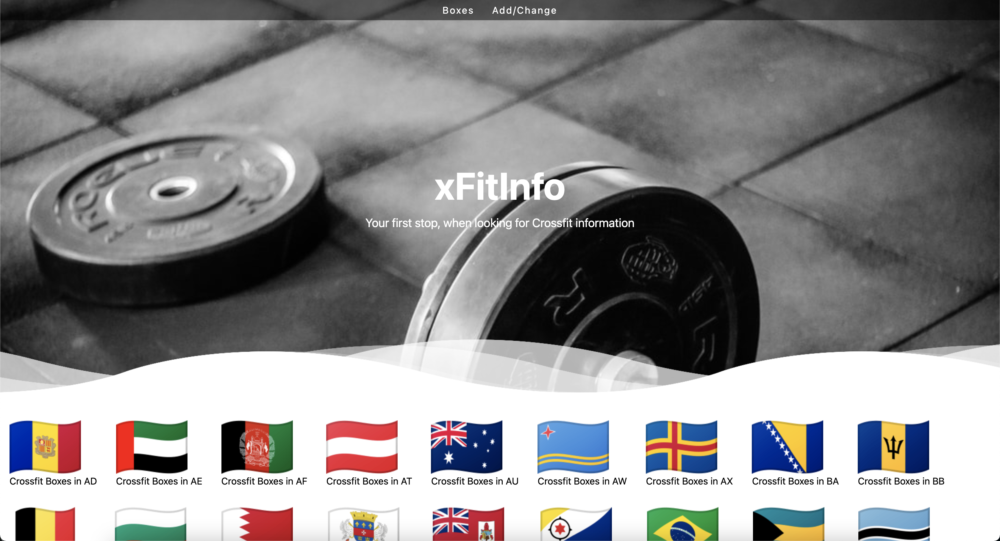

I love doing doing Crossfit, and before Covid19 hit, I was pretty active in my local Box.

Crossfit boxes are split into 2 segments. The official affiliates, which is a part of the company [Crossfit.com](https://www.crossfit.com/), and all the others, which offer functional training.

For a new person, that wants to get into shape, and do some functinal training, then it's probably hard to see the difference. 
But the first step, is to find a box, that offers training, and this is where my litte project comes ind.

So I set out, to create a website, that contains information, around all Boxes, split into countrys and locations, so it's easy to find a box near you.
As far as I can see, such a complete list, does not exist.

Since this is a technical blog (for the most parts), I will focus this post, on the technical parts of the project.
But if you are doing Crossfit (or functional training), then take a look, at see if your Box is there. If not, then add it, so others can find it as well :-) 
The address is [www.xFitInfo.com](https://www.xFitInfo.com)

The site is far from finished, so expect to see a lot of changes, over the next couple of month.

### The setup

First up I wanted to create a website, that could scale. 
The last couple of websites, I have been doing, has been based on [Hugo](https://gohugo.io), as a static website, hosted on a CDN. 
I think it's hard to find anything that scales more than that, and setting it up on [Netlify](https://www.netlify.com) is easy.

But the content, should not be static pages, that I maintain.
Hugo supports data, from JSON (or Toml).
This can be static files, hosted with the website. This is perfect for small set's of data.
But in my case, there is probably more than 10k boxes in the world, and manageing a json file, of that size, was not an option. 

So next part of my project, was to find a Database, and a way to get the data.

I ended up using [MongoDB](https://www.mongodb.com) as the Database, with [FastApi](https://fastapi.tiangolo.com) as the api frontend.
All services are running on my local enviroment, in containers, behind a [Traefic](https://traefik.io) reverse proxy, with [Letsencrypt](https://letsencrypt.org) certificate. 

Mongodb was an easy way to store the documents, since it's basicly just storing Json documents.
And FastApi, was perfect, since I could use the Python skills I have, to grab the data from MongoDB, and present it to Hugo.

A setup, that is easy to change, grow and maintain. 
But more about that next.

### Next

This wraps up the intial post around the setup.
In the next couple of posts, I will go into details, around the different parts of the project. 

Photo by <a href="https://unsplash.com/@dcemr_e?utm_source=unsplash&utm_medium=referral&utm_content=creditCopyText">Joshua Eckstein</a> on <a href="https://unsplash.com/s/photos/project?utm_source=unsplash&utm_medium=referral&utm_content=creditCopyText">Unsplash</a>
  