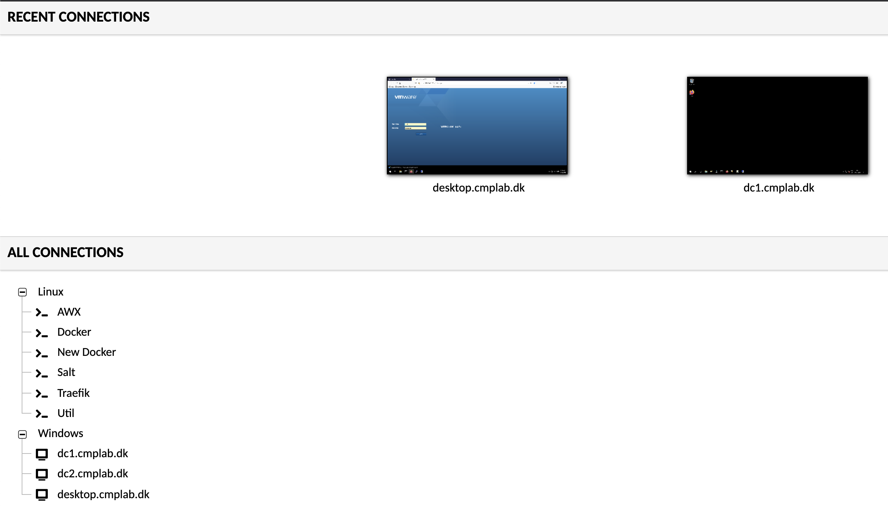
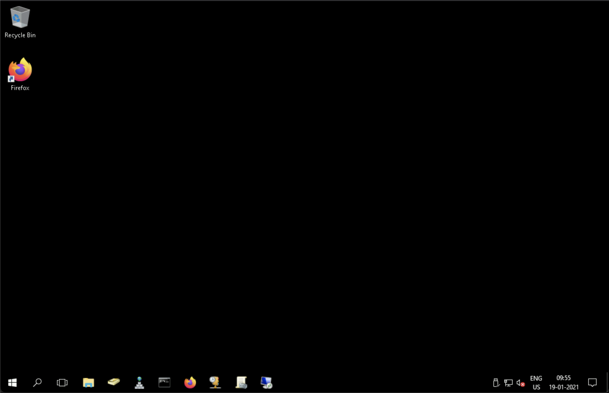
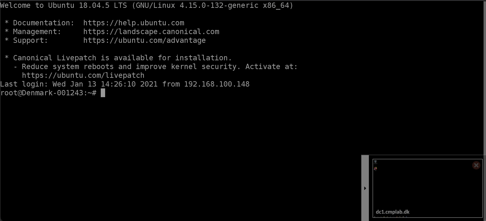
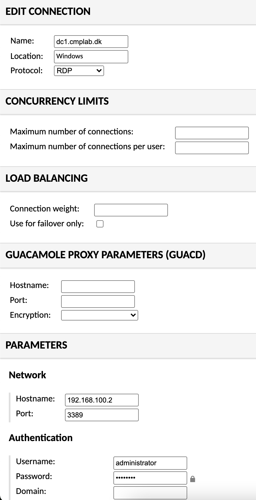

My demolab, is not hostet at home, but remote. So i'm always dependend, on some kind of remote access.
At home, I use a IPSEC Site2Site VPN, between my [PFsense](https://www.pfsense.org), and the Edgerouter lite, I have in my Demo enviroment.

Remote I use [Tailscale](https://tailscale.com) for client VPN, as I have described, in an earlier post.

But I have recently added another option, for my enviroment, and that is  [Apache Guacamole](https://guacamole.apache.org/).
Guacamole is an RDP, VNC and SSH client, that runs entirely in your browser, using HTML5.

I have 2 usecases for it. 

1. Access from anywhere, where i just have a browser.

2. Overview and access, to all my servers, from a single point.

## Guacamole

I have been really impressed with Guacamole. It's fast, and does not require anything else, than a HTML5 browser. 
It supports the protocols, that I need (VNC, RDP, and SSH), and it gives a nice overview, of the servers I have.
It's acutalily so fast, that I have begun to use this, as a default client, when I do demos.

For work that takes longer, I prefer my Terminal, or a RDP (or Horizon View) client.

Let me take you thru how it looks.

The login is easy, and can be setup with LDAP and 2 factor auth. It also supports different groups, so you can chose who can access what.


The overview, shows the connections you have avalible, and the ones you have active. 


The Rdp Connection works as expected, and you can make it so, it resizes the screen, after the size of your browser window.


SSH also works as expected, and a nice feature, is that you can easily change between active connections, in the windows in the bottom right (the was is also true for RDP)
There is also an opton for SFTP, but I have not tried that yet. 


Creating a new connection is easy, and there is a ton of options to chose from. I have only setup the minimum in my enviroment, like username, pass and FQDN.


And for me, that is all I needed to get it working. 

## Installation

The way I have installed it, is as a Docker container, running behind my [Traefik](https://traefik.io) reverse proxy. 
That way, I have a secure way to access it, and it's protected by a [Let'sEncrypt](https://letsencrypt.org) certificate. 
Note when I say secure, it's secure in the way, that it uses HTTPS, and i'm offcourse dependend on the security Guacamole provides and you have to know the url, to be able to access it. So for me, it's currently good enough.

The docker compose file i use, looks like below, and i'm running it on the same host as I run my Traefik container.
```
---
version: "2.1"
services:
  guacamole:
    image: oznu/guacamole
    container_name: guacamole
    environment:
      - PUID=1000
      - PGID=1000
      - TZ=Europe/Copenhagen
    networks:
      - web
    volumes:
      - /Change_this:/config
    ports:
      - 8080
    restart: unless-stopped
    labels:
        - "traefik.enable=true"
        - "traefik.http.routers.guacamole.rule=Host(`public_url`)"
        - "traefik.http.routers.guacamole.entrypoints=websecure"
        - "traefik.http.routers.guacamole.tls=true"
        - "traefik.http.routers.guacamole.tls.certresolver=myresolver"
        - "traefik.http.services.guacamole.loadBalancer.server.port=8080"

networks:
  web:
    external: true
```

So if your setup looks like the one I described in this [post](https://www.robert-jensen.dk/posts/2021-tailscale-on-edgerouter/) then all you need to do, is to change, the file path, for your configuration files, and set your public url, and you should be good to go.

<span>Photo by <a href="https://unsplash.com/@markusspiske?utm_source=unsplash&amp;utm_medium=referral&amp;utm_content=creditCopyText">Markus Spiske</a> on <a href="https://unsplash.com/s/photos/access?utm_source=unsplash&amp;utm_medium=referral&amp;utm_content=creditCopyText">Unsplash</a></span>