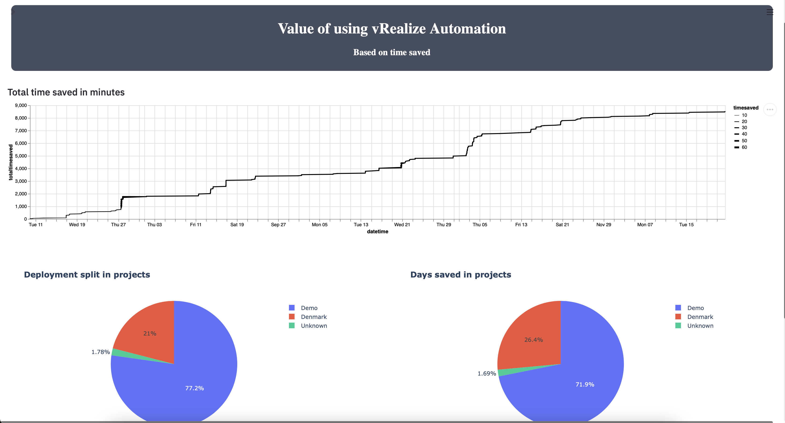

During the christmas holliday, I had some time, to look into [Traefik](https://traefik.io/traefik/) reverse proxy.

The reason for me to use Traefik, is due to the automation, it delivers. 
It can automaticly detect deployments, and present them, and for my demo projects, that is exactly what I need.

Optimal, I would deploy everything to a K8S cluster, but i'm having some problems getting it working with Traefik. So for now, it's just running on a single docker host. So K8S must be for a later blog post, when I get it working :-) 

My configuration is quite simple (when I finalily got it working).

I run everything using docker-compose, so make sure you have both docker installed, as well as docker-compose.

Before running the docker compose, you need to create the docker network maualily.

It's easy. just run
```
docker network create web
```
If you want to use the network name web, as I do in my example.

The Traefik docker compose file, is as below. 
Note i'm using :latest. That is not best practice. 

```
version: '3'

networks:
  web:
    external: true

services:
  traefik:
    container_name: traefik
    # The official v2 Traefik docker image
    image: traefik:latest
    # Enables the web UI and tells Traefik to listen to docker
    networks:
      - web
    restart: unless-stopped
    ports:
      # The HTTP port
      - "80:80"
      #The HTTPS port
      - "443:443"
      # The Web UI (enabled by --api.insecure=true)
      - "8080:8080"
    volumes:
      # So that Traefik can listen to the Docker events
      - /var/run/docker.sock:/var/run/docker.sock
      - local_mount_point:/etc/traefik
```
The external: true 
is important, as is the volume mount, that I use.
That's where I keep my traefic.yml config file. 
I keep mine in a NFS mount, that I backup, but you can use it anyway you want. 

I also expose port 80 and 443, as described in the traefik.yml

The traefik.yml file, is shown below. 

```
## STATIC CONFIGURATION

log:
  level: INFO
  filePath: "/etc/traefik/traefik.log"

# Configuring a buffer of 100 lines
accessLog:
  filePath: "/etc/traefik/access.log"
  bufferingSize: 100

pilot:
    token: "Key"

providers:
  docker:
    defaultRule: "Host(`{{ trimPrefix `/` .Name }}.cmplab.dk`)"
  file:
    filename: "traefik.yml"

api:
  insecure: true

entryPoints:
  web:
    address: ":80"

  websecure:
    address: ":443"


# LetsEncrypt config
certificatesResolvers:
  myresolver:
    acme:
      email: email
      storage: acme.json
      httpChallenge:
        # used during the challenge
        entryPoint: web
```
It sets 2 entrypoints to web and websecure, and setup's [LetEncrypt](https://letsencrypt.org), to auto generate a certificate, if asked for it. 

I also created a docker provider, that auto generates a url, based on containername.cmplab.dk (note i overwerite that, in my label, and set my own name)

I have forwarded port 80 and 443 to my docker host, where the Traefik container is running, so it can handle all Web traffic.

The application container, is where it get's more interesting.

The application im using is my Value app, config can be found [here](https://github.com/rhjensen79/DemoApp)
For testing, I rcommend switching it with a simple Apache or NGINX container. 


The docker-compose file is as below :

```
version: '3.4'

services:
  value:
    image: value
    ports:
      - 80
    networks:
      - web
    restart: always
    build:
      context: .
      dockerfile: ./Dockerfile
    environment:
      - aws_key=${aws_key}
      - aws_secret=${aws_secret}
    labels:
        - "traefik.enable=true"
        - "traefik.http.routers.value.rule=Host(`value.cmplab.dk`)"
        - "traefik.http.routers.value.entrypoints=websecure"
        - "traefik.http.routers.value.tls=true"
        - "traefik.http.routers.value.tls.certresolver=myresolver"
        - "traefik.http.services.value.loadBalancer.server.port=80"

networks:
  web:
    external: true
```
It builds the Dockerfile, from the repo. But the interesting part, is the network, and the labels, in the compose file.

The network, is the same as the Traefik container. 
As i understand it, that is a requirement, and remember the ecxternal: true, or else it don't work.

The real config here, is the labels.

- "traefik.enable=true" : Eables the container. You can setup Traefik, to not auto enable new containers (probably a good idea).
- "traefik.http.routers.value.rule=Host(`value.cmplab.dk`)" : The external url of the container
- "traefik.http.routers.value.entrypoints=websecure" : Set's it to be websecure (443)
- "traefik.http.routers.value.tls=true" : Enables TLF (I think)
- "traefik.http.routers.value.tls.certresolver=myresolver" : Selects the resolver, I use to get my LetsEncrypt certificate
- "traefik.http.services.value.loadBalancer.server.port=80" : Selects the port the container, uses (default to the first port in the compose file, if not specified)

For [LetEncrypt](https://letsencrypt.org) to work, it must be able to resolve the domain name, you specify, to the public ip. 
My DNS setup is 

```
A       cmplab.dk   public ip
CNAME   *           cmplab.dk
```

That makes sure, the domain can be resolved, and also enables me to use whatever subdomain automaticly.

The result from the docker-compose file above, can be seen here https://value.cmplab.dk as a secure website.


When using the configuration above, it's simple for me, to spin up a container, and dynmic deploy a new webservice, with a valid, secure certificate. 
Also I can presentm any container, using a subdomain, in a secure manner, without opening additional ports. 

Hope you enjoyed, and found it usefull.


<span>Photo by <a href="https://unsplash.com/@dsmacinnes?utm_source=unsplash&amp;utm_medium=referral&amp;utm_content=creditCopyText">Danielle MacInnes</a> on <a href="https://unsplash.com/s/photos/lock?utm_source=unsplash&amp;utm_medium=referral&amp;utm_content=creditCopyText">Unsplash</a></span>