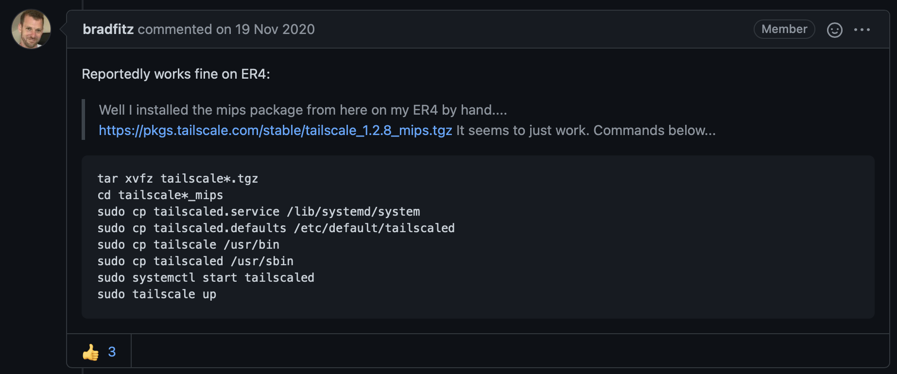

[Tailscale](https://tailscale.com) is what I have been using, to get access to my demo enviroment, and allow clients to communicate with each other, across networks etc.
But I have really missed, having it installed on my firewall, to make it act as a more traditional vpn.
The firewall i'm using is an Ubitique Edgerouter lite.

While searching the internet, I found the following [post](https://github.com/tailscale/tailscale/issues/735)


I got it working, but the commands was not 100% correct. So I thought I would fix them, and present them here. 

The guide, which is working for me, is as follows :


Find the correct .mips.tgz file on this [page](https://pkgs.tailscale.com/stable/#static)

SSH to the edgerouter, and download the file, using the following command
```
curl https://pkgs.tailscale.com/stable/tailscale_1.2.10_mips.tgz --output tailscale_1.2.10_mips.tgz
```

Untar the file
```
tar xvfz tailscale*.tgz
```

Open the directory
```
cd tailscale*_mips
```
Copy the files
```
sudo cp systemd/tailscaled.service /lib/systemd/system
sudo cp systemd/tailscaled.defaults /etc/default/tailscaled
sudo cp tailscale /usr/bin
sudo cp tailscaled /usr/sbin
```

Enable Tailscale to run as a service and at start
```
sudo systemctl enable tailscaled
sudo systemctl start tailscaled
sudo tailscale up
```

The last command will require you to autentificate the client. But now it should be running as a normal client, that you can use as a relay node, by running the following command (with your own subnets)

```
sudo tailscale up --advertise-routes=10.0.0.0/24,10.0.1.0/24
```

You should now be running Tailscale, on you Edgerouter, and be able to use all the greatness that involves :-) 

<span>Photo by <a href="https://unsplash.com/@jjying?utm_source=unsplash&amp;utm_medium=referral&amp;utm_content=creditCopyText">JJ Ying</a> on <a href="https://unsplash.com/s/photos/network?utm_source=unsplash&amp;utm_medium=referral&amp;utm_content=creditCopyText">Unsplash</a></span>