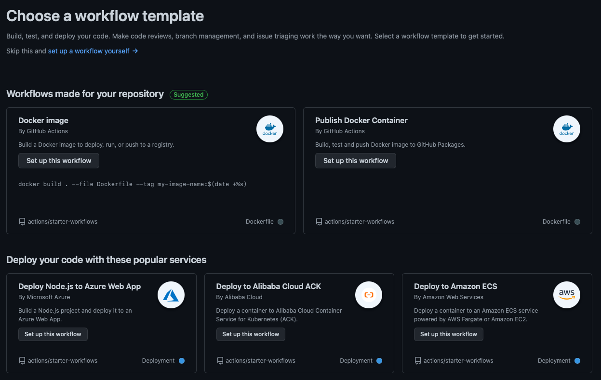
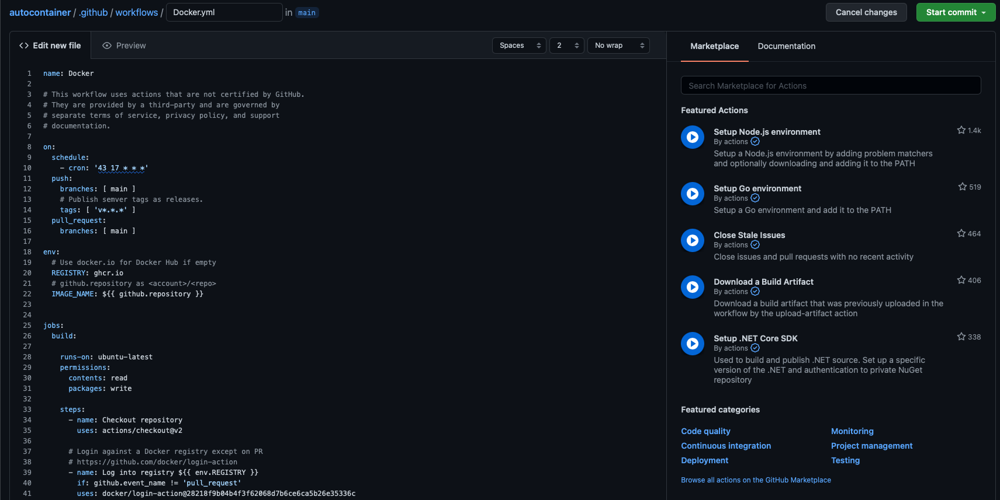

Some time ago, I wrote a [blog](https://www.robert-jensen.dk/posts/2021-easy-updating-cdicd-tools/), around how to easily build and host, [Docker](https://www.docker.com) containers using Dockers autobuild tools.

After the blog post Docker both changed to using [rate limits](https://www.docker.com/increase-rate-limits), for API calls, but also removed the [Autobuild feature](https://www.docker.com/blog/changes-to-docker-hub-autobuilds/).

I understand fully, that Docker is trying to find out, how to make money, but I am not a fan of the Rate limit. Imho it should be based on pulls, and not the amount of API call's.

So I updated the blog, to show how to do this, using [Gitlab](https://gitlab.com) runners, with a local hosted [Harbor](https://goharbor.io) instance. 

Some time ago [Github](https://github.com) announces, that you could also host Docker images, as part of their [Packages offering](https://github.com/features/packages).

I have long been wanting to look more into github Actions, but have struggled to find a usecase. But here was one, that sounded like it could be usefull.

This is a post, on how I changed to using Github Actions to build and host my Docker containers.

First off. I did not change anything in my repo, from my last [blog](https://www.robert-jensen.dk/posts/2021-easy-updating-cdicd-tools/).
But if you are starting from scratch, then create a Dockerfile in your Github repo, and make sure it works. Then you are good to follow the rest of my guide.

First I disconnected the [Gitlab sync](https://docs.gitlab.com/ee/user/project/repository/repository_mirroring.html), that I had been running, to have a synced repo, on both Github and Gitlab. 

Then I opened the repo on github, and chosed Actions on the top.


From here I selected "New Workflow" and then I selected the "Publish Docker Container" from the top right.


The cool thing, is that all I had to do now, was to give the file a Name, and then press "Start Commit" in the top right corner, for it to work.


The action, automaticly found my Dockerfile in the root of my Repo, build it using the repo name and branch, and pushed it to my Github Repo. 

How cool is that :-) 

In my case, the full url to use, when pulling it, is :
```
ghcr.io/rhjensen79/autocontainer:main
```
If that name does not fit you, then it's easy to change the action, to someting that fit's you better. 

The continer is now also being build every night, and pushed to Github's repo, so it's aways up to date.

Since this is a public repo, there is no charge, but let's see if that changes in the future.
For now, i'm happy with my new hosted repo, can I can use without thinking about API limits, in my CI/CD pipelines.

I will still save my private images in my private Harbor registry, since it gives me some added services, with security scanning etc. But most of my images are ok in being public, and there I can see myself using this a lot more in the future. Maybe even creating small repo's for single containers, to have an easy way of building, updating, and hosting them.

If you want to try yourself, then feel free to use my container image, or to fork the Repo to create your own version : https://github.com/rhjensen79/autocontainer 

Hope you found this usefull. 

Photo by <a href="https://unsplash.com/@carrier_lost?utm_source=unsplash&utm_medium=referral&utm_content=creditCopyText">Ian Taylor</a> on <a href="https://unsplash.com/s/photos/containers?utm_source=unsplash&utm_medium=referral&utm_content=creditCopyText">Unsplash</a>
  