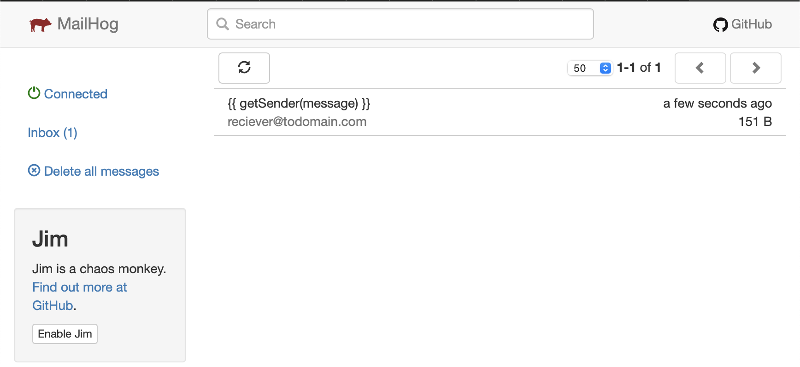
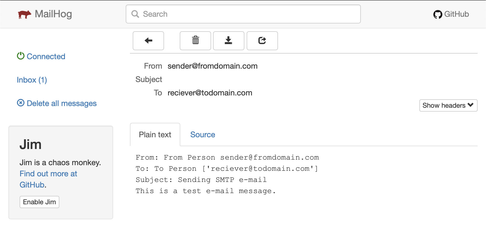

Sometimes it's the simple tings, that are the hardest.
For a small projekt, i'm working on, I have to test sending a lot of emails. A simple thing, but in my case, I don't have a local SMTP server. 

I could set one up, but then, I have to configure users, maybe MX records, and other stuff. 
I have used [AWS simple email service](https://aws.amazon.com/ses/) in the past, and that was high on my list, but I would really like to keep things local, and not having to configure a lot of stuff. 

The solution I found, was so simple, that I had to share it here.

A simple email server, running in a Docker container, with a web interface, to read the emails. Meet [Mailhog](https://hub.docker.com/r/mailhog/mailhog/)

I have created a [Github repo](https://github.com/rhjensen79/smtp-test), with the files shown here, so it's easy to clone and use yourself.

## Installation

To get started, I created a Dockerfile, that I found in the main [Docker repo](https://hub.docker.com/r/mailhog/mailhog/)

```
#
# MailHog Dockerfile
#

FROM alpine:3.4

# Install ca-certificates, required for the "release message" feature:
RUN apk --no-cache add \
    ca-certificates

# Install MailHog:
RUN apk --no-cache add --virtual build-dependencies \
    go \
    git \
  && mkdir -p /root/gocode \
  && export GOPATH=/root/gocode \
  && go get github.com/mailhog/MailHog \
  && mv /root/gocode/bin/MailHog /usr/local/bin \
  && rm -rf /root/gocode \
  && apk del --purge build-dependencies

# Add mailhog user/group with uid/gid 1000.
# This is a workaround for boot2docker issue #581, see
# https://github.com/boot2docker/boot2docker/issues/581
RUN adduser -D -u 1000 mailhog

USER mailhog

WORKDIR /home/mailhog

ENTRYPOINT ["MailHog"]

# Expose the SMTP and HTTP ports:
EXPOSE 1025 8025
```

To make it easier to run and to stop, I then created a docker-compose.yml file, in the same directory.

```
version: "3"
services:
  mailhog:
    build: .
    ports:
      - 1025:1025
      - 8025:8025
```
All it does, is to build the Dockerfile and to expose port 1025 (for SMTP) and 8025 (for Web) on my local computer.

I then created a mail.py file, with the content i found [here](https://www.javatpoint.com/python-sending-email), to send an email, using the docker smtp server.

```
import smtplib    
sender_mail = 'sender@fromdomain.com'    
receivers_mail = ['reciever@todomain.com']    
message = """From: From Person %s  
To: To Person %s  
Subject: Sending SMTP e-mail   
This is a test e-mail message.  
"""%(sender_mail,receivers_mail)    
try:    
   smtpObj = smtplib.SMTP('localhost:1025')    
   smtpObj.sendmail(sender_mail, receivers_mail, message)    
   print("Successfully sent email")    
except Exception:    
   print("Error: unable to send email")   
```
Note that I changed the port, in the python script, to match the port on the server (1025)

All I had to do now, was to run 

```
docker-compose up -d
```
To start the container, and run it in the background.

Run 
```
python3 mail.py
```
To use the script to send an email.

and open [http://localhost:8025](http://localhost:8025)

As you can see, there is an email in the inbox.
The server is setup, to catch all the emails that we send to it. 


And when we open it, we can read the content. 

When i'm done testing, all I need to do is to run 
```
docker-compose down
```
And everything is cleaned up.

Hope you found this usefull. For me, this will prove valuable, for my testing. 


<span>Photo by <a href="https://unsplash.com/@hudsoncrafted?utm_source=unsplash&amp;utm_medium=referral&amp;utm_content=creditCopyText">Debby Hudson</a> on <a href="https://unsplash.com/s/photos/typewriter?utm_source=unsplash&amp;utm_medium=referral&amp;utm_content=creditCopyText">Unsplash</a></span>