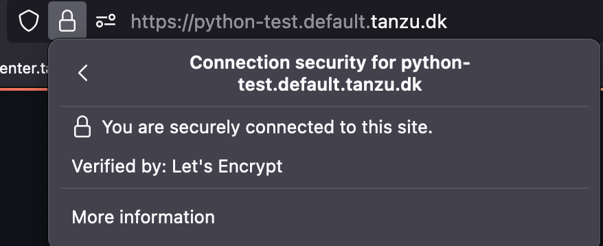

As part of learning and using [Tanzu Application Platform (TAP)](https://tanzu.vmware.com/application-platform), I looked into auto generating TLS certificates, for the Workloads I provision.

The full documentation for what I describe in this blog post, can be found [here](https://docs.vmware.com/en/Cloud-Native-Runtimes-for-VMware-Tanzu/2.0/tanzu-cloud-native-runtimes/GUID-auto-tls.html).

TAP installs [Cert-Mnager](https://cert-manager.io) as part of the installation.
It made sense to use that, to generate the certificates I needed.

To be able to create new certificates, I created a Clusterissuer, that could generate certificates from [Let's Encyrpt](https://letsencrypt.org), by using DNS validation, via [CloudFlare](https://www.cloudflare.com).

This requires having your domains hosted by Cloudflare, and to generate a API key. It's easy, and only a quick googling away, so I won't include it here.

The first thing I needed to do, was to create a secret, with the API key, to communicate, with Cloudflare.

secret.yaml

```
apiVersion: v1
kind: Secret
metadata:
  name: cloudflare-api-token
  namespace: cert-manager
type: Opaque
stringData:
  api-token: YOURAPITOKEN
```

Replace "YOURAPITOKEN" with your own token

```
kubectl apply -f secret.yaml
```

Then I created the ClusterIssuer, that was going to use that secret

clusterissuer.yaml

```
apiVersion: cert-manager.io/v1
kind: ClusterIssuer
metadata:
  name: letsencrypt
  namespace: cert-manager
spec:
  acme:
    email: YOUREMAIL
    server: https://acme-v02.api.letsencrypt.org/directory
    privateKeySecretRef:
      name: letsencrypt-account-key
    solvers:
    - dns01:
        cloudflare:
          email: YOUREMAIL
          apiTokenSecretRef:
            name: cloudflare-api-token
            key: api-token
```

Replace "YOUREMAIL" with your own email.

```
kubectl apply -f clusterissuer.yaml
```

You should now have the ability to create valid certificates.

The next part, was configuring TAP to do this automaticly.

For this, I needed to update 2 configmaps.
I did this by creating the following file

patch-certmanager-tls.yaml

```
data:
  issuerRef: |
    kind: ClusterIssuer
    name: letsencrypt
```

Witch I used to update the config-certmanager configmap, by running the following

```
kubectl patch configmap config-certmanager -n knative-serving --patch-file patch-certmanager-tls.yaml
```

Then I created

patch-network-tls.yaml

```
data:
  auto-tls: Enabled
  http-protocol: Redirected
```

To set TLS to be auto genarated, and to redirect to HTTPS.
And used that to patch onfig-network configmap, by running

```
kubectl patch configmap config-network -n knative-serving --patch-file patch-network-tls.yaml
```

And that was it.
All workloads, is now deployed with a valid certificate :-)

