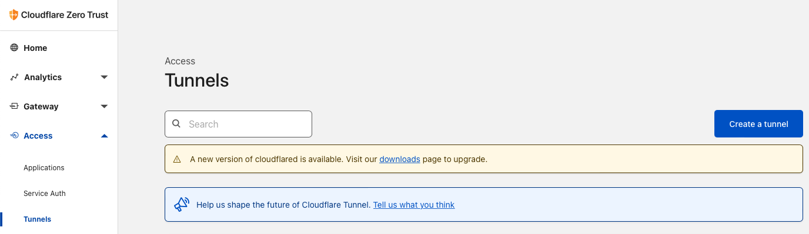
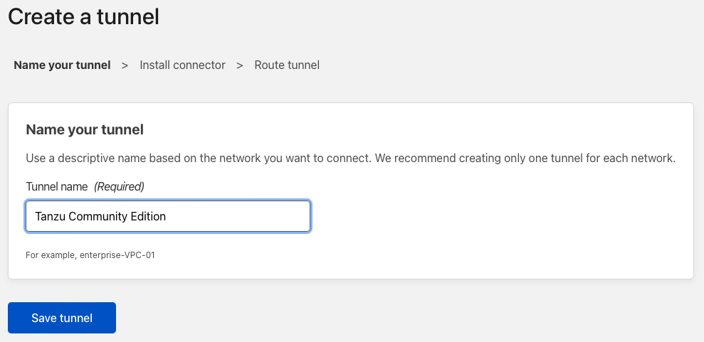
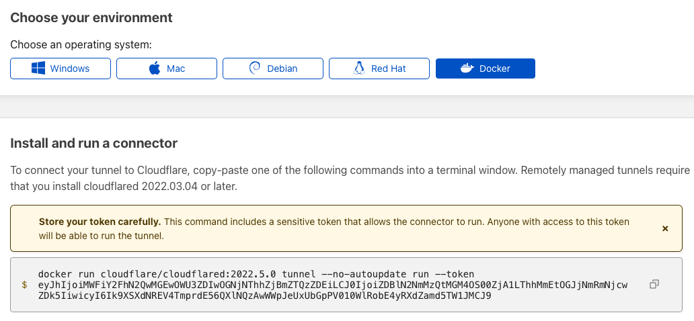
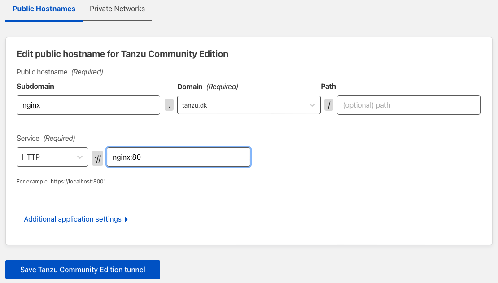
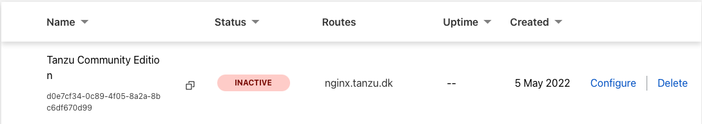
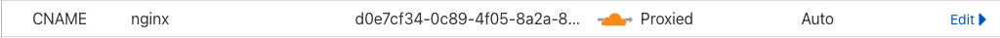

In tihs blog post, i'm gonna show you, how you can open access up to an internal pod, running on your own machine, to the outside world. All without opening any firewall ports, and with a valid certificate, and access control. And did i mention, it's all for free.

I will be doing all on the [Tanzu Community edition](https://tanzucommunityedition.io). It will work on any Kubernetes distibution, Docker container etc. But when we got a cool free product, why not show it there :-) 

## Install Tanzu Community Edition

First off, let's install Tanzu Community edition.
I'm using a Mac, with Brew and docker already installed, so it's really easy.
If you are using something else, then you have to read thru the [documentation](https://tanzucommunityedition.io/docs/v0.11/).

Just run 
```
brew install vmware-tanzu/tanzu/tanzu-community-edition
```

After that, it's as easy as running the following, to get your first cluster up and running
```
tanzu unmanaged-cluster create firstcluster
```

After a minute or so, you should see
```
✅ Cluster created

🎮 kubectl context set to firstcluster
```
To see everything is working run
```
kubectl get pods -A
```
In my setup setup everything looks good
```
NAMESPACE            NAME                                                 READY   STATUS    RESTARTS   AGE
kube-system          calico-kube-controllers-59ccff4b57-mcmlx             1/1     Running   0          100s
kube-system          calico-node-4k986                                    1/1     Running   0          100s
kube-system          coredns-78fcd69978-282k6                             1/1     Running   0          2m12s
kube-system          coredns-78fcd69978-tt28j                             1/1     Running   0          2m12s
kube-system          etcd-firstcluster-control-plane                      1/1     Running   0          2m28s
kube-system          kube-apiserver-firstcluster-control-plane            1/1     Running   0          2m28s
kube-system          kube-controller-manager-firstcluster-control-plane   1/1     Running   0          2m28s
kube-system          kube-proxy-r5kd7                                     1/1     Running   0          2m12s
kube-system          kube-scheduler-firstcluster-control-plane            1/1     Running   0          2m27s
local-path-storage   local-path-provisioner-85494db59d-p5crc              1/1     Running   0          2m12s
tkg-system           kapp-controller-779d9777dc-hf7fr                     1/1     Running   0          2m12s
```

## Create Deployment

To test this is working, we are going to create a simple Nginx deployment, and publish a service from it.

To create the deployment run
```
kubectl create deployment nginx --image=nginx
```
To create a service, we can use, run
```
kubectl create service clusterip nginx --tcp=80:80
```
To see all is running, run the following command 
```
kubectl get pod,svc
```
This dhould provide the following result, showing you both have a Pod and a Service created and running.
```
NAME                         READY   STATUS    RESTARTS   AGE
pod/nginx-6799fc88d8-tltz2   1/1     Running   0          34m

NAME                 TYPE        CLUSTER-IP     EXTERNAL-IP   PORT(S)   AGE
service/kubernetes   ClusterIP   10.96.0.1      <none>        443/TCP   35m
service/nginx        ClusterIP   10.96.17.103   <none>        80/TCP    30m
```


## Setup CloudFlare Team

The thing that makes all of this work, is [Cloudflare](https://www.cloudflare.com) so you will need to have at least an account there, and a domain, controlled by them.

It's free, and I have been using them, to host all my domains, for the last couple of years, so I can recommend you doing the same.

Once that is done, you need to login, and access their [Zero Trust page.](https://dash.teams.cloudflare.com/)

The first time you click the link, you have to setup a team. Just pick a name that makes sense to you, and select the Free plan, you you are prompted for it.

## Setup Cloudflare tunnel

To create a new tunnel, select Access -> Tunnels from the left menu, and click `Create a tunnel` on the right.


Give your tunnel a name. Note a tunnel can expose multiple endpoints, so the name should be generic. I will call mine `Tanzu Community Edition` 

Click `Save tunnel`

You will now be presented with different enviroment options. The closest fit we have, is the Docker one. So click that one, and copy and save the command. We will need some of it later.

Note I have regenerated the token, so it's not working anymore. You should offcourse not share it on the internet.

The last thing, we need to do, is to create a public url, to access our service on.

I have chosen the url nginx.tanzu.dk and i'm pointing it to the internal service, within my k8s cluster.
The cloudflare tunnel, will be deployed in the default namespace, so I can just reference the nginx service with http://nginx:80
If i was in seperatete namespaces, then the url would look something like this http://nginx.namespace:80


Click `Save Tanzu Community Edition tunnel`

You should now see a new tunnel apear, with the status Inactive.
Don't close the website, since we will use it later.


I you go the the DNS settings for your domain, you will see a new CNAME entry has been created, with the nginx.tanzu.dk domain name, pointing to a strange url.
This is CloudFlare pointing your new record, to the newly created tunnel id.


## Create container

Since i'm using an Arm Based M1, I cannot use the officiel Docker image on [Docker Hub](https://hub.docker.com/r/cloudflare/cloudflared). 
So I have created my own build, that works on both ARM and x86.
If you are not running ARM, then feel free, to use the official one from Docker Hub.

My version, can found [here](https://github.com/TanzuDK/cloudflared/pkgs/container/cloudflared) 
and can be pulled by running
```
docker pull ghcr.io/tanzudk/cloudflared:latest
```

## Deploy cloudFlare tunnel container

To get access to the cluster, we will create a deployment.
Create a file `cloudflared.yaml` with the following content
```
---
apiVersion: apps/v1
kind: Deployment
metadata:
  name: cloudflared
  namespace: cloudflare
spec:
  selector:
    matchLabels:
      app: cloudflared
  template:
    metadata:
      labels:
        app: cloudflared
    spec:
      containers:
      - name: cloudflared
        image: ghcr.io/tanzudk/cloudflared:latest
        args:
        - tunnel
        # Points cloudflared to the config file, which configures what
        # cloudflared will actually do. This file is created by a ConfigMap
        # below.
        - run
        - --token
        - YourToken
```
You need to replace `YourToken` with the token, we got in the `Setup Cloudflare tunnel` section.
Note this is a modified version, of the official [one](https://github.com/cloudflare/argo-tunnel-examples/blob/master/named-tunnel-k8s/cloudflared.yaml), since I found this to work better for this usecase.
I recommend you take a look at the official one, if you want to learn more, or maybe do more advanced configurations.


## Cleanup

To delete your running cluster, and cleanup just run
```
tanzu unmanaged-cluster delete firstcluster
```

Photo by <a href="https://unsplash.com/@matthaeus123?utm_source=unsplash&utm_medium=referral&utm_content=creditCopyText">matthaeus</a> on <a href="https://unsplash.com/collections/1964905/open-doors?utm_source=unsplash&utm_medium=referral&utm_content=creditCopyText">Unsplash</a>
  