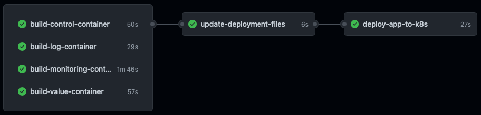
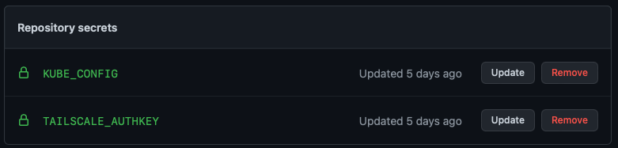

## Intro

I have been a long time user of [GitLab](www.gitlab.com), due to the fact, that their runners was so easy to get working, and they allowed me to deploy them on prem, so I had access to my local enviorement.

I have long been looking at [Github actions](https://github.com/features/actions), but found it hard, to combine this with local deployments (might just be me, who havent found out how).
But then [TailScale](www.tailscale.com) did a [blog post](https://tailscale.com/blog/2021-05-github-actions-and-tailscale/), on how to use them, with [Github](www.github.com) Actions.

This was exactly what I was looking for.
I have been using Tailscale for a long time, to get remote access to my lab enviroment, when i'm on the road.
And this was the solution that would allow me to use internal ressources, without opening my firewall to the internet.

All I needed now, was a project, where I could combine the two.

## The Project

So this blog post, is not about the project. but I wanted to share a bit of light, on that it is i'm doing here.

The project i'm using here, is a small hobby project, where I grab the current electricity price, and if the price is below a certain amount, then I start to charge my electrical car.

Pretty simple, but i'm also trying to make this a lot more complex, by splitting out, what could probably just be a single script, into multiple containers, deployed on Kubernetes.
The reason is that I also want to be able to use this, as a demo app, for my day job.

The name of the app is [Perfect-Charge](https://github.com/rhjensen79/perfect-charge), and it's avaliable on [Github](https://github.com/rhjensen79/perfect-charge), if you want to check it out :-)

## The job



My current action, builds each of the current 4 containers, and pushes them to Githib's Container registry, with a unique label.

When they are all done, I update the Kubernetes deployment yaml file, with the unique label of the containers.
And then I install Tailscale, and apply's the updated config, to my Kubernetes cluster.

To make this work, I have created an [Ephemeral](https://tailscale.com/kb/1111/ephemeral-nodes/) auth key. This means that as soon as the Tailscale agent stops, then the client is removed again, which is exactly what I need in my pipeline.

The key is added as a Action Secret in Github as "TAILSCALE_AUTHKEY"


The actions is pretty simple.
I will only focus on the last phase, and it looks like this.

```
jobs:
  deploy-app-to-k8s:
    runs-on: ubuntu-latest
    steps:
    - uses: actions/checkout@v2

    - name: Tailscale
      uses: tailscale/github-action@v1
      with:
        authkey: ${{ secrets.TAILSCALE_AUTHKEY }}
    - name: Set Kubernetes Context
      uses: azure/k8s-set-context@v2
      with:
        method: kubeconfig
        kubeconfig: ${{ secrets.KUBE_CONFIG }}
        context: microk8s-nuc-cluster
    - name: Deploy to Cluster
      run: |
        kubectl apply -f k8s/perfect-charge.yaml
```

I use the "tailscale/github-action@v1" to pull the repo

Then I use the "tailscale/github-action@v1" to install the Tailscale agent, with the "TAILSCALE_AUTHKEY" secret.

And at last, I use the "azure/k8s-set-context@v2" to install all Kubernetes tools, and create the KubeConfig credentials, and to run "kubectl apply -f k8s/perfect-charge.yaml" so apply the new deployment.

The real magic here, is Tailscale, and how easy they have made it, to connect to different enviroments.

I need to have the network setup prior to this, but it's really easy, and it just connects to the setup I already had in place.

Photo by <a href="https://unsplash.com/@kellysikkema?utm_source=unsplash&utm_medium=referral&utm_content=creditCopyText">Kelly Sikkema</a> on <a href="https://unsplash.com/s/photos/build?utm_source=unsplash&utm_medium=referral&utm_content=creditCopyText">Unsplash</a>
  