## Intro

The other day, I replied to a tweet from [@ChrisShort](https://twitter.com/ChrisShort) where he mentioned seing that [Github Container registry,](https://github.blog/2020-09-01-introducing-github-container-registry/) was being used more and more.

I replied since I have been using it ever since [Docker Hub(https://hub.docker.com)] started with their [rate limiting](https://docs.docker.com/docker-hub/download-rate-limit/), and I was hit by it, in my small demo enviroment.
My search for a replacement, lead me to Github Container Registry.

A part of that move, it was natural, to also use [Github Actions](https://github.com/features/actions), to build the container images as well.

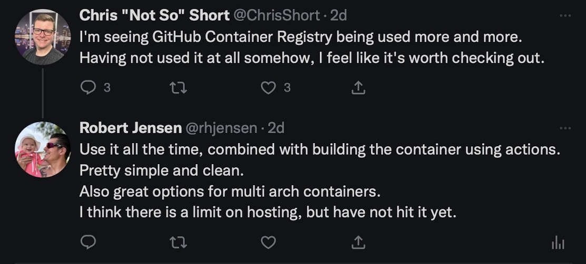

This blog post, is ment as a getting started guide, for building and publishing Docker images to Github Container registry, fully automated using [Github Actions](https://github.com/features/actions).

## Prerequisites

You will need the following:

- A clean public [Github Repository](https://www.github.com)
- [VS Code](https://code.visualstudio.com)
- Docker installed, so you can test the image

## Repository

Start by creating a new Repository on [Github.com](https://www.github.com)
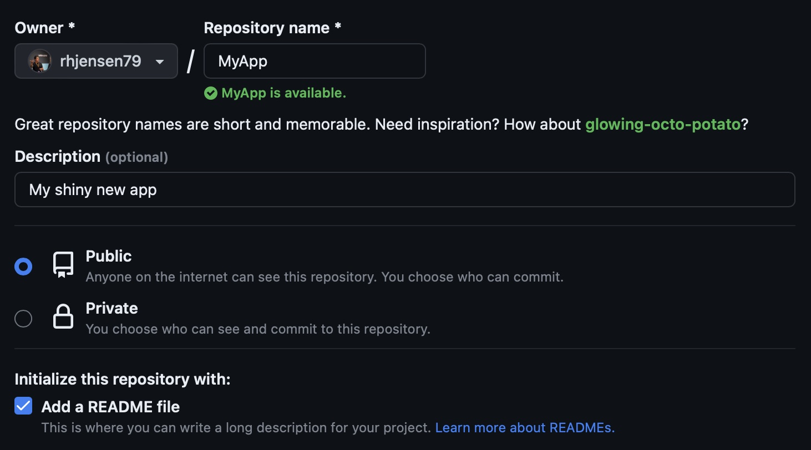
I call mine "MyApp" which will also be the default name of the container image, unless you change it.

Remember to set it Public, and add a Readme file, since we will use it in the demo, and it's always a good thing to have in your repository.

You can still use the Registry, if you set it private, but then you need to setup autentification.
This is probably a good thing going forward, if you have private projects, but it's out of scope, for this blog post.

Now clone it to your local computer and open it in VS Code.
For me this is done by running

```bash
git clone git@github.com:rhjensen79/MyApp.git
cd MyApp
code .
```

## Dockerfile

Let's create a simple [Dockerfile](https://docs.docker.com/engine/reference/builder/), so we have something to build from.

Add a new file with the name "Dockerfile", with the following content.

```Dockerfile
FROM ubuntu:22.04
WORKDIR /app
COPY README.md .
```

This will create a container, from the Official [Ubuntu 22.04 image](https://hub.docker.com/_/ubuntu), and includes the Readme file from the repository.

## Github actions

Let's create the automation, that builds and pushed the container to the registry.

Open your repository on github.com and select the actions tab.

In the search field type `container` and click `configure` on the first one that show up with the name "Publish Docker Container"

Note there are many others Actions, but this one, will work for our usecase.

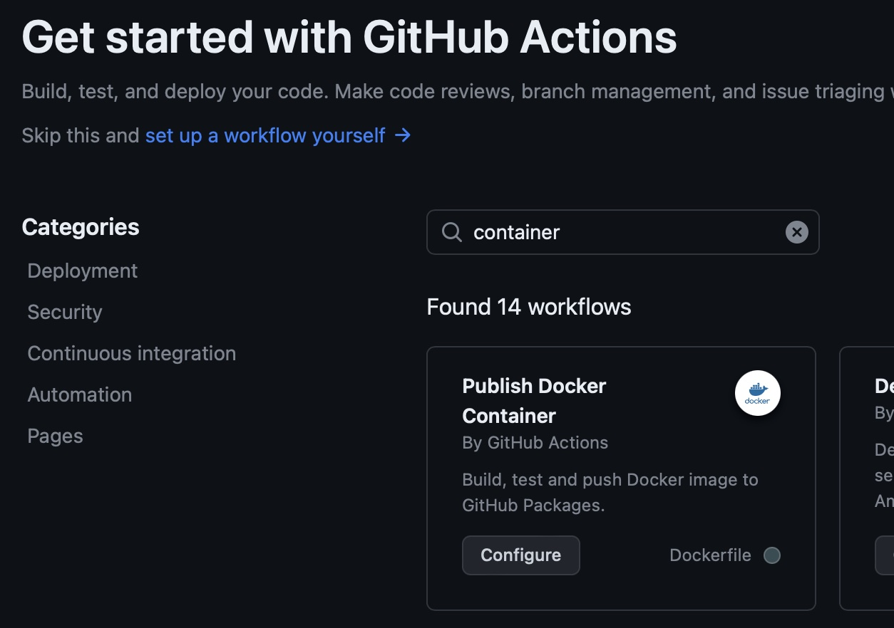

You should now see a Yaml file, with all the steps required.
We will modify it a bit, to make it a bit more usefull, for our setup.

Remove line 9 and 10 about scheldule and cron and line 12 about branches.

The reason is that I don't want it build on a scheldule, and I only want it build, when I add a tag.

The end file should look like this

```yaml
name: Docker

# This workflow uses actions that are not certified by GitHub.
# They are provided by a third-party and are governed by
# separate terms of service, privacy policy, and support
# documentation.

on:
  push:
    # Publish semver tags as releases.
    tags: [ 'v*.*.*' ]
  pull_request:
    branches: [ "main" ]

env:
  # Use docker.io for Docker Hub if empty
  REGISTRY: ghcr.io
  # github.repository as <account>/<repo>
  IMAGE_NAME: ${{ github.repository }}


jobs:
  build:

    runs-on: ubuntu-latest
    permissions:
      contents: read
      packages: write
      # This is used to complete the identity challenge
      # with sigstore/fulcio when running outside of PRs.
      id-token: write

    steps:
      - name: Checkout repository
        uses: actions/checkout@v3

      # Install the cosign tool except on PR
      # https://github.com/sigstore/cosign-installer
      - name: Install cosign
        if: github.event_name != 'pull_request'
        uses: sigstore/cosign-installer@f3c664df7af409cb4873aa5068053ba9d61a57b6 #v2.6.0
        with:
          cosign-release: 'v1.13.1'


      # Workaround: https://github.com/docker/build-push-action/issues/461
      - name: Setup Docker buildx
        uses: docker/setup-buildx-action@79abd3f86f79a9d68a23c75a09a9a85889262adf

      # Login against a Docker registry except on PR
      # https://github.com/docker/login-action
      - name: Log into registry ${{ env.REGISTRY }}
        if: github.event_name != 'pull_request'
        uses: docker/login-action@28218f9b04b4f3f62068d7b6ce6ca5b26e35336c
        with:
          registry: ${{ env.REGISTRY }}
          username: ${{ github.actor }}
          password: ${{ secrets.GITHUB_TOKEN }}

      # Extract metadata (tags, labels) for Docker
      # https://github.com/docker/metadata-action
      - name: Extract Docker metadata
        id: meta
        uses: docker/metadata-action@98669ae865ea3cffbcbaa878cf57c20bbf1c6c38
        with:
          images: ${{ env.REGISTRY }}/${{ env.IMAGE_NAME }}

      # Build and push Docker image with Buildx (don't push on PR)
      # https://github.com/docker/build-push-action
      - name: Build and push Docker image
        id: build-and-push
        uses: docker/build-push-action@ac9327eae2b366085ac7f6a2d02df8aa8ead720a
        with:
          context: .
          push: ${{ github.event_name != 'pull_request' }}
          tags: ${{ steps.meta.outputs.tags }}
          labels: ${{ steps.meta.outputs.labels }}
          cache-from: type=gha
          cache-to: type=gha,mode=max


      # Sign the resulting Docker image digest except on PRs.
      # This will only write to the public Rekor transparency log when the Docker
      # repository is public to avoid leaking data.  If you would like to publish
      # transparency data even for private images, pass --force to cosign below.
      # https://github.com/sigstore/cosign
      - name: Sign the published Docker image
        if: ${{ github.event_name != 'pull_request' }}
        env:
          COSIGN_EXPERIMENTAL: "true"
        # This step uses the identity token to provision an ephemeral certificate
        # against the sigstore community Fulcio instance.
        run: echo "${{ steps.meta.outputs.tags }}" | xargs -I {} cosign sign {}@${{ steps.build-and-push.outputs.digest }}
```

Don't worry about not understanding all the steps. You can always dig deeper into it, when you get more comfortable with Github Actions, and the steps it runs thru.

Note if you want to change the name of the container, then you want to change the `IMAGE_NAME` in the beginning of the file.
By default it's using the repository name.

I suggest leaving it as is for now.

Also by default, it uses your Github credentials, to push the finished container image, to the repo. This can also be changed, if you are using a different container registry.

!!! Remember not to put secrets in your Public (or private) git repository, if you chose another repository at a later time.

For now click "Commit Changes" and commit directly to the main branch.
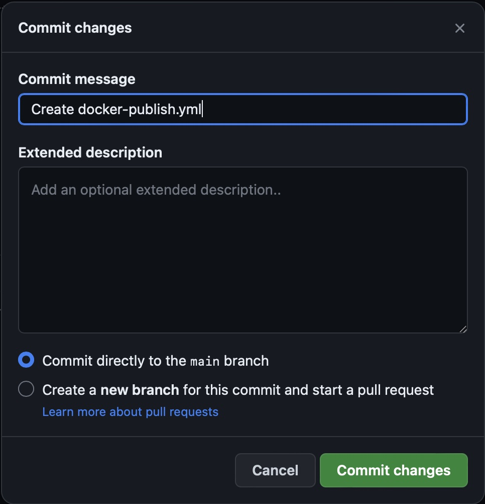

On you local computer run

```bash
Git pull
```

to pull the newly comitted changes, and see the following directories and file apear `.github/workflows/docker-publish.yml` in your repo

This is the actions YAML file, from before.

If you need to change anything, you can just edit that file, and commit it.

But for now, let's focus on the first build.

## First Build

The Dockerfile in your repo should not be comitted yet.
So start by doing that.
Give it the commit message "Added Dockerfile" and click `Commit`
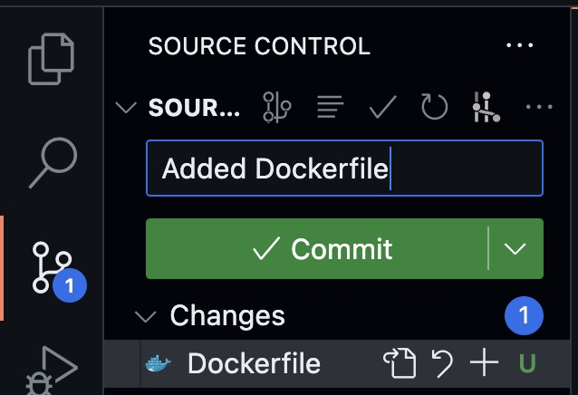

Also click `Sync Changes` to push the commit to the remote Registry on Github.

Note i'm using the VS Code UI here, but you can do all of these steps, from the CLI, if you are more comfortable with that.

To build a container with the changes, we have made so far, we need to add a tag.

Click `Command ⌘ + Shift ⇧ + P` to open the command pallette, and type `Create Tag`
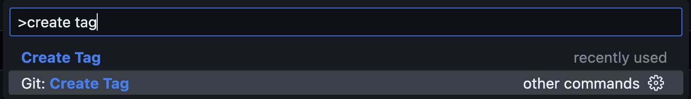

The tag needs to be in the format `v*.*.*`as described in the actions file. We will name ours `v0.0.1`
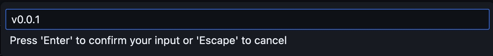

Give it the description `Version v0.0.1`
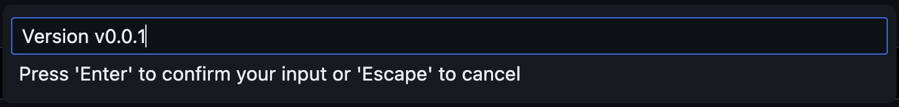

And say yes to sync the tag.
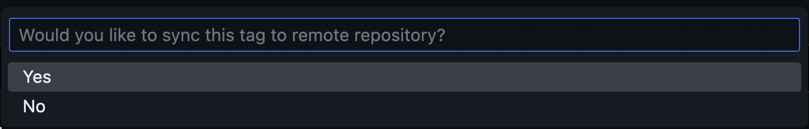

After this, you can open your repository on github,.com, and select the Actions tab, and see a new workflow has been run.
If you did everything right, then it should be green. If not, then it's time to trubleshoot. But don't worry, there is plenty of logs to help you.
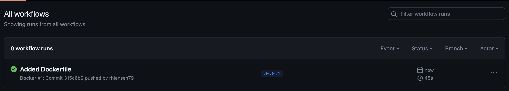
Note the Workflow Run name is the latest Commit message, and the version is the tag.

## Registry

On the front page, of your Github repository, you should see `MyApp`under Packages.
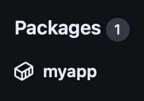

click on `MyApp` to go to the Package site.

Here you can see all the information about yor container.
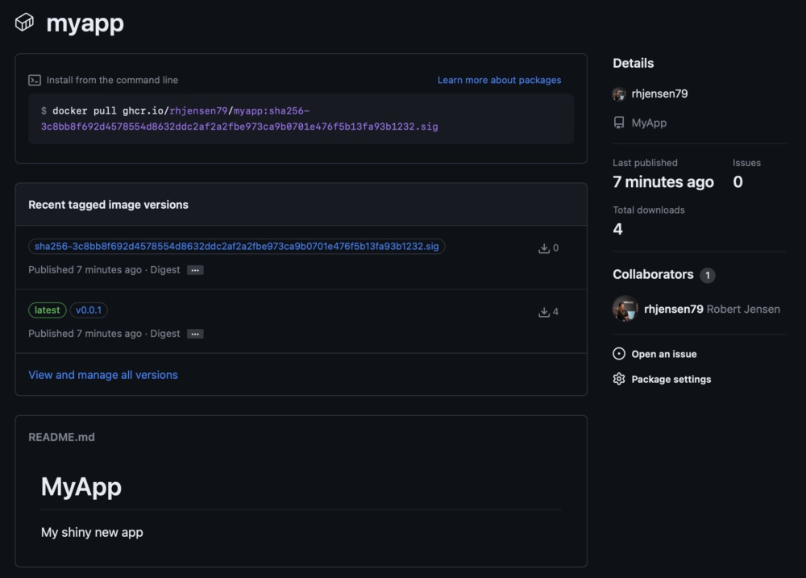

The container can be pulled in 3 different ways.

The initial name is ghcr.io/username/reponame/packagename:

Followed by

- SHA tag
- version tag
- latest

To keep this correct, we will use the tag.
In my case that means running

```bash
docker pull ghcr.io/rhjensen79/myapp:v0.0.1
```

To test the image, i'm running the following command

```bash
docker run -it ghcr.io/rhjensen79/myapp:v0.0.1 /bin/bash
ls
cat README.md
```

This allows me to run a bash shell, inside the container, to see the README.md file, we copied into it during the build.
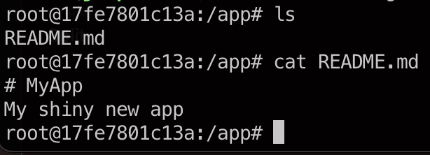

## Ending

So by now, you should have an idea on how to build, and host a container, on Github.

When you want a new build, simply commit and push your changes, and then create a new tag, with a higher version, and see it get build.

Note since Github Actions is running in x86 mode, this will not work for ARM based images.
This is easy to change, and something I recommend doing.

You can also make the workflow more advanced, by adding testing, scanning, signing etc.

For most of these tasks, there already exist Github Action modules, that does this, and they are easy to add.

But thats for another blog post.

If you found it usefull, then let me know in the comments below.

Thanks for reading this far.
