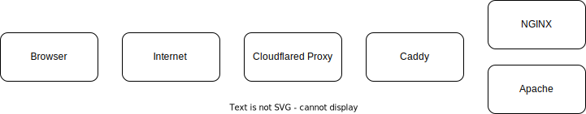
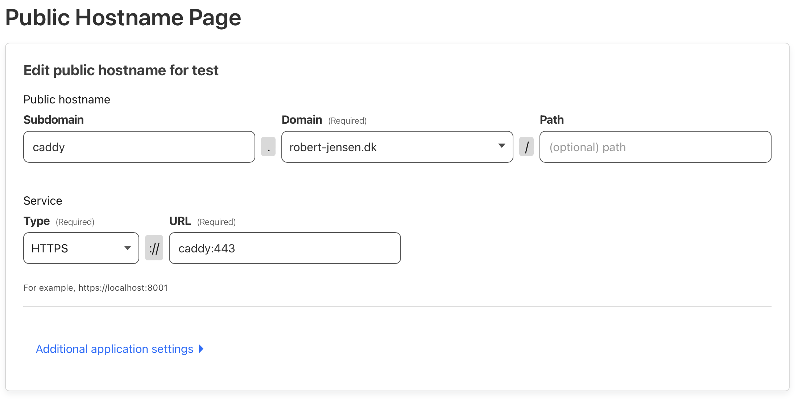
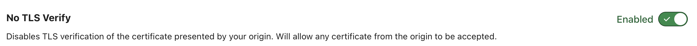
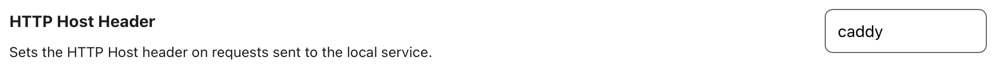
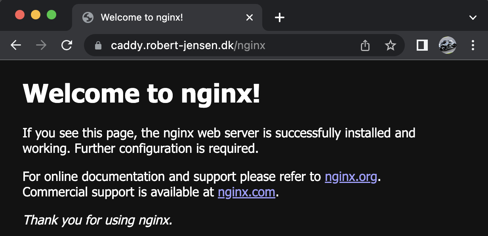
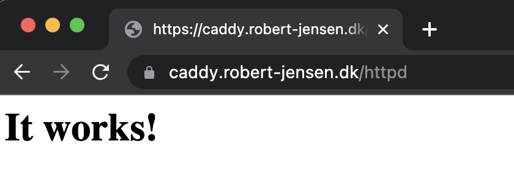
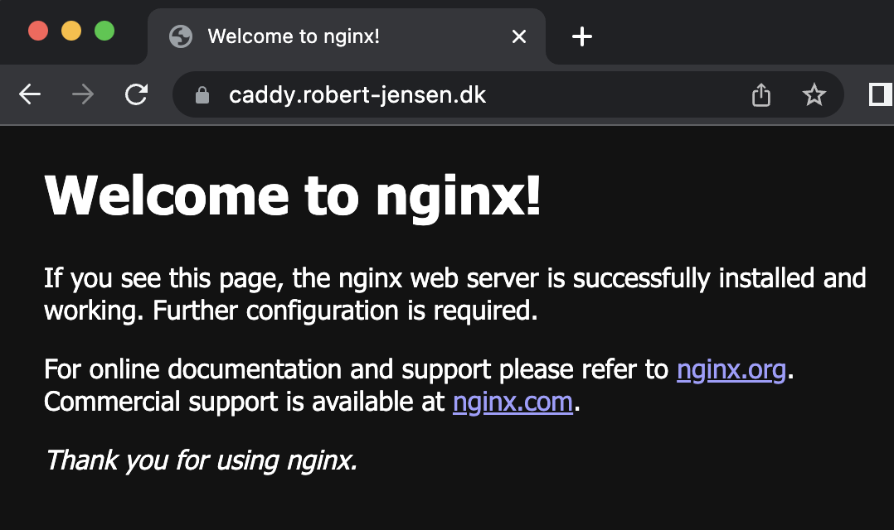

## Intro

For a small project I was doing, I had to set up a [Caddy](https://caddyserver.com) reverse proxy, after a [Cloudflare](https://www.cloudflare.com) reverse proxy.

Everything had to be with TLS etc, and it turned out to be a bit harder than expected. So here is how I did it, so you don't have to struggle.

## Enviroment

For this post, I will be running everything locally using Docker so it's easy to replicate and test, before pushing this to the final environment.

The concept looks something like this.



Cloudflared proxy creates a tunnel, to CloudFlare CDN. So I don't have to open any fw ports.
If you haven't tried this, then I have a couple of blog posts, on this site, that show how. It's a really cool solution.

The reason for using Caddy, is that I can use it, to deliver the request to the correct endpoint, based on the URL etc.

This was a specific requirement in my use case.

Also, there were some issues with [CORS](https://fetch.spec.whatwg.org/#http-cors-protocol) which restricted me from using multiple URLs.
And as far as I can see, then I cannot point the same public URL in Cloudflare, to different endpoints, based on the URL, after the FQDN.

But hey. This was a great excuse for testing out Caddy :-)

If you don't have this requirement, you can use cloudflare without Caddy, and just point it directly to the endpoint you wish, or expose Caddy directly without Cloudflare.

## Setup

The environment is pretty simple, and you can find all files etc. in the Github repository [https://github.com/rhjensen79/double-reverse-proxy](https://github.com/rhjensen79/double-reverse-proxy)

It consists of an env file, that contains the Cloudflare proxy token.

A Caddyfile with the configuration for Caddy.

And a Docker-Compose file, for running the entire environment.

After running it for the first time, a couple of config files might also appear, but I will keep them out of this guide.

## Docker-Compose

The docker compose file looks like this

```yaml
version: '3'
services:
  cloudflared:
    image: cloudflare/cloudflared
    container_name: cloudflared
    networks:
      - caddy
    environment:
      - TUNNEL_TOKEN=${TUNNEL_TOKEN}
    command: tunnel run
    restart: unless-stopped
  caddy:
    image: caddy:latest
    container_name: caddy
    restart: always
    networks:
      - caddy
    stdin_open: true
    tty: true
    volumes:
      - ./caddy:/config
      - /etc/localtime:/etc/localtime:ro
    entrypoint: /usr/bin/caddy run --adapter caddyfile --config /config/Caddyfile
    depends_on:
      - cloudflared
  nginx:
    image: nginx
    networks:
      - caddy
    depends_on:
      - caddy
  httpd:
    image: httpd
    networks:
      - caddy
    depends_on:
      - caddy
networks:
  caddy:
```

It creates a `Caddy` network and attaches the Cloudflare, Caddy, Nginx, and Httpd container to it.

This allows us to communicate with all containers, using their name.

## Cloudflare

In Cloudflare, go to Zero Trust and find your Tunnel.
Once found, edit it.
Create a new public hostname.

Mine is called caddy.robert-jensen.dk, but the important thing, is the service part.
Here i have selected https and the url is caddy:443 which is the internal dns name, for my container, along with the port.

I have also configured one additional setting.

`No TLS Verify Enabled`

This is important since the certificate for Caddy is self-signed and not trusted.
Caddy can pull its own certificate, from Let's Encrypt, etc. But in this case, Cloudflare provides a certificate, so it's not needed.
This setting tells Cloudflare to ignore the certificate warning.


Another thing is to set the `HTTP Host Header` to caddy.

This ensures that the requested URL matches the one we set in the first line in the `Caddyfile` in the next step.

## Caddy

The `Caddyfile` in the repository, is what tells Caddy how to handle requests.

Mine looks like this

```yaml
https://caddy {
 tls internal
 
 handle_path /httpd* {
  rewrite * /
  reverse_proxy http://httpd:80
 }

 handle_path /nginx* {
  rewrite * /
  reverse_proxy http://nginx:80
 }
 
 reverse_proxy * http://nginx:80
}
```

The first line tells Caddy to handle all traffic, with the destination <https://caddy>

Tls internal tells it to create a self-signed certificate.

And then we tell it to handle traffic with /httpd and rewrite it to / and then forward it to the container named httpd on port 80

We do the same for traffic to /nginx. Here we just point it to the nginx container instead.

In the end, we tell it that all other traffic goes to the nginx container, without rewriting it.

## Test

Running a simple `docker compose up` should provide this result for  `https://caddy.robert-jensen.dk/nginx`


This result for `<https://caddy.robert-jensen.dk/httpd>`


And this result for `https://caddy.robert-jensen.dk`


Note that all URL have a valid certificate. This is provided by default by the `Cloudflared Proxy`

So it's a pretty cool solution, for exposing multiple endpoints, using Caddy as a reverse proxy.

Hope this was useful, and thanks for reading this far.

Photo by <a href="https://unsplash.com/@marcojodoin?utm_source=unsplash&utm_medium=referral&utm_content=creditCopyText">Marc-Olivier Jodoin</a> on <a href="https://unsplash.com/photos/-TQUERQGUZ8?utm_source=unsplash&utm_medium=referral&utm_content=creditCopyText">Unsplash</a>
  