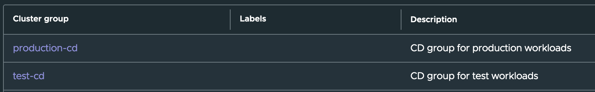
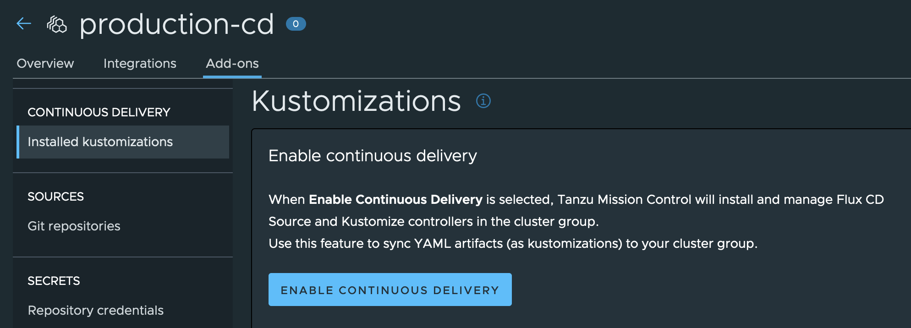
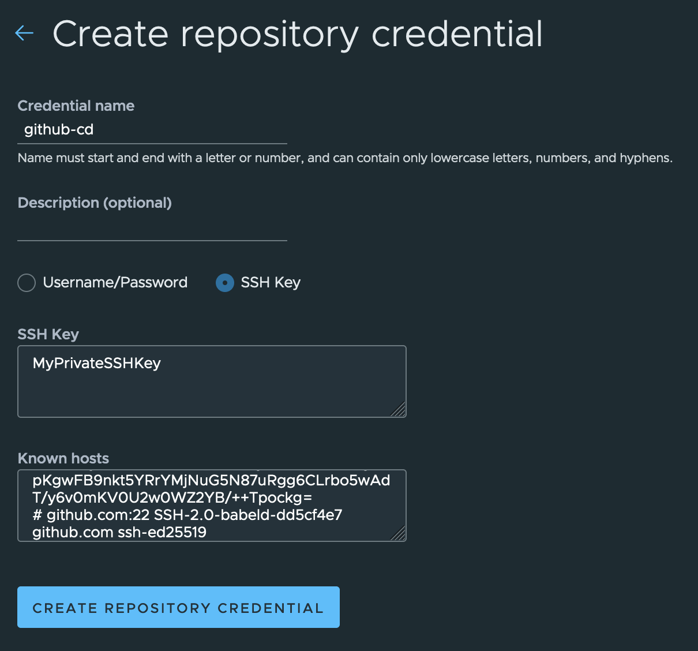
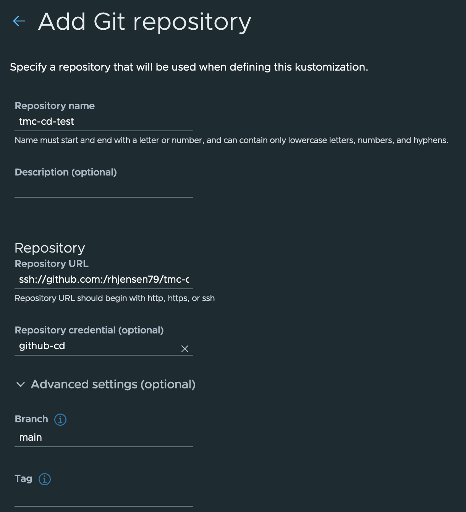
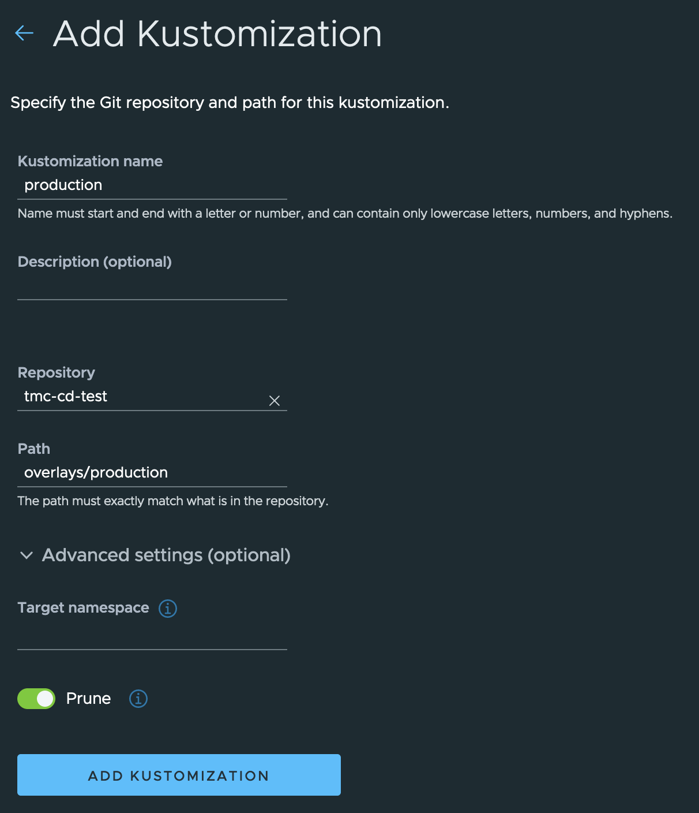
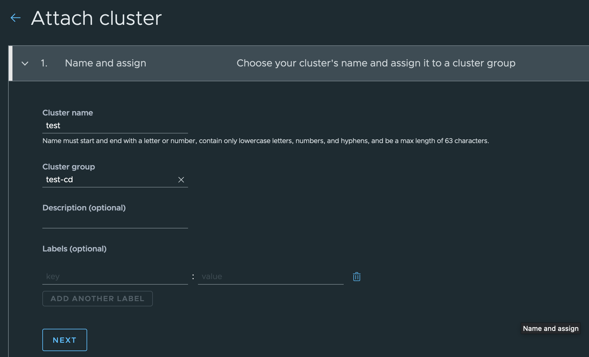
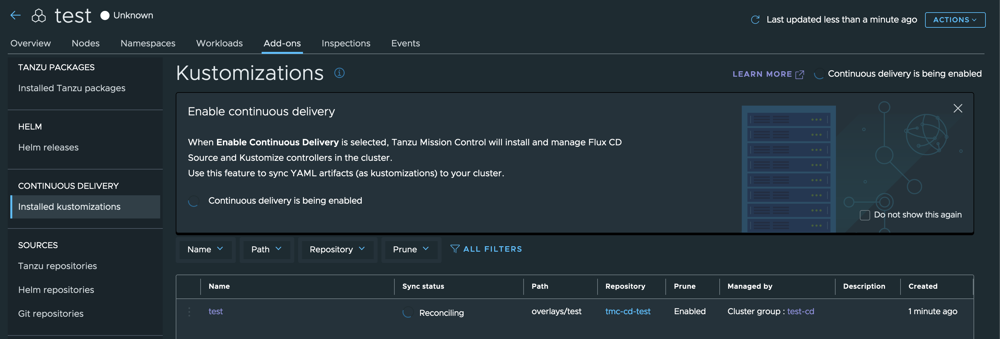
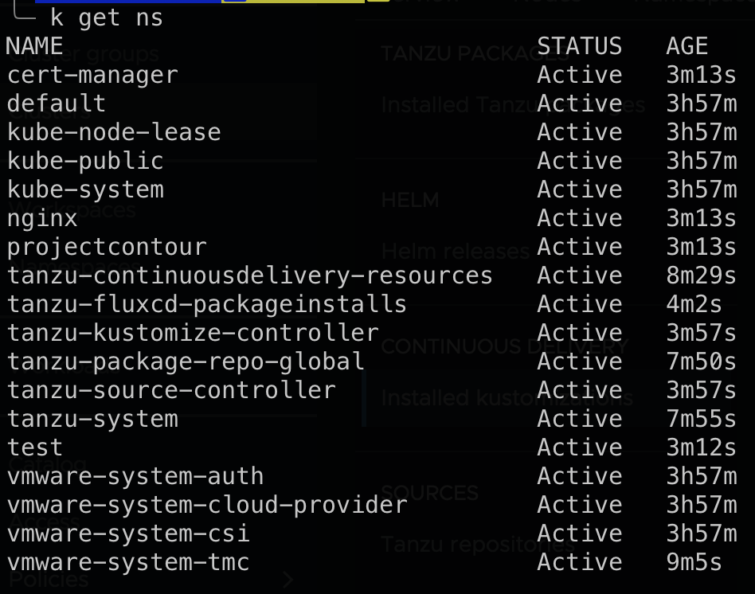
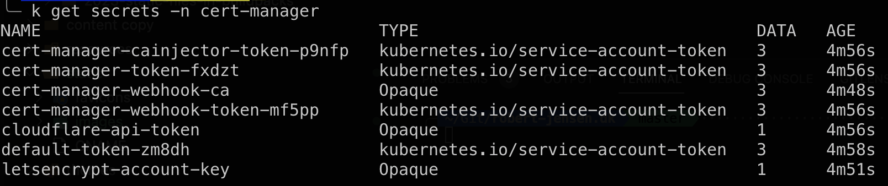

## Intro

One of the features I have been looking most forward to, in [Tanzu Mission Control (TMC)](https://tanzu.vmware.com/mission-control) is the ability to deploy a new Kubernetes (K8S) cluster and enable Continuous Delivery, as part of the deployment.

What that means, is that the cluster, will fetch a config, from a Git repository, after deployment, and allow configurations to be handled, thru that.

So basically anything you can add as a Yaml file or Helm chart can be automatically applied.

Sounds complicated? Not at all. Here I will explain how to set it up, for all future deployments, with different configurations, depending on what group you select.

## Prerequisites

Before we begin, we need to create a Git repository. I have created one in Github, with the following structure

```bash
.
├── apps
│   ├── kustomization.yaml
│   └── nginx
│       ├── deployment.yaml
│       ├── kustomization.yaml
│       ├── namespace.yaml
│       └── service.yaml
├── base
│   ├── cert-manager
│   │   ├── api-token.yaml
│   │   ├── cert-manager.yaml
│   │   ├── clusterissuer.yaml
│   │   └── kustomization.yaml
│   ├── config
│   │   ├── clusterrole.yaml
│   │   └── kustomization.yaml
│   ├── contour
│   │   ├── contour.yaml
│   │   └── kustomization.yaml
│   └── kustomization.yaml
├── overlays
│   ├── production
│   │   ├── kustomization.yaml
│   │   └── namespace.yaml
│   └── test
│       ├── kustomization.yaml
│       └── namespace.yaml
└── readme.md
```

It uses [Kustomize](https://kustomize.io) for the structure, so if you are not familiar with that, then I recommend taking a look at their website.
They has some good getting-started guides.

The concept is that I can point to overlays/production folder, for production workloads, and overlays/test for test workloads.
All my base templates are in Apps and Base, and Kustomize can customize them, so they match the configuration I want in Production and Test.

We also need to be able to connect to the Github repo.
This is done, by creating SSH keys.

I use the following command to generate my private and public keys.

```bash
ssh-keygen -t ecdsa -b 521 -C "your_email@example.com"
```

Then I add the public key, to my GitHub profile, and save my private key for later.

I also ran

```bash
ssh-keyscan github.com
```

And saved the output, to use in the next step.

# TMC

In TMC, I have created 2 cluster groups, which I will be using for this.

production-cd and test-cd


I enabled "continuous delivery" on the production group.


Created Repository credentials with a name, my private key, and the output from the ssh-keyscan command.


In Git repositories, I added my repository and pointed it to the credentials I created in the last step.
Note the SSH URL for my repo is in the following format `ssh://github.com/username/reponame.git`
The branch also needs to be set to main, under advanced settings (or whatever your branch is)


Last I added a Kustomization, with a name, my repository, and the path `overlays/production` for my production cluster group.

I also enable "Prune" under advanced settings.


And then I did the same, for the `test-cd` cluster group. The only change is that the path is `overlays/test` instead.

## Deployment

All there's left now is to deploy a new cluster using TMC, or to attach an existing one, and add it to the cluster group.

I have created one, and attached it to the `test-cd group`.


Right after attaching it to TMC, I can see it says `reconciling` which means it's enabling continuous delivery and applying the configurations.


A simple `k get ns` shows that a test namespace has been created.

This is specific for the `overlays/test`folder

But I can also see projectcontour, cert-manager, nginx there.

Running `k get secrets -n cert-manager` shows that my Cloudflare secret, has been applied, so I can pull new certificates, using the Clusterissuer, that is also installed.


This means all my configurations, have been applied, without me having to do anything, and my colleagues that use the same platform, can deploy K8S clusters, pre-configured, with the settings they need.

Also if I change or add anything, it will be applied, within the next 5 minutes.

Pretty neat, or what do you think?

Photo by <a href="https://unsplash.com/@carlosaranda?utm_source=unsplash&utm_medium=referral&utm_content=creditCopyText">carlos aranda</a> on <a href="https://unsplash.com/photos/QMjCzOGeglA?utm_source=unsplash&utm_medium=referral&utm_content=creditCopyText">Unsplash</a>
  