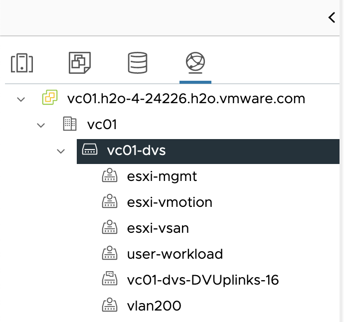
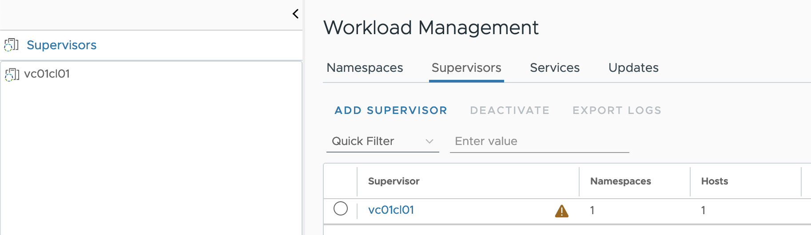
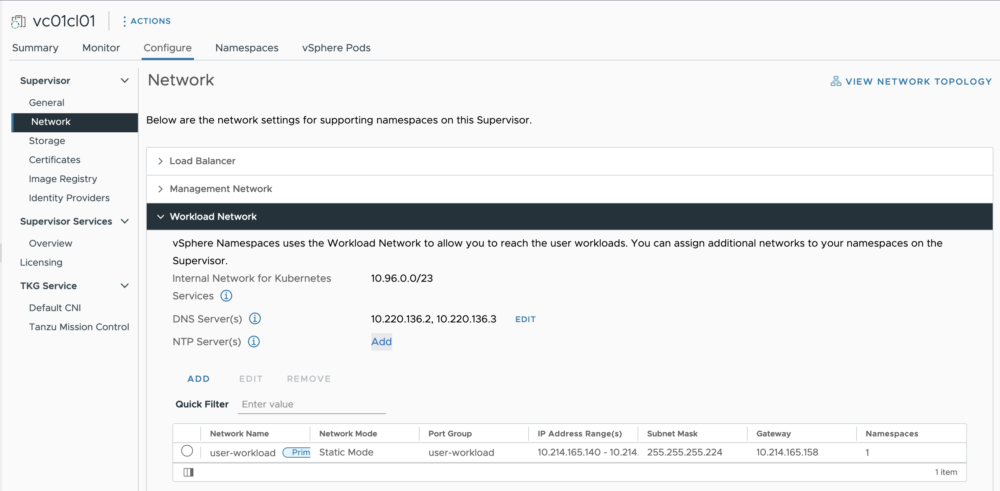
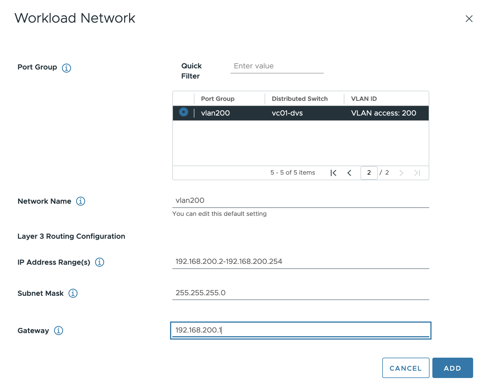
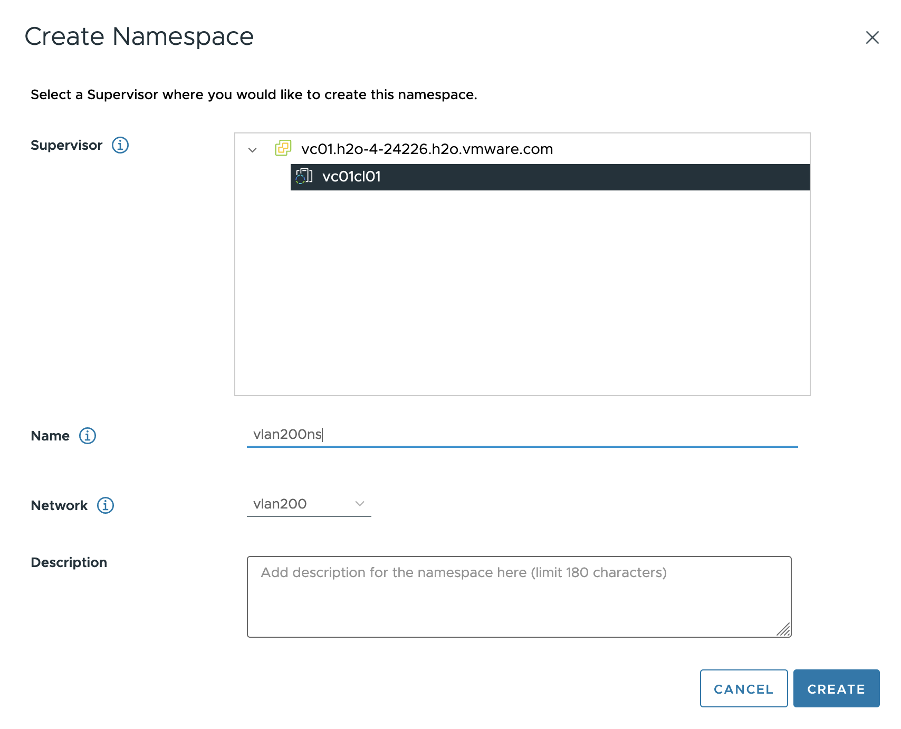

## The problem

I have met several customers, who have vSphere with Tanzu that is struggling to add more than 1 network, to their environment, when they use the AVI Loadbalancer, and not the full NSX solution.

This is a quick guide, on how to do just that.
Note it's only possible (as far as I know), to have 1 network to each vSphere namespace. 

## Preprerequisite

- A fully functional vSphere with Tanzu environment.
- An extra port group, configured and working (the one you want to add)

## Howto

I will be adding my new port group vlan200, in this guide.

Go to workload management, find your supervisor cluster, and select it.

Click configure -> Network -> Workload Network and click add

Select the new port group, and add the network ranges that can be used.

Now you can select the new network when you create new vSphere namespaces.

## Notes

Note that the API ip is still the same. So this only separates the workload and nodes on different networks. 
So if you are concerned, about security for the API, then you should protect that somehow (this is probably always a good idea)

Hope you fund this useful.

Photo by <a href="https://unsplash.com/@jordanharrison?utm_content=creditCopyText&utm_medium=referral&utm_source=unsplash">Jordan Harrison</a> on <a href="https://unsplash.com/photos/blue-utp-cord-40XgDxBfYXM?utm_content=creditCopyText&utm_medium=referral&utm_source=unsplash">Unsplash</a>
  