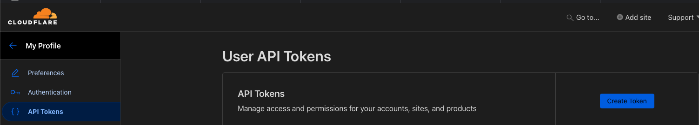
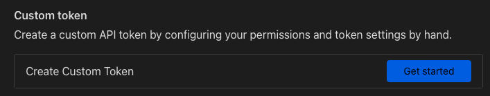
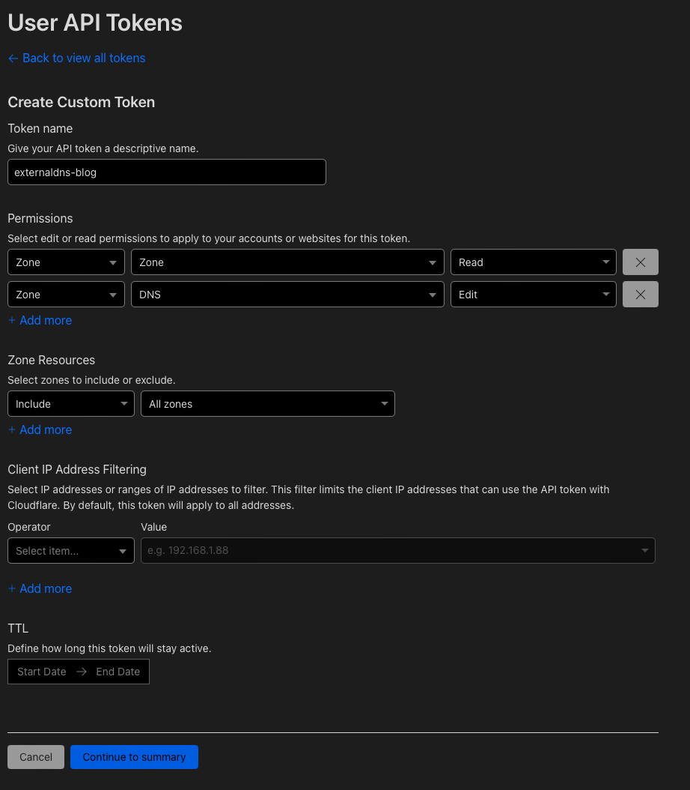
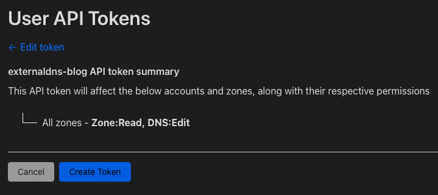
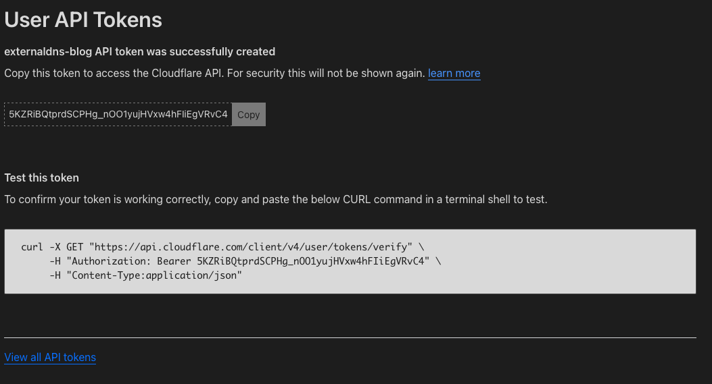
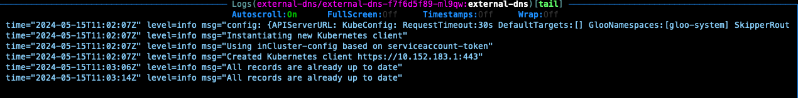
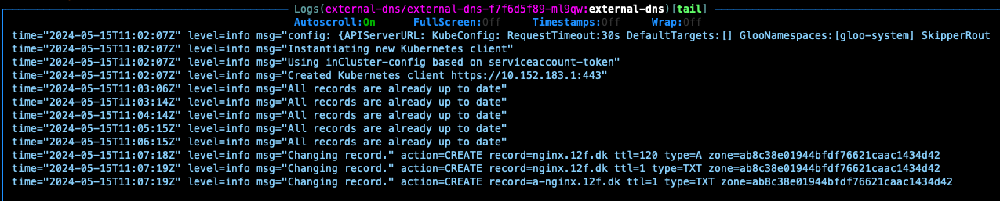
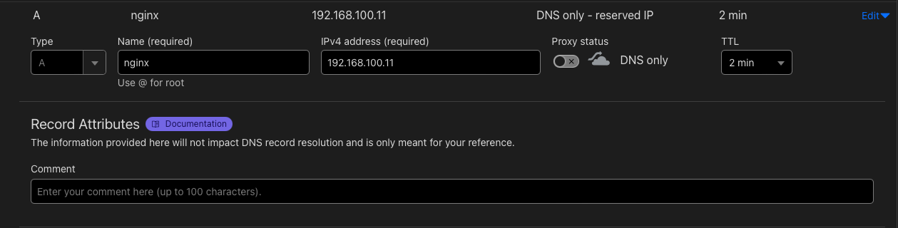

## Update

Just after creating this blog post, I submitted a PR to [https://github.com/kubernetes-sigs/external-dns/](https://github.com/kubernetes-sigs/external-dns/) where I added the things I was missing in the documentation.

I expected it to take weeks, if ever, to get approved. But a couple of hours later, it was merged into the Master branch.

This kinda makes this blog post obsolete. 
But I will still keep it here, for reference, and maybe as a reminder to fix things at the source, before writing a blog post about it, in the future :-) 

## The problem

I love [external DNS](https://github.com/kubernetes-sigs/external-dns).
The idea of just adding your services to Kubernetes, and then having automatic DNS entries created, is really fantastic. 

But since I'm running CloudFlare, then I want to use it with that. 
And it's possible, but I had some problems using the official guide (and finding others with the same problem), so I decided to create this blog post, to show how I got it working.

## Preprerequisite

A Kubernetes cluster that has a LoadBalancer that can give out an external IP.

A Cloudflare API key with correct permissions.

To create an API key

- Go to [Cloudflare.com](www.cloudflare.com)
- Log in.
- Select "My Profile"
- Select "API Tokens"
)

At the bottom, there is a section called "API Keys"

DO NOT USE THEM!!!!
It will work, but it's not a good way to deal with security, and you don't want any of them, to fall into the wrong hands, and give them unrestricted access to your CloudFlare account.

Instead, select Create Token" in the top right corner.

Select "Create Custom Token" at the bottom of the screen.



Give it a custom name.

Permissions should be 

Zone -> Zone -> Read

Zone -> DNS -> Edit

Include -> All Zones (you can of course restrict this one if you only want it to access a single zone)

I did not define expiry, but it's absolutely best practice, to not let it live forever.

Click "Continue to Summery"



You should see a summary like this

Click "Create Token"



Copy the token, and save it in a safe place. We will need it later.

(The token has already been deleted when you read this blog post. Just FYI.)



Note at the bottom, that you can copy the command, to test the token.
I recommend doing so, so you know it works before you begin troubleshooting later.

## Install External DNS

Start by creating a "values.yaml" file with the following content
```yaml
provider:
  name: cloudflare

policy: sync # or upsert-only

env:
  - name: CF_API_TOKEN
    valueFrom:
      secretKeyRef:
        name: cloudflare-api-key
        key: apiKey
```

Then add the Helm repo to your cluster and update it.

```bash
helm repo add external-dns https://kubernetes-sigs.github.io/external-dns/
helm repo update
```

Create a namespace for external-dns
```bash
kubectl create ns external-dns
```

Create a secret with our new token in that namespace
```bash
kubectl create secret generic cloudflare-api-key --from-literal=apiKey="5KZRiBQtprdSCPHg_nOO1yujHVxw4hFIiEgVRvC4" --namespace external-dns
```

Install it, by running this command, in the same directory, as your values.yaml file
```bash
helm upgrade --install external-dns external-dns/external-dns --values values.yaml --namespace external-dns
```

If you use [K9S](https://k9scli.io) then you can quickly start it, and find your external-dns pod, and see the logs, by pressing "l"


It shows that it's working by saying that all records are up to date.

But let's test it.

External DNS has a Nginx example on their website.
```yaml
apiVersion: apps/v1
kind: Deployment
metadata:
  name: nginx
spec:
  selector:
    matchLabels:
      app: nginx
  template:
    metadata:
      labels:
        app: nginx
    spec:
      containers:
      - image: nginx
        name: nginx
        ports:
        - containerPort: 80
---
apiVersion: v1
kind: Service
metadata:
  name: nginx
  annotations:
    external-dns.alpha.kubernetes.io/hostname: nginx.12f.dk
    external-dns.alpha.kubernetes.io/ttl: "120" #optional
spec:
  selector:
    app: nginx
  type: LoadBalancer
  ports:
    - protocol: TCP
      port: 80
      targetPort: 80
````

Save the above yaml file to nginx.yaml and change the hostname from nginx.12f.dk to one that you own and manage in Cloudflare.

Then run 
```bash
kubectl apply -f nginx.yaml
```

Open K9S again, and see the logs of the External DNS pod again.
It should now show something like this.


In Cloudflare, you can also see that 3 new records have been created.

The most important one is the A record, for our Nginx service.
The other 2 txt records, are External DNS way of keeping track of the records it creates (as I understand it)


## Notes

This is my current working setup.

You can follow the External DNS Cloudflare documentation [here](https://github.com/kubernetes-sigs/external-dns/blob/master/docs/tutorials/cloudflare.md), to see what's different.

For me, is was all about using locked-down tokens, and not the full API access keys.

And I had a lot of trial and error, finding a configuration that worked.

Hope you found it useful and can use it to automate your DNS creations.

Photo by <a href="https://unsplash.com/@candidbcolette?utm_content=creditCopyText&utm_medium=referral&utm_source=unsplash">Brittany Colette</a> on <a href="https://unsplash.com/photos/persons-holding-book-GFLMi4c8XMg?utm_content=creditCopyText&utm_medium=referral&utm_source=unsplash">Unsplash</a>
  