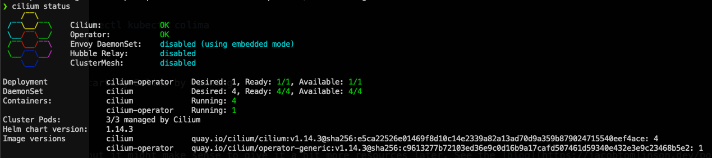

## Update

It seams that either downgrading Docker engine, to an earlier version or waiting for version 4.27.0 will fix the Cilium problem.

More info can be found in this [issue](https://github.com/kubernetes/minikube/issues/17780).
Thanks to [Daniil Bazhanov](https://www.linkedin.com/in/daniil-bazhanov-65bb16184/), for the link/update.

For me, Docker Desktop is gone, and I will test out Colima in my env going forward, and see how that works.

## Intro

I have started playing with [Cilium](https://cilium.io), and learning about all the interesting things it offeres. 
That involves running a local Kind cluster, where I can quickly test things out. 

## Problem

Cilium has a [guide](https://docs.cilium.io/en/stable/gettingstarted/k8s-install-default/) on how to run this on a Kind cluster. The only problem, is that it's not working on my M1 Macbook.

The deamonset pods keep restarting, and my coredns pods, never starts.

This means it's pretty useless for me.

I have created a [PR](https://github.com/cilium/cilium/issues/30278), where I think the error was found, but no real solution, until [Parshin Pavel](https://github.com/pparshin) gave me a workaround.

## Solution

The workaround was simply to replace Docker desktop with [Colima](https://github.com/abiosoft/colima)

This was also a good excuse to try something else that Docker desktop.

So I tested it by simply deleting the Docker desktop app from my system, and followed the following steps, from this [guide](https://jacobtomlinson.dev/posts/2022/goodbye-docker-desktop-for-mac-hello-colima/), to install Colima and tools.

```bash
brew install docker docker-compose kubectl kubectx colima

colima start
```

After that it was just a matter of starting Colima by running
```bash
colima start
```

If you want it to auto start, then you can run the following instead
```bash
brew services start colima
``````

Also if you want to change the default settings like cpu, memory, disk and a lot of other things, then run
```bash
colima template
```

With colima running, I could follow the Cilium Kind guide again, and after 2 minutes, I had a fully working Cilium installation again.


## Afterthought

Calima seams to be a seamless replacement for Docker desktop.

And judging from some of the comments, I got on this post, there is a lot of options for running colima, that is worth looking further into.

But that's for another blog post :-)  

Thanks for reading this far.

Photo by <a href="https://unsplash.com/@marcojodoin?utm_content=creditCopyText&utm_medium=referral&utm_source=unsplash">Marc-Olivier Jodoin</a> on <a href="https://unsplash.com/photos/long-exposure-photography-of-road-and-cars-NqOInJ-ttqM?utm_content=creditCopyText&utm_medium=referral&utm_source=unsplash">Unsplash</a>
  