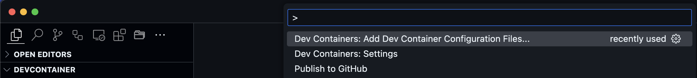
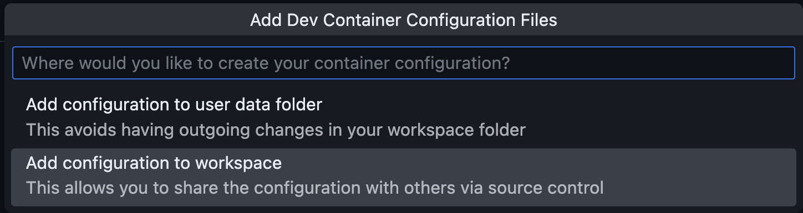
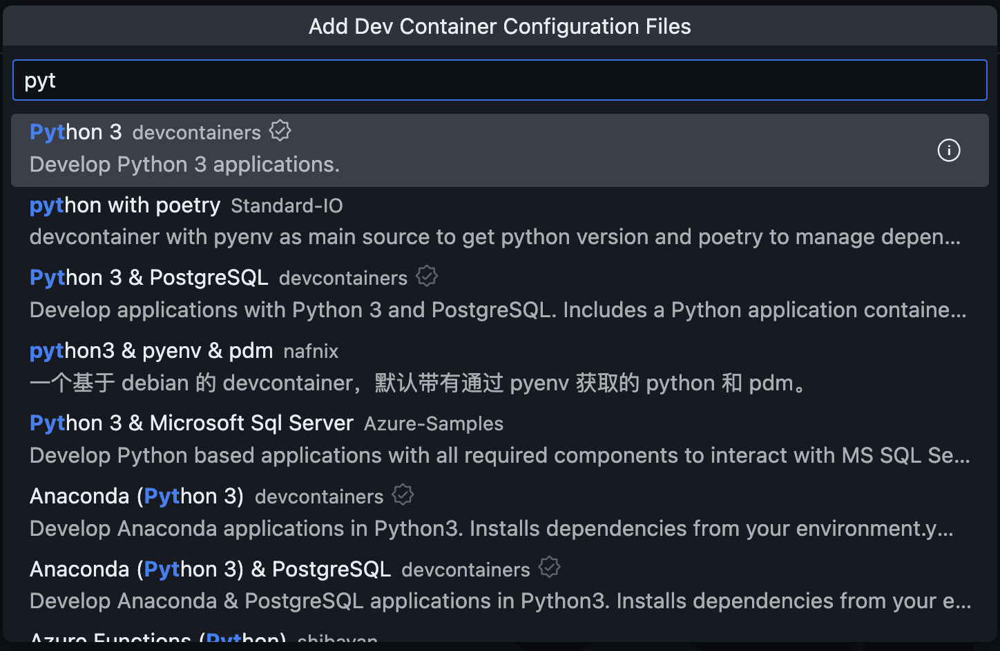
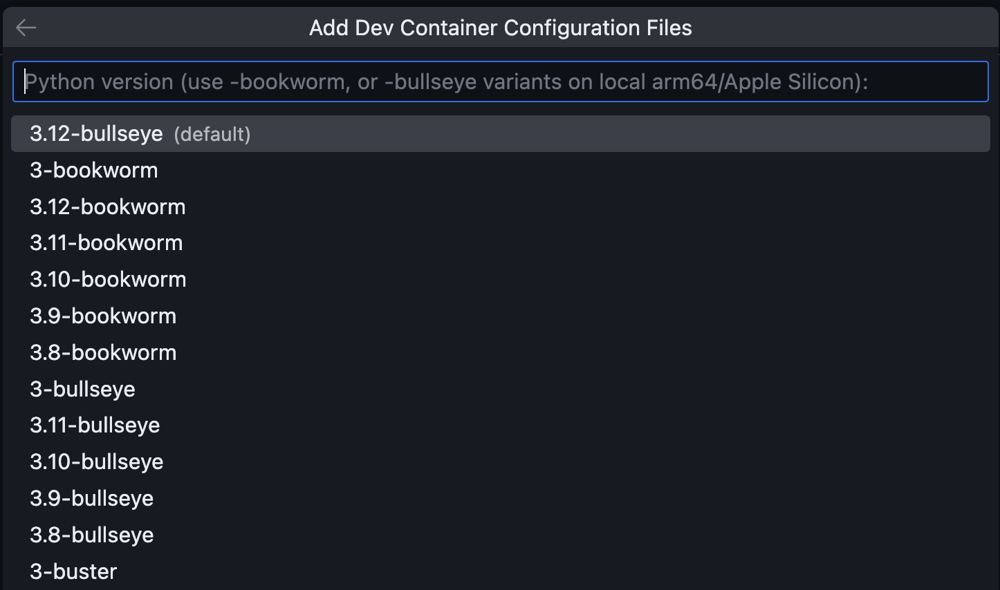
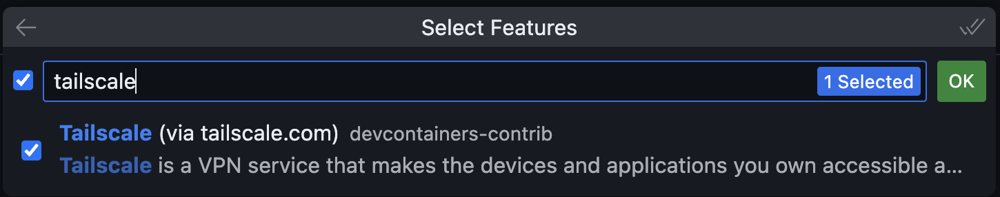
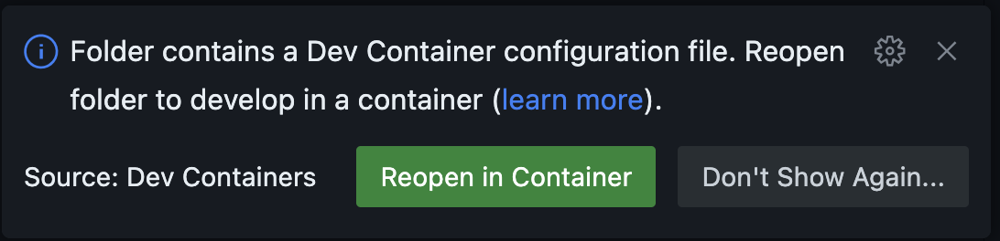

## The problem

For the last 12 years, I have been working in different locations, where I had to have access to different tools, no matter where I was.

Due to that, it's part of my core way of working, that all tools, must be either synced or avaliable, whereever I am, as long as i have a working internet connection.

Due to that, I'm a huge fan of [Tailscale](https://tailscale.com), and I use it to access more or less everything I have. I'f you havent tried it yet, then stop reading, and go test it now. You will thank me later. 

I'm also using different computers, and having the same enviroment on all of them, can be a challenge. 
That's why i'm also using [Devcontainers](https://code.visualstudio.com/docs/devcontainers/containers), as much as possible.

Devcontainers also allow me to use [Github Codespaces](https://github.com/features/codespaces), to spin up a dev env in the cloud, to use. But that one does not have access to local ressources, which I might need.
And that's where Tailscale is a perfect match.

In this blog post, I want to show you, how to setup Devcontainers with Tailscale, and how to use it remote with Github Codespaces.

## Prerequisite

To use this guide you must have the following installed.
- [vscode](https://code.visualstudio.com)
- A container engine ([Docker desktop](https://www.docker.com/products/docker-desktop/), [Colima](https://github.com/abiosoft/colima) etc.)
- [vscode Devcontainer extention](https://marketplace.visualstudio.com/items?itemName=ms-vscode-remote.remote-containers)
- A [Github](https://github.com) account


## Setup

I created a new folder and opened vscode in in.
```bash
mkdir devcontainer
cd devcontainer
code.
```

Then I opened VScode command pallette and found "Dev Containers: Add Devcontainers Configuration files..."


I chose to add the files to my workspace, to keep it in Git. This is my prefered option, since config and code stays in the same location.


I selected Python, since that is what I will be developing in. But there are tons of options, if you are doing something else.


Selected latest version as of this writing.
If I sas updating an older project, then I might have chosen a different version, that was more compatible.


Then I serached for Tailscale, to have that automaticly installed inside my container.


VScode automaticly detects that there is now a Devcontainer config, and asked me if I want to open my env inside of it. I selected "Reopen in container", to have it build and run.


After a short while (Depending on the hw you are running on), I have a VScode running inside of a container, with the latest version of Python and Tailscale installed.


I also got a couple of new files and folders.

the .devcontainer folder contains the devcontainer.json file, which contains all the configurations of my env

I also got a .github folder, with a dependabot.yml file. 

I won't go into that in this post, but it's used, to help me keep my dentainers and code up2date.

```bash
.
├── .devcontainer
│   └── devcontainer.json
└── .github
    └── dependabot.yml
```
