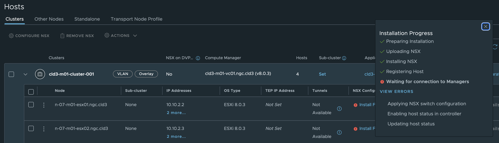

## The problem

For a clean installation, Cloud Builder fails with the step "Create Transport Node Collection".

## Troubleshooting

Troubleshooting the problems by logging into the NSX manager, revelaled the problem was "Waiting for connection to managers"
So that ment that the hosts were trying to contact the NSX manager, with no luck.


The ESX hosts and the NSX appliances, were on different subnets. 

The first thing I did, was to make sure there was connectivity. There was.

I then looked at the logs on the ESXi.

They revealed something interesting.
```bash
tid="2150760" level="WARNING"] StreamConnection[47643 Connecting to ssl://10.10.1.5:1234 sid:47643] Couldn't connect to 'ssl://10.10.1.5:1234' (error: 104-Connection reset by peer)
```

Connection reset by peer. 

I tried to connect to the NSX manager on port 1234 from the ESX host, and got the same error.

That ment something waas responding, but the connection did not go thru.

I searched for KB articles, but without any luck.

A VMware support engineer (Danilo) helped me, and solved the problem.

He found that there was a firewall dropping the connection, after doing a packet trace.

## Solution

Going back to my network engineer, we found out, that he had set the firewall to allow all application trafic. 

He changed it to any any, and then it worked.

My guess is that the firewall, could not recognize the type of trafic it was seeing, and then dropped it. 

When I tested connectivity, it worked, since that was known trafic.

A big thanks to VMWare (broadcom) Support, for helping with this. 

I don't think I would have found this on my own.

Photo by <a href="https://unsplash.com/@timmossholder?utm_content=creditCopyText&utm_medium=referral&utm_source=unsplash">Tim Mossholder</a> on <a href="https://unsplash.com/photos/yellow-and-black-round-cookies-rx_GNopVlFs?utm_content=creditCopyText&utm_medium=referral&utm_source=unsplash">Unsplash</a>
  