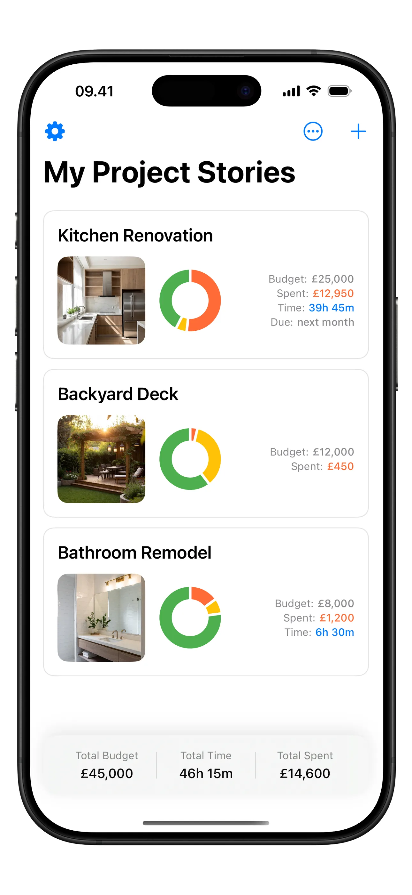
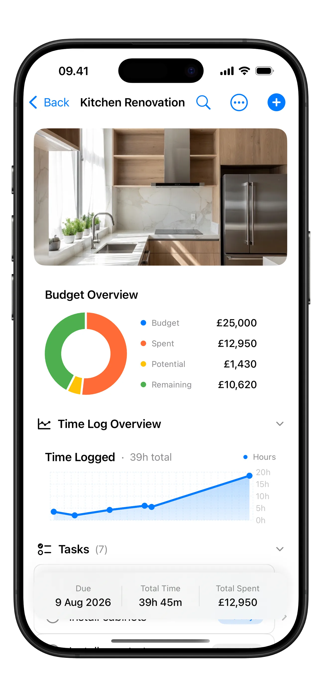
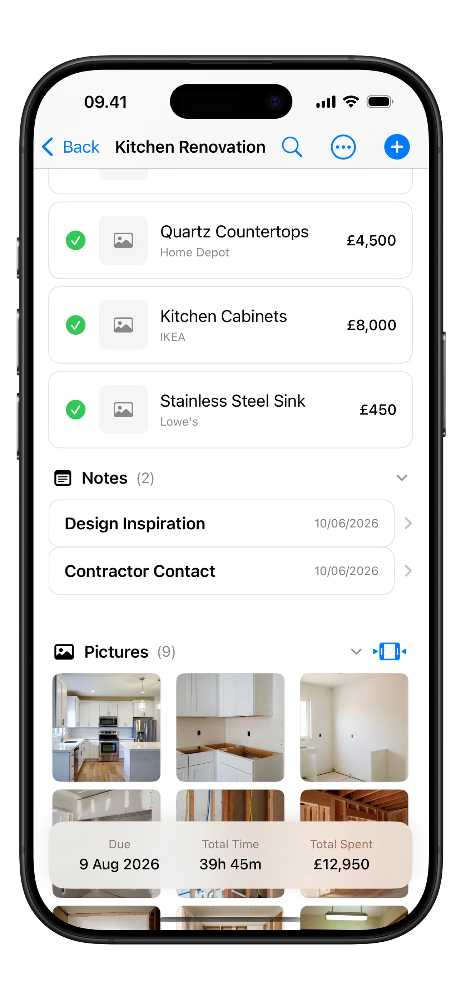
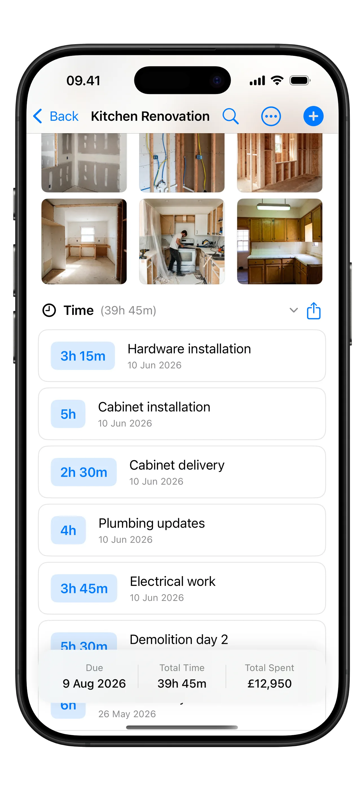
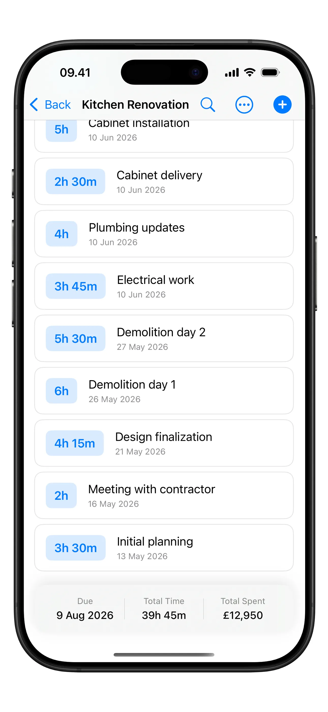

## Intro

Most of my side projects start the same way: I run into a small, annoying problem and can't stop thinking about it. **Home Stories** was different. It didn't start with my problem at all - it started with my sister's camera.

If you've followed this blog for a while, you know I mostly write about Kubernetes, automation and homelabs. This post is a bit of a detour. It's about a personal project, why I built it, and what happened once real people started using it. If you want to skip straight to the app, it lives at **[home-stories.12f.dk](https://home-stories.12f.dk)**.

## It started with a "Wood Story"

My sister runs a YouTube channel called [Standish Wood Story](https://www.youtube.com/@standishwoodstory), where she documents her woodworking and home projects. What I love about it isn't the finished pieces - it's that she shows the *whole* journey. The messy middle. The plan that changed three times. The thing that didn't fit and had to be redone.

Watching her document projects that way stuck with me. There's something powerful about treating a project as a *story* you tell over time, instead of just a before photo and an after photo with all the interesting parts missing.

Around the same time, I was staring at my own home renovation notes, scattered across the usual places: a few reminders here, some photos buried in my camera roll, a couple of prices screenshotted in a shopping app, a budget in a spreadsheet I opened maybe twice. Nothing talked to anything else. I had no idea what I'd actually spent.

So the idea more or less wrote itself: **what if a homeowner could document a renovation the same way my sister documents a build?** One place for the plan, the budget, the receipts, the photos - the whole story. That's where the name came from, and honestly the whole *-stories* family of apps I've built since traces back to her channel.

## What Home Stories actually does

At its core, Home Stories is a place to keep one renovation project honest with itself. You create a project - say, a kitchen renovation - give it a budget and a start date, and then everything about that project lives in one screen.

Each project gets its own little dashboard. The part I use the most is the **budget overview**: a simple donut chart of budget vs. spent vs. what's still committed. It's the one number renovations always get wrong, and seeing it update every time you add something is weirdly motivating - and occasionally terrifying.

A few things I deliberately wanted it to handle:

- **Items you're buying** - you're standing in IKEA or scrolling a store, you see a sink you like, you add it: name, store, price, a photo. It rolls straight into the project total. If you don't know the price yet, it just counts as zero until you do.
- **Tasks** - "call the carpenter", "find a countertop", the endless list.
- **Notes and documents** - the contractor's quote as a PDF, the plumber's number, the paint code you'll otherwise forget.
- **Time logging** - how many hours actually went into this thing, which is the number DIY renovators most love to underestimate.

And then there are the photos. This is the part that ties back to where the whole idea came from. A renovation is a *before and after*, but the good stuff is everything in between - the demolition, the studs, the primed walls, the day it finally started looking like a room again.

Being able to scroll back through that timeline months later, and see the empty shell it started as, turns out to be the feature people get most attached to. Myself included.

The app is free to use, with an optional Pro upgrade for the extras - things like iCloud sync across devices, PDF export and reminders. I went back and forth on where that line should sit, and I'll be honest: I got it wrong the first time and had to move it. More on that in a second.

## The part nobody tells you: shipping is the easy bit

Building the first version was the fun, fast part. I know that story well - I even [wrote about vibe coding](../2025-vive-coding-is-the-new-frontpage/) and how AI-assisted tooling lets you get a working idea in front of people faster than ever. Getting Home Stories from "idea in the shower" to "on the App Store" was genuinely quick.

What I underestimated was everything *after* shipping.

The first design had me gating the budget features - the pie chart, the totals - behind Pro. It seemed reasonable. Except it meant free users never got to *see* the budget tracking do anything useful, so the app was asking for money before it had proved it was worth any. That's backwards. I moved prices and totals to the free tier so the value is obvious first, and kept Pro for the genuinely "power user" stuff. That change came directly from watching how people actually used it - not from a plan I had up front.

## The feedback is the best part

Here's the thing I did not expect: **the messages.**

When you publish a blog post, you mostly hear silence, and maybe the occasional comment. An app is different. People email. And the feedback has fallen into three buckets, all of which I've come to genuinely love:

- **"Could it also do X?"** - feature requests. People wanting reminders, better sync, a widget on their home screen, a way to share a project with a partner. A lot of what's in the app now exists because someone asked for it. They're using it in ways I never designed for, and telling me where it falls short.
- **"This is broken on my phone."** - bug reports. Never fun to read, always useful. Someone with a different device, a different language, a weird edge case I'd never hit myself. Every one of those has made the app more solid.
- **"Thank you."** - and this is the one that gets me. People writing just to say the app helped them keep track of a stressful, expensive, emotional project. Someone renovating their first home. Someone finally able to show their partner where the money went.

I want to be honest about how much that last one means. You build something alone, at night, not really knowing if anyone will care - and then a stranger takes the time to tell you it made their renovation a little less chaotic. That's a feeling I don't take for granted, and I try to reply to every single one.

If you're one of the people who has written to me: **thank you.** You've shaped this app far more than you probably realise.

## What I've learned watching it grow

A few honest takeaways from the process:

1. **Ship the smallest honest version.** The first release did far less than what's there today. That was fine. It let real usage tell me what mattered.
2. **Your first monetisation guess is probably wrong.** Let people feel the value before you ask for anything.
3. **Feedback beats assumptions every time.** I've stopped trying to predict what people want and started listening to what they tell me.
4. **A project is a story, not a snapshot.** The whole reason the app exists is that the middle matters. That turned out to be true for building the app, too.

I still work on Home Stories in the gaps between everything else, and it's still growing - slowly, through the feedback loop as much as through my own roadmap. If you're in the middle of a renovation, or about to start one, I'd genuinely love for you to try it and tell me what's missing.

You can find it at **[home-stories.12f.dk](https://home-stories.12f.dk)**.

And if you want to see the kind of project-documenting that inspired the whole thing, go watch my sister's channel, [Standish Wood Story](https://www.youtube.com/@standishwoodstory). She was telling project stories long before I built an app for it.
