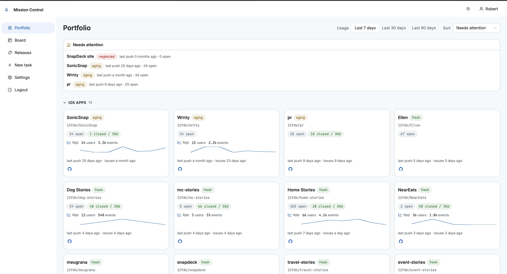
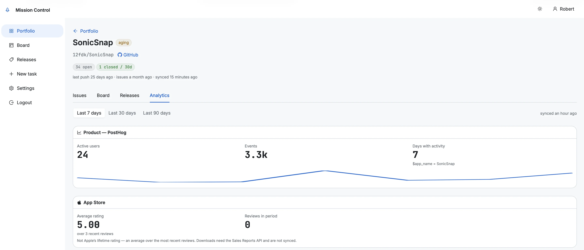

## Intro

I have a problem, and it's a nice problem to have: I have too many projects.

Somewhere north of 30 repos at this point. iOS apps in the `*-stories` family, WodSnap, snapdeck, a handful of marketing sites, homelab automation, this blog. Every single one of them uses GitHub issues as the source of truth for tasks, which has worked really well for me. I've written before that I keep all task state in issues so any tool, any session, any agent can pick up where the last one left off.

What I didn't have was a way to see all of it at once.

## The problem isn't the tasks, it's the projects you forget

I want to be precise about what was actually broken, because for a long time I misdiagnosed it.

I thought I needed a better task list. I didn't. GitHub issues are a perfectly good task list, and every project already had one. Opening a repo and seeing what's open takes five seconds.

The real problem was the projects I *wasn't* opening. A repo I hadn't pushed to in six weeks didn't send me a notification about it. It just quietly sat there while I spent another evening on whatever was already at the top of my mind. The apps with users got attention because users email you. The ones without users got nothing, which is exactly backwards if the goal is to give them a chance.

So the question I actually needed answered wasn't "what are my tasks?" It was **"which of my projects have I been neglecting, and how badly?"**

That's a question no per-repo view can answer, because the answer only exists when you look across all of them.

## What I wanted

I wrote the requirements down before writing any code, which for a side project is unusual for me but turned out to be worth it. The short version:

1. One screen with every tracked project: open issues, in progress, closed recently, last activity.
2. A ranking of the stalest projects, so the "what do I work on tonight" question has a default answer.
3. A Kanban board that spans repos, not one board per repo.
4. A way to file a new task into the right repo without leaving the dashboard.
5. Usage numbers next to each project, so I can see which things people actually use.
6. Usable one-handed on my phone, because half of these decisions happen on the sofa.

And one hard rule that shaped everything else: **the browser never talks to GitHub, PostHog, Umami or App Store Connect directly.** Only the backend holds tokens. That single constraint decided most of the architecture for me.

Here's what that turned into:



Projects are grouped into categories I define by hand, each card carries its freshness badge and issue counts, and where a project is mapped to analytics it gets a small usage line underneath. The strip at the top is the bit that does the actual work.

## The stack

- **Frontend**: [Refine.dev](https://refine.dev) (React + Vite). It gives you resources, routing, auth and data providers out of the box, and an Appwrite data provider already exists.
- **Backend**: my existing self-hosted [Appwrite](https://appwrite.io) instance, new project. Databases, Functions, Auth, and Sites for the hosting. No new infrastructure to run.
- **Data**: Appwrite Databases used purely as a cache of GitHub and analytics data.
- **Sync**: scheduled Appwrite Functions, one per source.

The UI reads only from the cache. Page load never calls GitHub. That means the dashboard is fast whether or not GitHub is having a day, and I stay comfortably inside the PAT rate limits regardless of how often I refresh.

The sync side is four scheduled functions plus one HTTP function:

| Function | Schedule | Job |
|---|---|---|
| `sync-github` | every 15 min | repos, issues, labels, milestones, releases, plus the recomputed scores |
| `sync-posthog` | hourly | active users and event counts per app |
| `sync-umami` | hourly | pageviews and visitors per site |
| `sync-asc` | daily | App Store versions, review state, ratings |
| `github-write` | HTTP | the only path that mutates GitHub |

Syncs are incremental with a `since` cursor and conditional requests, so a repo that hasn't changed costs essentially nothing. Each project syncs in isolation too: if one repo fails, that failure gets written to the project's `lastSyncError` and the rest of the run carries on. I've been burned before by a sync that dies on item three and silently leaves everything after it stale.

## The staleness score

This is the part I actually care about, and it's about 40 lines of code.

Three signals, all measured as days-since, all capped at 90 days so one truly ancient repo can't dominate the ranking:

- last push
- last issue activity (created, updated, closed)
- last time I opened it in Mission Control

```ts
const score =
  0.4 * daysSince(signals.lastPushAt, now) +
  0.4 * daysSince(signals.lastIssueActivityAt, now) +
  0.2 * daysSince(signals.lastViewedAt, now);
```

The weights sum to 1, which is deliberate: the score *is* a weighted average in days, so I can read the buckets straight off it. Under 7 is fresh, under 21 is aging, under 45 is stale, and anything above that is neglected.

Two small details that matter more than they look:

**A missing timestamp counts as maximally stale, not as zero.** A repo I've never pushed to and never opened has no dates at all. If you treat that as "0 days ago" it shows up as the freshest project you own, which is nonsense. It's the opposite.

**The third signal is about me, not the repo.** "Last viewed in Mission Control" is stamped when I open a project's detail page. It means a project I keep glancing at without doing anything about slowly climbs the list anyway, and one I genuinely dealt with drops off. Without that signal the same three repos sat at the top forever and I started ignoring the whole strip, which defeats the point.

The freshness colours are mapped onto GitHub's own status palette, green through amber to red, so severity reads the same way it does in the tab next door.

## Status lives in labels

I did not want GitHub Projects v2 in the middle of this. The API is heavier than I need and it introduces a second place where state lives.

Instead, three labels: `status:backlog`, `status:in-progress`, `status:blocked`. Closed means done. That's the whole state machine, and it works everywhere, including in the repos themselves when I'm not in the dashboard.

Dragging a card between Kanban columns swaps the label through the `github-write` function. That function applies the change on GitHub first, then updates the cache so the board is correct immediately rather than up to 15 minutes later. If the cache write fails, the GitHub change still stands and the next sync reconciles it. Wrong-order-of-operations here would mean a board that looks right and a GitHub that isn't, which is the worse failure by a long way.

One thing I got wrong and had to pin down with a test: the cached document ids written by `github-write` have to be byte-identical to the ones `sync-github` writes (`{projectId}_{number}`). They weren't, for about an hour, and every issue I touched ended up stored twice.

## Per-repo config that lives in the repo

Some settings belong to the project, not to the dashboard: what it's called, its live URL, which Umami site it maps to, its App Store id. Putting those in the dashboard's settings screen means the repo doesn't know anything about itself.

So a tracked repo can carry a `.mission-control.json` at the root of its default branch:

```json
{
  "displayName": "Home Stories",
  "siteUrl": "https://home-stories.12f.dk",
  "umamiWebsiteId": "b1c2d3e4-…",
  "posthog": "home-stories",
  "appStoreId": "1234567890"
}
```

The sync reads it conditionally, so an unchanged file is free. Identifiers only, never secrets, because most of these repos are public.

The rule I settled on is that **the file wins over the settings screen**. Fields set in the file render read-only in the UI. Two editable sources for one value drift apart silently and then you spend an evening working out which one is lying. Pick one. A malformed file never breaks the sync either, it just gets reported in that project's error field.

## The analytics tab, and a number that lied to me

Each project can map to PostHog (app events and users), Umami (website traffic) and App Store Connect (versions, review state, ratings). The Analytics tab only shows the panels that are actually mapped, so most projects show one or none, and that's fine.



One detail I insisted on: the panels state what they're actually measuring. The PostHog card shows the filter it used (`$app_name = SonicSnap`), because all my apps share one PostHog project and I will absolutely forget that in six months. The App Store card says out loud that the rating is an average over the most recent reviews, not Apple's lifetime rating, and that downloads aren't synced at all. Downloads only come through the asynchronous Sales Reports API as gzipped TSV, which is a separate afternoon of work I haven't done yet. Better an empty spot with an explanation than a confident number that means something other than what you think.

I care about this more than I used to, because of what happened next.

Then I caught the portfolio showing me 66 users on two different cards.

The app `home-stories` is measured by PostHog and the App Store. The website that markets it, `home-stories.12f.dk`, is a separate repo measured by Umami. I'd lazily put the PostHog filter on both, so the same 66 people appeared twice, in two places, and the portfolio read as twice the audience I actually had.

Nothing crashed. No error was logged. It just quietly told me a flattering lie, which is the most dangerous kind of dashboard bug there is. The fix is a rule rather than code: an app repo carries PostHog and App Store, a website repo carries Umami, and no repo carries both.

## Things that bit me

A few notes for anyone building on Appwrite, mostly so future me can find them:

- **The Appwrite CLI can't be scripted for function deploys.** `appwrite push function` prompts for confirmation, and with no TTY it crashes on a closed readline instead of taking a default. I ended up writing my own deploy script that talks to the API directly.
- **Build the frontend locally, not on the server.** Vite reads the repo-root `.env` and injects an explicit allowlist of three non-secret values. Upload only the `app/` folder and the server-side build has no `.env`, so you ship a bundle pointing at an empty endpoint. It builds fine. It just doesn't work.
- **Deployment preview URLs are frozen snapshots.** Appwrite mints a per-deployment hostname, and they're console-gated. Bookmark one and you'll be looking at an old build wondering why your change didn't land. Use the custom domain, which always serves the active deployment.
- **Provisioning has to be idempotent.** The schema lives in a script and gets re-run any time it changes. It only adds what's missing and warns about drift rather than dropping anything, because the day it decides to "fix" a collection by recreating it is the day I lose the cache.

## Was it worth building?

Honestly, yes, and not for the reason I expected.

I assumed the value would be the Kanban board. It isn't. The board is nice, but I mostly work inside one repo at a time anyway. The thing I actually open every few days is the needs-attention strip, and its whole job is to make me slightly uncomfortable. Three or four project names, ranked by how long I've ignored them. It's a small, boring feature and it has changed what I work on more than anything else in the app.

As I write this, the top entry is the SnapDeck site, in red, last push five months ago, zero open issues. Five months. I genuinely had no idea, and that's precisely the point: nothing about that repo was ever going to tell me. It has no users to email me and no failing build to nag me. It just needed something to notice it had gone quiet.

The other honest observation: this thing exists because building it was cheap. The design interview, the PRD, the architecture doc and most of the implementation happened with Claude Code sitting alongside me, working through GitHub issues one at a time on feature branches. I've [written before](/posts/2025/vibe-coding-is-the-new-frontpage-and-thats-not-necessarily-bad/) about how AI-assisted tooling lowers the cost of going from idea to working software. This is what that looks like in practice: a tool I'd never have justified spending three weekends on, built in a few evenings, solving a problem that only I have.

That's the category I think is genuinely underrated right now. Not startups. Not products. Just small, sharp internal tools built for exactly one user, where the requirements are perfect because you're the one with the problem.

Next on the list is a weekly digest, so the neglected projects come and find me instead of waiting for me to open a tab. Given the whole point is that I forget things, that seems like the obvious next step.

If you're curious about the kind of projects it's keeping an eye on, [Home Stories](/posts/2026/building-home-stories-how-my-sisters-youtube-channel-turned-into-a-renovation-app/) is one of them, and it's currently green.
